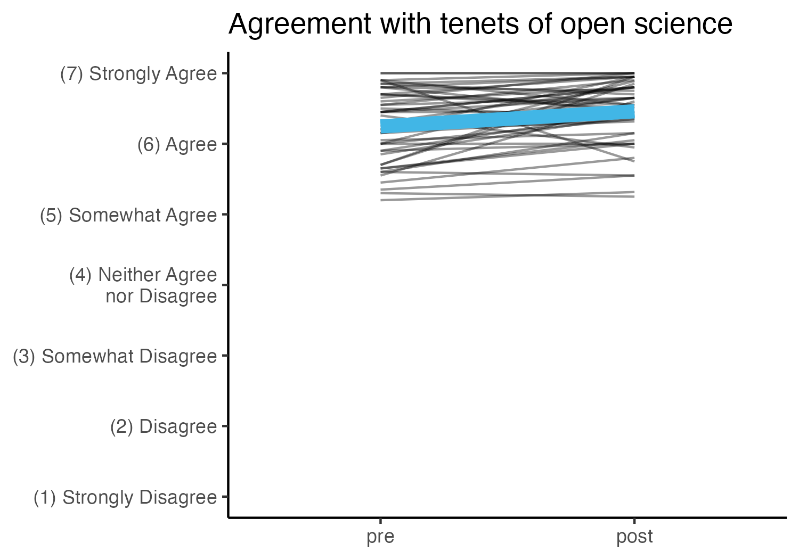
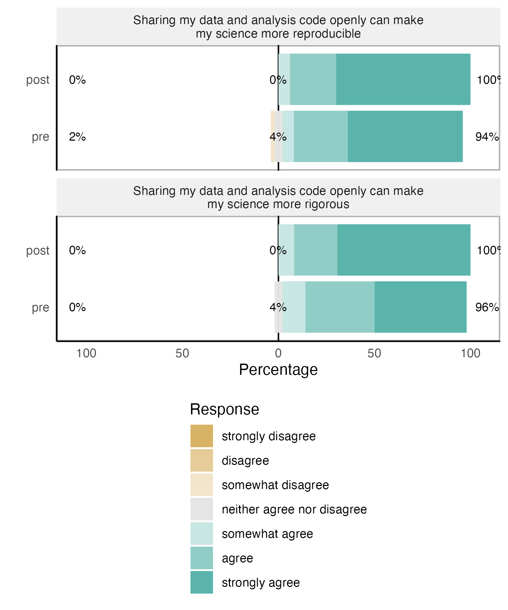

```{r setup, include=FALSE}
knitr::opts_chunk$set(echo = FALSE)
library(ggplot2)

# load custom functions for plotting
source(here::here("src", "scripts", "functions_plotting.R"))

# if the figures directory doesn't exist, create it
dir.create(here::here("reports"), showWarnings = FALSE)
dir.create(here::here("reports", "figures"), showWarnings = FALSE)
```

`r if(!knitr::opts_chunk$get()$echo) ">Note that code chunks are not printed in this report in order to keep the output tidy. To see all of the code to generate these results, open the .Rmd file."`

```{r load_data}
participants <- readr::read_csv(here::here("participant_waves.csv"), show_col_types = FALSE) |> 
  # limit analysis to wave 1, as wave 2 data collection isn't completed yet
  dplyr::filter(wave == 1)

nih_post <- readRDS(here::here("data", "deidentified", "nih_post.rds")) |> 
  dplyr::filter(record_id %in% participants$record_id) |> 
  dplyr::mutate(event = "post")

nih_pre <- readRDS(here::here("data", "deidentified", "nih_pre.rds")) |> 
  # only include pretest for which we also have posttest 
  dplyr::filter(record_id %in% nih_post$record_id) |> 
  dplyr::mutate(event = "pre")

nih <- rbind(nih_pre, nih_post) |> 
  dplyr::mutate(event = factor(event, levels = c("pre", "post")))

# load exit survey
exit <- readRDS(here::here("data", "deidentified", "exit_survey.rds")) |> 
  dplyr::filter(record_id %in% participants$record_id)

# get pathway assignments
pathways <- readr::read_csv(here::here("participant_pathways.csv"), show_col_types = FALSE)
```

```{r calculate_mean_scores}
nih <- nih |> 
  dplyr::rowwise() |> 
  dplyr::mutate(ability = mean(as.numeric(dplyr::c_across(findable:atomize)), na.rm = TRUE),
                openscience = mean(as.numeric(dplyr::c_across(data_storage_1:code_efficient)), na.rm = TRUE))
```

```{r calculate_engagement}
engagement <- exit |> 
  dplyr::rowwise() |> 
  dplyr::mutate(engagement = mean(c(completed_modules, interaction_how_often), na.rm = TRUE)) |> 
  # only keep record_id and the engagement index
  dplyr::select(record_id, engagement, completed_modules, interaction_how_often)
```

```{r data_for_testing}
# combine engagement with nih data, drop variables we don't need, get it in wide format for easier comparison
data <- nih |> 
  dplyr::select(record_id, event, ability, openscience) |> 
  tidyr::pivot_longer(cols = c(ability, openscience)) |> 
  tidyr::pivot_wider(id_cols = record_id, names_from = c(name, event), values_from = value) |> 
  dplyr::left_join(engagement, by = "record_id") |> 
  dplyr::left_join(pathways, by = "record_id") |> 
  # calculate change scores
  dplyr::mutate(ability_change = ability_post - ability_pre,
                openscience_change = openscience_post - openscience_pre) |> 
  dplyr::select(record_id, pathway, engagement, completed_modules, interaction_how_often, ends_with("change"), ends_with("pre"), ends_with("post")) |> 
  # only keep cases that have data for all three key variables
  dplyr::filter(!is.na(engagement) & !is.na(ability_change) & !is.na(openscience_change))
```

```{r plot_data}
plot_data <- data |> 
  tidyr::pivot_longer(cols=tidyselect::starts_with(c("ability","openscience"))) |> 
  tidyr::separate(name, into=c("measure", "event"), sep="_") |> 
  tidyr::pivot_wider(names_from = measure, values_from = value) |> 
  dplyr::mutate(event = factor(event, levels = c("pre", "post", "change")))

plot_data_means <- plot_data |> 
  dplyr::filter(event %in% c("pre", "post")) |> 
  dplyr::group_by(event) |> 
  dplyr::summarise(ability = mean(ability), 
                   openscience = mean(openscience))
```

```{r change_ability}
ability_plot <- plot_data |> 
  dplyr::filter(event %in% c("pre", "post")) |> 
  ggplot(aes(x=event, y=ability)) + 
  scale_y_continuous(breaks = 1:4, limits = c(1,4),
                     labels = c("(1) I wouldn't know where to start",
                                "(2) I could struggle through,\nbut not confident I could do it",
                                "(3) I could probably do it\nwith some trial and error",
                                "(4) I am confident in my ability to do it")) + 
  labs(x=NULL, y=NULL, 
       title = "Ability")

p1 <- ability_plot + 
  geom_boxplot(fill = chop_blue)
ggsave("ability_boxplot.png", 
       p1, 
       path = here::here("reports", "figures"),
       width = 5, height = 3.5, units = "in")

p2 <- ability_plot + 
  geom_line(aes(group = record_id), alpha = .4)

ggsave("ability_lineplot.png", 
       p2, 
       path = here::here("reports", "figures"),
       width = 5, height = 3.5, units = "in")  

p3 <- ability_plot + 
  geom_line(aes(group = record_id), alpha = .4) +
  geom_line(data = plot_data_means, 
            aes(group = 1),
            size= 3, color = chop_blue)

ggsave("ability_lineplot_mean.png", 
       p3, 
       path = here::here("reports", "figures"),
       width = 5, height = 3.5, units = "in")  
```


```{r change_openscience}
# 1, strongly disagree | 2, disagree | 3, somewhat disagree | 4, neither agree nor disagree | 5, somewhat agree | 6, agree | 7, strongly agree
openscience_plot <- plot_data |> 
  dplyr::filter(event %in% c("pre", "post")) |> 
  ggplot(aes(x=event, y=openscience)) + 
  scale_y_continuous(breaks = 1:7, limits = c(1,7),
                     labels = c("(1) Strongly Disagree",
                                "(2) Disagree",
                                "(3) Somewhat Disagree",
                                "(4) Neither Agree\nnor Disagree",
                                "(5) Somewhat Agree",
                                "(6) Agree",
                                "(7) Strongly Agree")) + 
  labs(x=NULL, y= NULL,
       title = "Agreement with tenets of open science")

p4 <- openscience_plot + 
  geom_boxplot(fill = chop_blue)

ggsave("openscience_boxplot.png", 
       p4, 
       path = here::here("reports", "figures"),
       width = 5, height = 3.5, units = "in")

p5 <- openscience_plot +
  geom_line(aes(group = record_id), alpha = .4) 

ggsave("openscience_lineplot.png", 
       p5, 
       path = here::here("reports", "figures"),
       width = 5, height = 3.5, units = "in")

p6 <- openscience_plot +
  geom_line(aes(group = record_id), alpha = .4) +
  geom_line(data = plot_data_means, 
            aes(group = 1),
            size= 3, color = chop_blue)

ggsave("openscience_lineplot_mean.png", 
       p6, 
       path = here::here("reports", "figures"),
       width = 5, height = 3.5, units = "in")
```




```{r effect_size}
ab_change_mean <- mean(data$ability_change, na.rm = TRUE) # average change
ab_change_sd <- sd(data$ability_change, na.rm = TRUE) # standard deviation 
```

## Changes in ratings of ability pre to post

```{r ability_ratings}
ability_ratings <- nih |> 
  dplyr::select(findable:atomize) |> 
  # likert doesn't like tibbles
  as.data.frame()

names(ability_ratings) <- c("Make my data findable by other researchers",
"Make my data accessible for other researchers",
"Make my data interoperable for other researchers",
"Make my data reusable by other researchers",
"Share my data in a public repository",
"Link my publications to the relevant dataset(s)",
"Use open-source tools for data management",
"Use open-source tools for analytics",
"Use open-source tools for data visualization",
"Find and use existing data for my research",
"Record metadata that will make my data useful in a broad range of contexts",
"Use version control on datasets / record data provenance",
"Use standardized data formats and vocabularies for my field",
"Access electronic health records securely, ethically, and legally",
"Use electronic health records to complement other data sources",
"Find relevant work in other fields like mathematics, statistics, computer science, engineering, and physics",
"Cite datasets others have created",
"Create and publish a preregistration for a study",
"Enable citizen scientists to access data without compromising its privacy or security",
"Use crowdsourcing to engage the public in biomedical research",
"Support or participate in community science events like code-athons and contests",
"Create or run community science events like code-athons and contests",
"Select a license for sharing and reuse of my data",
"Select a license for sharing and reuse of code or other tools I create in my research",
"Determine what data from my research should be stored, where, and in what form",
"Assess data storage options in terms of their long-term sustainability",
"Transform data for analysis",
"Construct a plot and table for exploratory data analysis",
"Build a data processing pipeline that can be used in multiple programs",
"Calculate, interpret, and communicate an appropriate statistical analysis of the data",
"Make use of programming software to work with data",
"Search for answers to my technical questions online",
"Write a small program, script, or macro to address a problem in my own work",
"Find ways of overcoming problems when I get stuck in a programming project",
"Break down data processing into smaller individual (and more manageable) steps")
```

```{r ability_likert}
p6 <- ability_ratings[,c(4, 8)] |> 
  # compare pre and post test results (event)
  likert::likert(grouping = nih$event) |> 
  plot(type = "bar", group.order = c("post", "pre")) + 
  ggplot2::theme(legend.position="bottom", legend.direction="vertical")

p7 <- ability_ratings[,c(33, 30)] |> 
  # compare pre and post test results (event)
  likert::likert(grouping = nih$event) |> 
  plot(type = "bar", group.order = c("post", "pre")) + 
  ggplot2::theme(legend.position="bottom", legend.direction="vertical")

ggsave("ability_likert1.png", 
       p6, 
       path = here::here("reports", "figures"),
       width = 5, height = 5, units = "in")  

ggsave("ability_likert2.png", 
       p7, 
       path = here::here("reports", "figures"),
       width = 5, height = 5, units = "in")  
```


## Changes in ratings of agreement with tennets of open science pre to post

```{r openscience_ratings}
openscience_ratings <- nih |> 
  dplyr::select(data_storage_1:code_efficient) |> 
  # likert doesn't like tibbles
  as.data.frame()

names(openscience_ratings) <- c("Data quality and integrity should be maintained even after a research project is completed",
"Existing data should be made accessible for reuse",
"Research data should be usable to as many people as possible (including researchers, institutions, and the public)",
"There are valuable tools and technologies from other fields that can be adapted for use in  biomedical research",
"Diversity in the biomedical research workforce is vital for the advancement of the field",
"All research data should be findable, accessible, interoperable, and reusable except for rare exceptions",
"Researchers should use data standards that work across fields, including standardized data vocabularies and ontologies",
"An important metric of a data set's value is how many times it is shared and reused",
"Siloed data is a serious problem in the field",
"The choice of where to store research data at the end of a project matters",
"Linking existing data systems so they can be used together is vital to the advancement of the field",
"Data should be available to not only biomedical researchers but also policymakers, funding agencies, professional organizations, and the public",
"Open and efficient data sharing is vital to the advancement of the field",
"Efficiently linking clinical and observational data is vital to the advancement of the field",
"Advanced research tools should be widely available at limited or no cost to users",
"Sharing my data and analysis code openly can make my science more reproducible",
"Sharing my data and analysis code openly can make my science more rigorous",
"I believe having access to the original, raw data is important to be able to repeat an analysis",
"Using a programming language (like R or Python) can make my analyses easier to reproduce",
"Using a programming language (like R or Python) can make me more efficient at working with data")
```

```{r openscience_likert}
p8 <- openscience_ratings[,c(8, 19)] |> 
  # compare pre and post test results (event)
  likert::likert(grouping = nih$event) |> 
  plot(type = "bar", group.order = c("post", "pre")) + 
  ggplot2::theme(legend.position="bottom", legend.direction="vertical")

p9 <- openscience_ratings[,c(16, 17)] |> 
  # compare pre and post test results (event)
  likert::likert(grouping = nih$event) |> 
  plot(type = "bar", group.order = c("post", "pre")) + 
  ggplot2::theme(legend.position="bottom", legend.direction="vertical")

ggsave("openscience_likert1.png", 
       p8, 
       path = here::here("reports", "figures"),
       width = 5, height = 6, units = "in") 

ggsave("openscience_likert2.png", 
       p9, 
       path = here::here("reports", "figures"),
       width = 5, height = 6, units = "in") 
```



