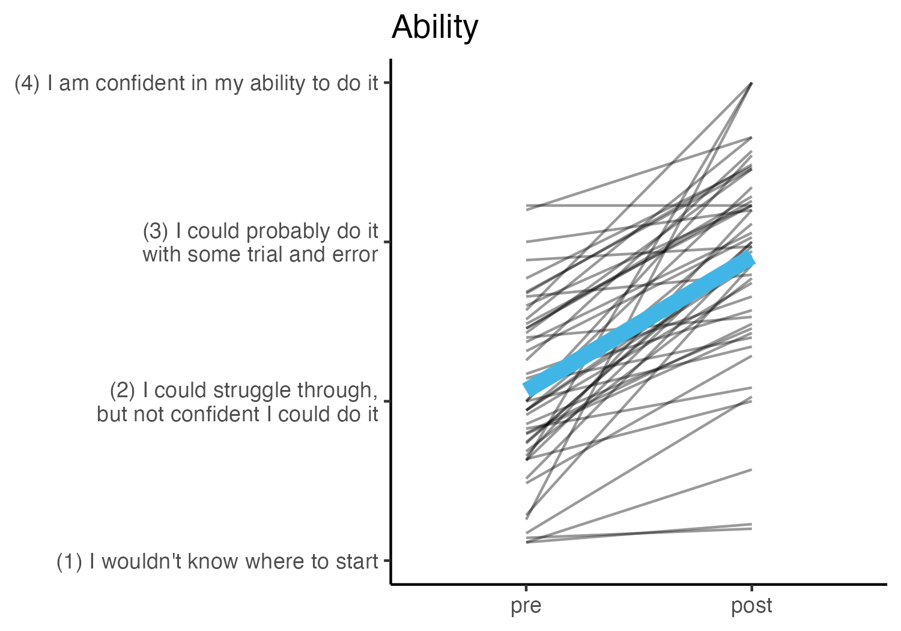
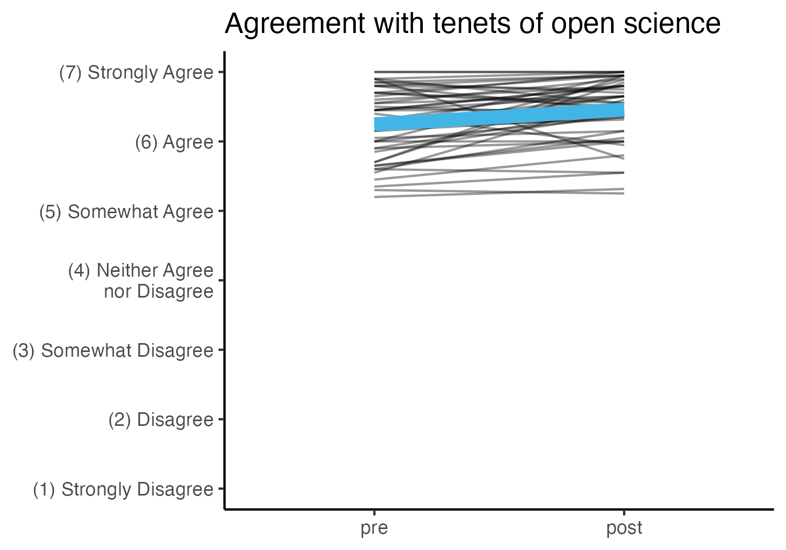
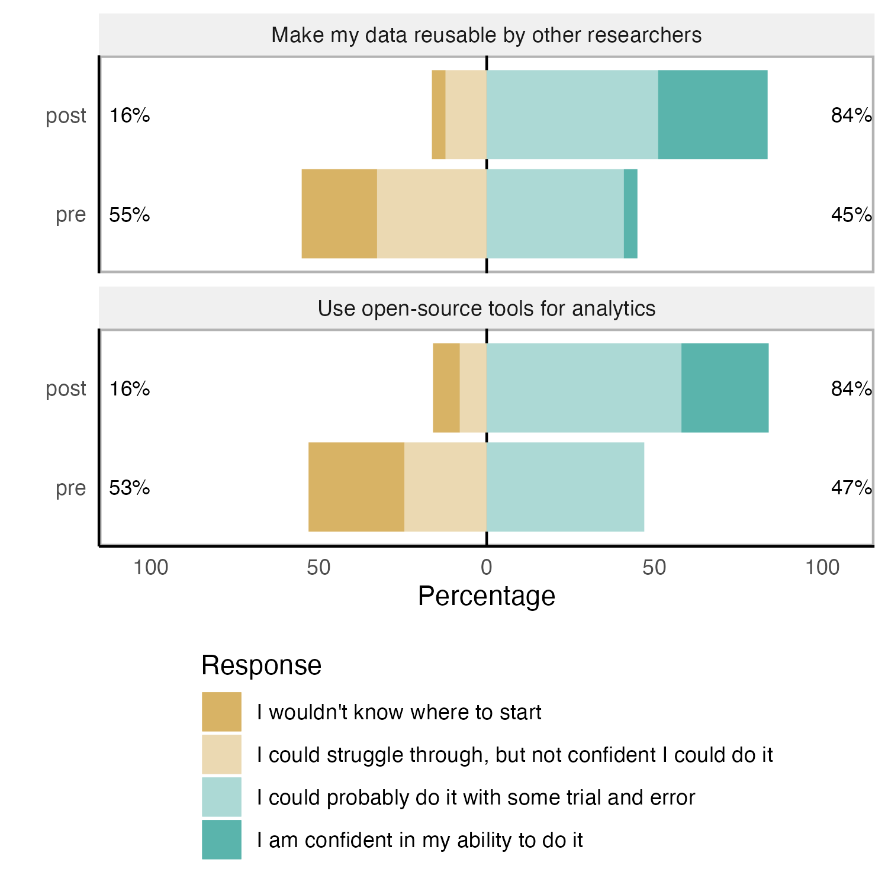
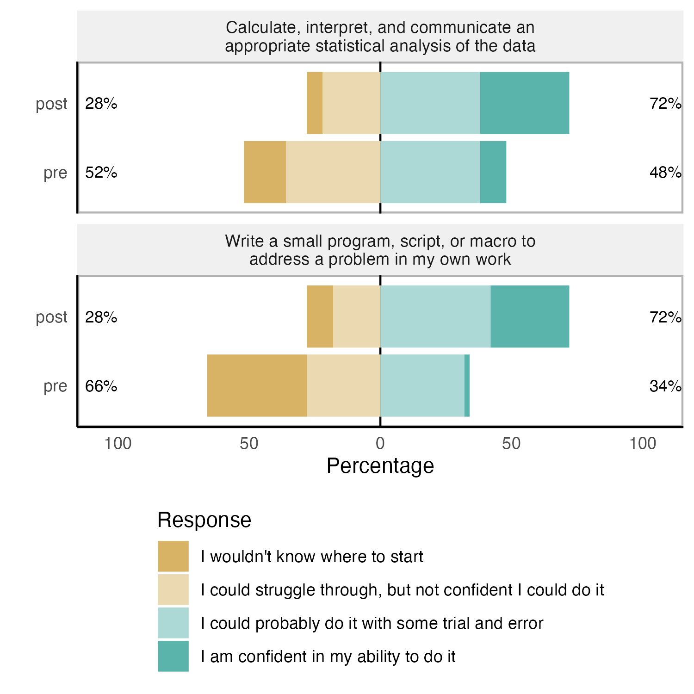
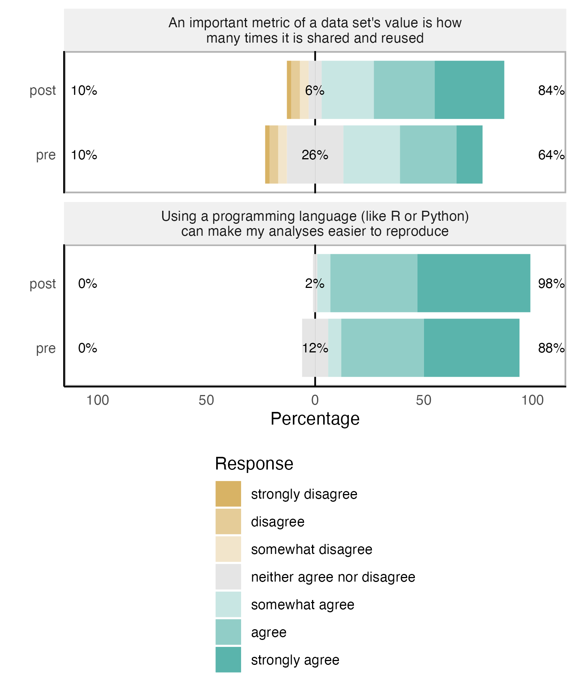
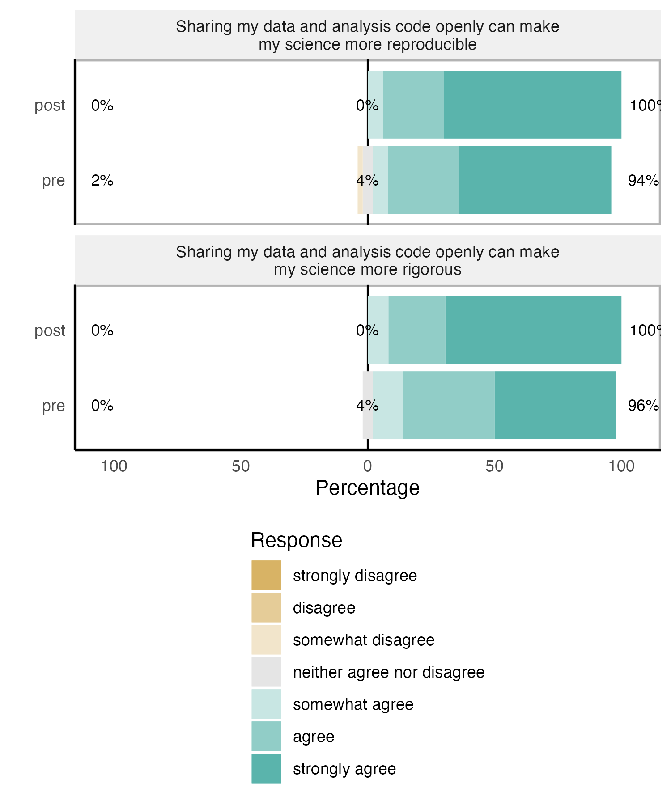

R3ISE Symposium Materials
================
Rose Hartman
2023-12-12

> Note that code chunks are not printed in this report in order to keep
> the output tidy. To see all of the code to generate these results,
> open the .Rmd file.

## Changes in ratings of ability pre to post

 
\## Changes in ratings of agreement with tennets of open science pre to
post

