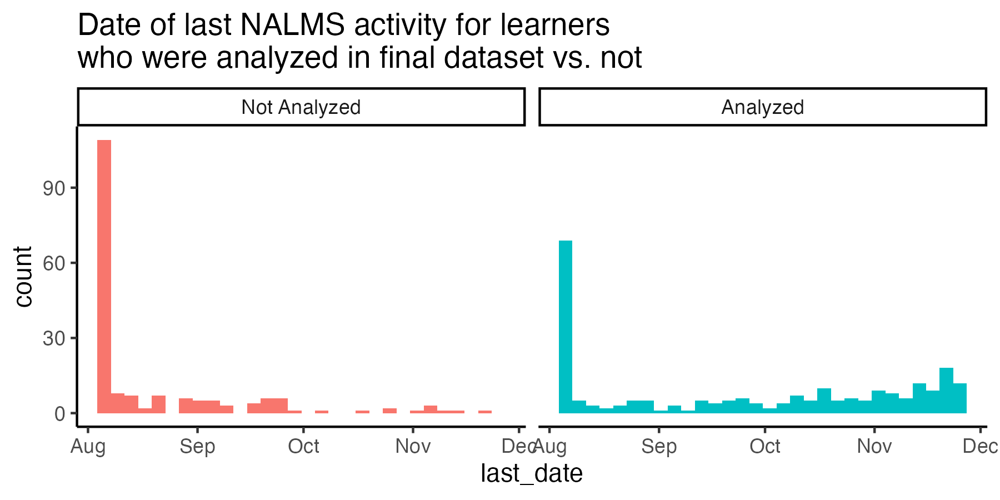
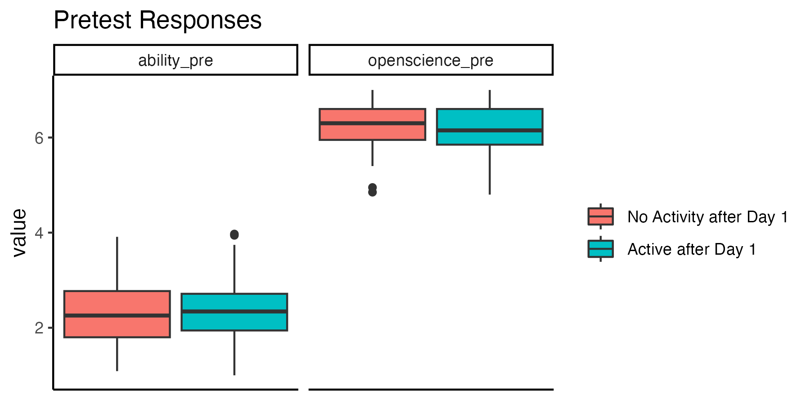
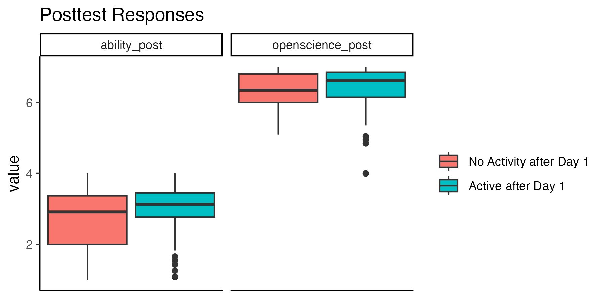

Attrition analysis
================
Rose Hartman
2025-03-05

> Note that code chunks are not printed in this report in order to keep
> the output tidy. To see all of the code to generate these results,
> open the .Rmd file.

Comment from reviewer 2:

> My concern about the methodology and discussion of results is that the
> authors do not discuss the fact that a significant number of
> participants in both waves, nearly half, didn’t complete both the pre
> and post test. This may introduce bias into the results, in a similar
> way to when patients are lost to follow up in a clinical trial. We
> can’t know for sure anything about the experience of the people who
> didn’t respond to the post test. Did they find the training useful but
> just not get around to the post test, or did they stop participating
> because they didn’t see value in the training? It seems reasonable to
> expect that the participants who did take the time to complete the
> post test may be different from those who did not in how useful they
> found the training, and this potential bias should at the very least
> be addressed in the discussion of limitations.

## How many participants completed each assessment phase for each wave?

## Look for differences for participants who dropped out

### Needs assessment differences for analyzed vs not?

    ##           Df   Pillai approx F num Df den Df Pr(>F)
    ## analyzed   1 0.055747   1.8302      3     93 0.1471
    ## Residuals 95

    ##  Response relevance :
    ##             Df  Sum Sq Mean Sq F value Pr(>F)
    ## analyzed     1  0.3575 0.35754  1.8895 0.1725
    ## Residuals   95 17.9763 0.18922               
    ## 
    ##  Response expertise :
    ##             Df Sum Sq  Mean Sq F value Pr(>F)
    ## analyzed     1 0.2402 0.240226  2.4981 0.1173
    ## Residuals   95 9.1356 0.096165               
    ## 
    ##  Response learn :
    ##             Df  Sum Sq Mean Sq F value  Pr(>F)  
    ## analyzed     1  0.8177 0.81774  4.7615 0.03157 *
    ## Residuals   95 16.3154 0.17174                  
    ## ---
    ## Signif. codes:  0 '***' 0.001 '**' 0.01 '*' 0.05 '.' 0.1 ' ' 1

    ##            Df    Pillai approx F num Df den Df Pr(>F)
    ## analyzed    1 0.0021252  0.29462      3    415 0.8293
    ## Residuals 417

    ##  Response relevance :
    ##              Df Sum Sq  Mean Sq F value Pr(>F)
    ## analyzed      1  0.013 0.012902  0.0604  0.806
    ## Residuals   417 89.074 0.213606               
    ## 
    ##  Response expertise :
    ##              Df Sum Sq  Mean Sq F value Pr(>F)
    ## analyzed      1  0.000 0.000018   1e-04  0.991
    ## Residuals   417 59.277 0.142152               
    ## 
    ##  Response learn :
    ##              Df Sum Sq Mean Sq F value Pr(>F)
    ## analyzed      1  0.104 0.10412  0.4854 0.4864
    ## Residuals   417 89.440 0.21449

### Pretest differences for analyzed vs not?

    ## 
    ## Call:
    ## glm(formula = analyzed ~ ability_pre * openscience_pre, family = "binomial", 
    ##     data = dplyr::filter(nih_pre_and_attrition, nih_pre == 1 & 
    ##         wave == "Wave 1"))
    ## 
    ## Coefficients:
    ##                             Estimate Std. Error z value Pr(>|z|)
    ## (Intercept)                  -8.2725    11.0485  -0.749    0.454
    ## ability_pre                   4.0311     5.1690   0.780    0.435
    ## openscience_pre               1.2000     1.7484   0.686    0.493
    ## ability_pre:openscience_pre  -0.5753     0.8144  -0.706    0.480
    ## 
    ## (Dispersion parameter for binomial family taken to be 1)
    ## 
    ##     Null deviance: 127.37  on 91  degrees of freedom
    ## Residual deviance: 125.73  on 88  degrees of freedom
    ## AIC: 133.73
    ## 
    ## Number of Fisher Scoring iterations: 4

    ## 
    ## Call:
    ## glm(formula = analyzed ~ ability_pre * openscience_pre, family = "binomial", 
    ##     data = dplyr::filter(nih_pre_and_attrition, nih_pre == 1 & 
    ##         wave == "Wave 2"))
    ## 
    ## Coefficients:
    ##                             Estimate Std. Error z value Pr(>|z|)
    ## (Intercept)                  -4.1944     4.1737  -1.005    0.315
    ## ability_pre                   2.8013     1.8353   1.526    0.127
    ## openscience_pre               0.7211     0.6614   1.090    0.276
    ## ability_pre:openscience_pre  -0.4415     0.2879  -1.534    0.125
    ## 
    ## (Dispersion parameter for binomial family taken to be 1)
    ## 
    ##     Null deviance: 541.03  on 400  degrees of freedom
    ## Residual deviance: 536.93  on 397  degrees of freedom
    ## AIC: 544.93
    ## 
    ## Number of Fisher Scoring iterations: 4

    ##           Df   Pillai approx F num Df den Df Pr(>F)
    ## analyzed   1 0.012227  0.55084      2     89 0.5784
    ## Residuals 90

    ##  Response ability_pre :
    ##             Df  Sum Sq Mean Sq F value Pr(>F)
    ## analyzed     1  0.3621 0.36206  1.1141  0.294
    ## Residuals   90 29.2492 0.32499               
    ## 
    ##  Response openscience_pre :
    ##             Df  Sum Sq  Mean Sq F value Pr(>F)
    ## analyzed     1  0.0013 0.001264  0.0049 0.9445
    ## Residuals   90 23.3486 0.259428

    ##            Df    Pillai approx F num Df den Df Pr(>F)
    ## analyzed    1 0.0042848  0.85634      2    398 0.4255
    ## Residuals 399

    ##  Response ability_pre :
    ##              Df  Sum Sq Mean Sq F value Pr(>F)
    ## analyzed      1   0.025  0.0248  0.0587 0.8087
    ## Residuals   399 168.617  0.4226               
    ## 
    ##  Response openscience_pre :
    ##              Df  Sum Sq Mean Sq F value Pr(>F)
    ## analyzed      1   0.488 0.48820  1.7169 0.1908
    ## Residuals   399 113.454 0.28435

### combined data

    ## Warning for variable 'relevance':
    ## simpleWarning in wilcox.test.default(x = DATA[[1L]], y = DATA[[2L]], ...): cannot compute exact p-value with ties

    ## Warning for variable 'expertise':
    ## simpleWarning in wilcox.test.default(x = DATA[[1L]], y = DATA[[2L]], ...): cannot compute exact p-value with ties

    ## Warning for variable 'learn':
    ## simpleWarning in wilcox.test.default(x = DATA[[1L]], y = DATA[[2L]], ...): cannot compute exact p-value with ties

    ## Warning for variable 'ability_pre':
    ## simpleWarning in wilcox.test.default(x = DATA[[1L]], y = DATA[[2L]], ...): cannot compute exact p-value with ties

    ## Warning for variable 'openscience_pre':
    ## simpleWarning in wilcox.test.default(x = DATA[[1L]], y = DATA[[2L]], ...): cannot compute exact p-value with ties

## NALMS activity by attrition

    ## `stat_bin()` using `bins = 30`. Pick better value with `binwidth`.

    ## `stat_bin()` using `bins = 30`. Pick better value with `binwidth`.

    ## Call: xtabs(formula = ~past_day_1 + analyzed, data = nalms_and_attrition)
    ## Number of cases in table: 419 
    ## Number of factors: 2 
    ## Test for independence of all factors:
    ##  Chisq = 39.4, df = 1, p-value = 3.456e-10

    ## 
    ##  Wilcoxon rank sum test with continuity correction
    ## 
    ## data:  engagement by analyzed
    ## W = 11488, p-value < 2.2e-16
    ## alternative hypothesis: true location shift is not equal to 0

### Do learners with 0 engagement in NALMS differ at post?

    ## Warning: Removed 6 rows containing non-finite outside the scale range
    ## (`stat_boxplot()`).

## Write up

We noted substantial attrition in both waves of the DART program, with
roughly half of our participants failing to complete the post-test
surveys. This level of attrition is typical of online learning programs
(e.g. Hadavand et al. 2018 report 49% attrition between enrollment and
completion in a large sample of online data science learners), but it
still raises important questions about the generalizability of the
results we observe.

Learners who completed the program almost certainly differed from those
who didn’t in important ways, both measurable and unmeasurable, such as
motivation, availability of protected time for study, support from
outside of the DART program (e.g. high-quality mentorship), and more.
This limits the extent to which we can expect these results to
generalize. Our findings are specific to the population who *completed*
the program; we are unable to extrapolate from these data to predict how
effective a program like DART might be in a broader population,
including the population who enrolled in but did not finish our program.

Problems of attrition and self-selection bias are endemic in online
education research, and improving understanding of factors that lead to
attrition is an active line of inquiry (Katy, 2015; Kim et al. 2020). As
with many online learning programs, part of our goal was to lower
barriers to enrollment – we made the program free, with no
prerequisites, advertised it widely, and created fully asynchronous
instruction to allow for maximum flexibility in busy learners’
schedules. A likely consequence of this approach is that a high
proportion of people signed up without actually having the time or
bandwidth to follow through on their learning goals (consider this in
contrast to something like a masters program in data science, where
requiring a substantial upfront investment from learners results in more
selective enrollment, and less attrition). This effect is reflected in
the engagement data we were able to capture in Wave 2 after switching
platforms; of the 419 enrolled learners, only 243 (58%) logged any
activity in their learning pathways after the first day. In other words,
fully 42% of our Wave 2 learners never engaged at all with their
learning pathways, suggesting that they either changed their minds about
participating between enrollment and beginning their learning pathways,
or that they maintained an intention to participate but never found the
time to do so. Interestingly, of the 176 learners who logged no activity
in their learning pathways after the first day, 69 (39%) of them did
complete the post-test surveys at the end of the program and were
included in the final analysis dataset, so their experiences are
reflected in our reported analyses, although they are still
significantly under-represented in the analysis dataset relative to
learners who did log activity on their learning pathways after the first
day (X2 (1, N = 419) = 39.4, p \< .001).
