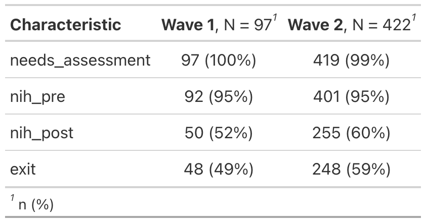
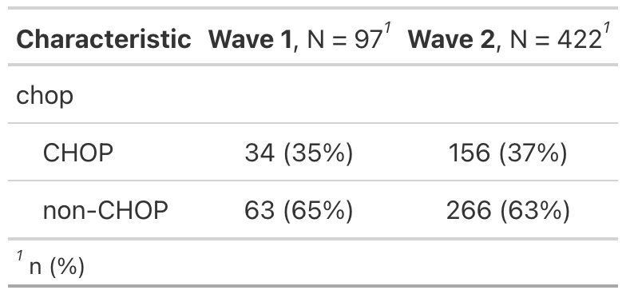
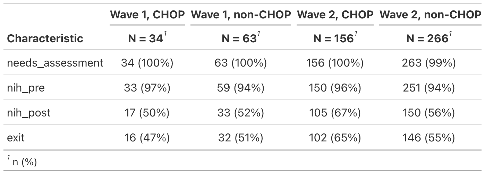

Participant counts and attrition
================
Rose Hartman
2024-03-22

> Note that code chunks are not printed in this report in order to keep
> the output tidy. To see all of the code to generate these results,
> open the .Rmd file.

## Now, limit to just the consented participants

Participants who consented + agreed to Code of Conduct

## How many total participants invited for each wave?

| wave   |   n |
|:-------|----:|
| Wave 1 |  97 |
| Wave 2 | 422 |

## How many participants completed each assessment phase for each wave?

## How many institutions?

| wave   | n_institutions |
|:-------|---------------:|
| Wave 1 |             23 |
| Wave 2 |             58 |

What about overall number of institutions across both waves?

    ## [1] 64

Limited only to participants that made it all the way through the exit
survey:

| wave   | n_institutions |
|:-------|---------------:|
| Wave 1 |             15 |
| Wave 2 |             41 |

Across both waves?

    ## [1] 43

## CHOP vs other institutions

