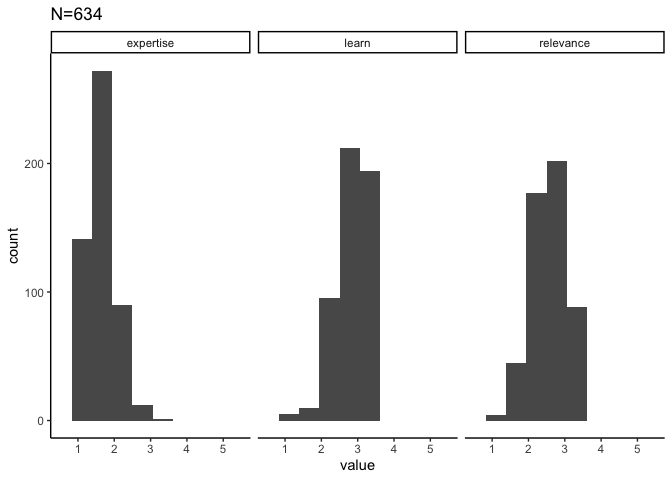
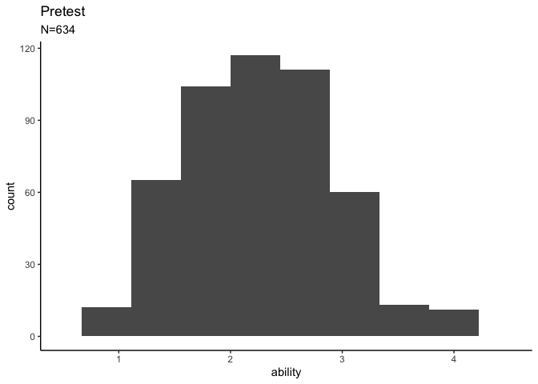
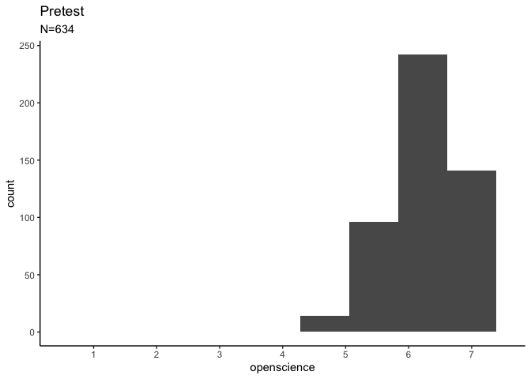
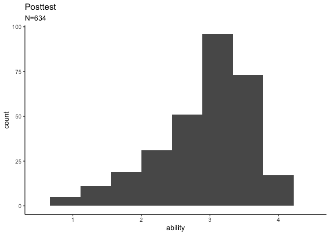
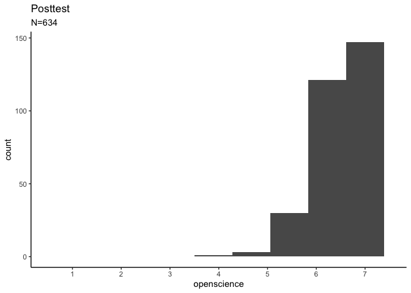

DART Summary
================
Rose Hartman
2024-02-29

> Note that code chunks are not printed in this report in order to keep
> the output tidy. To see all of the code to generate these results,
> open the .Rmd file.

## Study design

The DART program is efficient, targetted data science education for
biomedical researchers. We provide a tailored pathway of learning
“modules” designed to match each learners’ current expertise,
professional needs, and interest, and also supported an online Community
of Practice to give learners the opportunity to work collaboratively and
network. We ran DART twice, each for 16 weeks.

We assessed the effectiveness of DART by measuring self-report data
science ability and agreement with important tenets of open science both
before and after the program. There’s no control group. We used
hierarchical clustering to identify groups of learners with similar
educational needs and built a pathway for each; pathway is treated as a
random effect in the models to account for that grouping structure.

## This report

This report refers to 634 participants in DART meeting the following
criteria (“all” means no filtering):

- wave: all
- institution is CHOP: all
- career stage: all
- identifies as from an underrepresented racial or ethnic group as per
  NIH guidelines: all
- completed pretest surveys: all
- completed posttest surveys: all

## Needs assessment

<!-- -->

## Pretest data science ability and open science values

    ## Warning: Removed 141 rows containing non-finite values (stat_bin).

    ## Warning: Removed 2 rows containing missing values (geom_bar).

<!-- -->

    ## Warning: Removed 141 rows containing non-finite values (stat_bin).
    ## Removed 2 rows containing missing values (geom_bar).

    ## Warning: Removed 141 rows containing non-finite values (stat_bin).

    ## Warning: Removed 2 rows containing missing values (geom_bar).

<!-- -->

    ## Warning: Removed 141 rows containing non-finite values (stat_bin).
    ## Removed 2 rows containing missing values (geom_bar).

## Posttest data science ability and open science values

    ## Warning: Removed 331 rows containing non-finite values (stat_bin).

    ## Warning: Removed 2 rows containing missing values (geom_bar).

<!-- -->

    ## Warning: Removed 331 rows containing non-finite values (stat_bin).
    ## Removed 2 rows containing missing values (geom_bar).

    ## Warning: Removed 330 rows containing non-finite values (stat_bin).

    ## Warning: Removed 2 rows containing missing values (geom_bar).

<!-- -->

    ## Warning: Removed 330 rows containing non-finite values (stat_bin).
    ## Removed 2 rows containing missing values (geom_bar).
