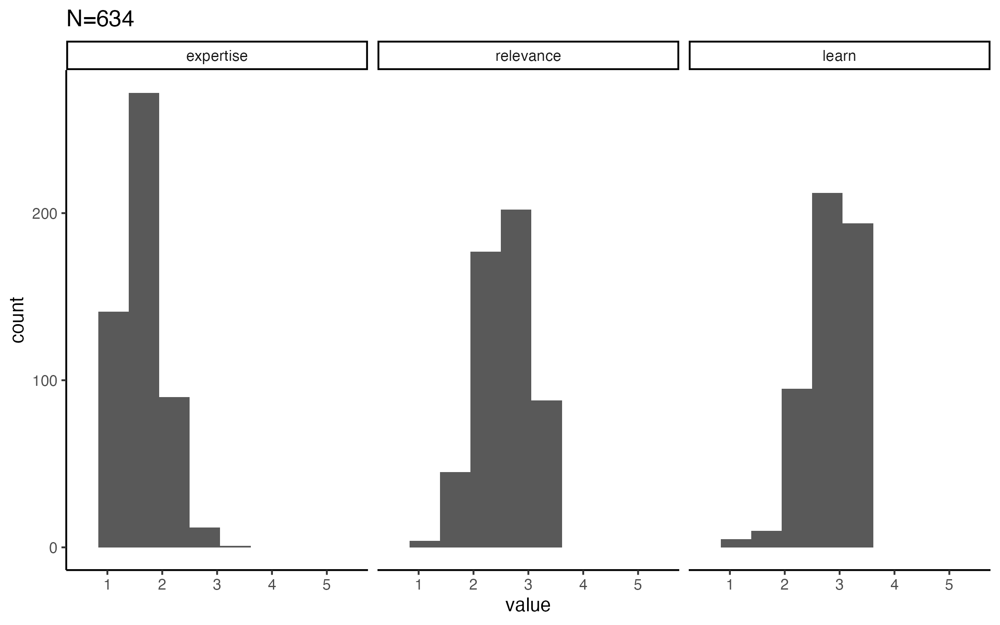
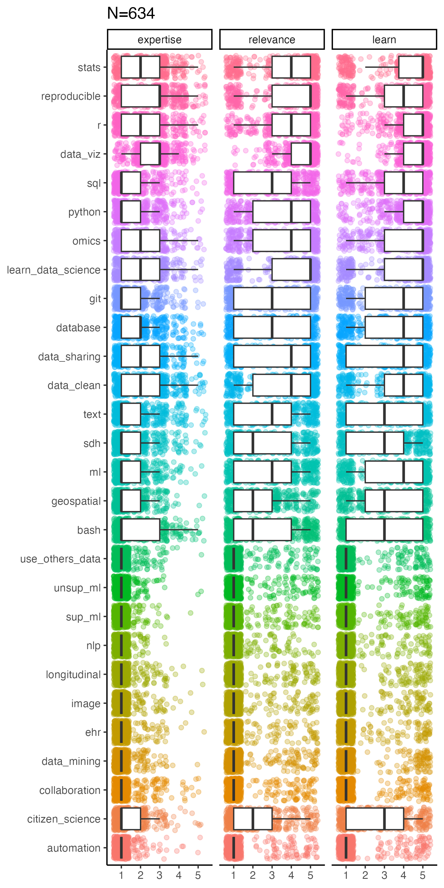
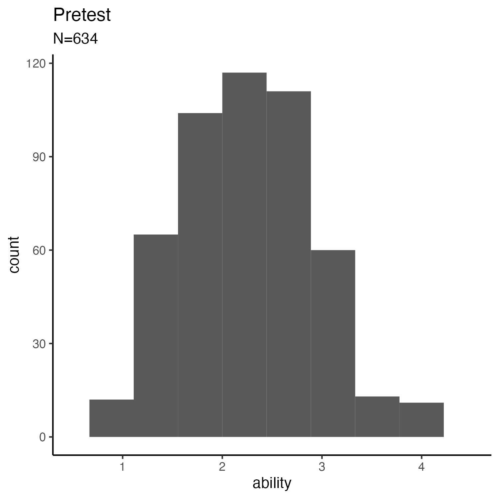
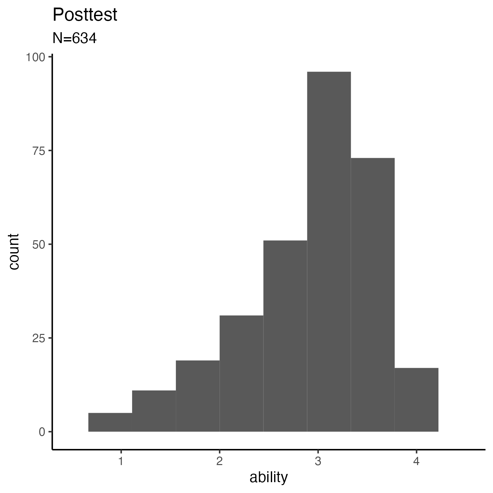
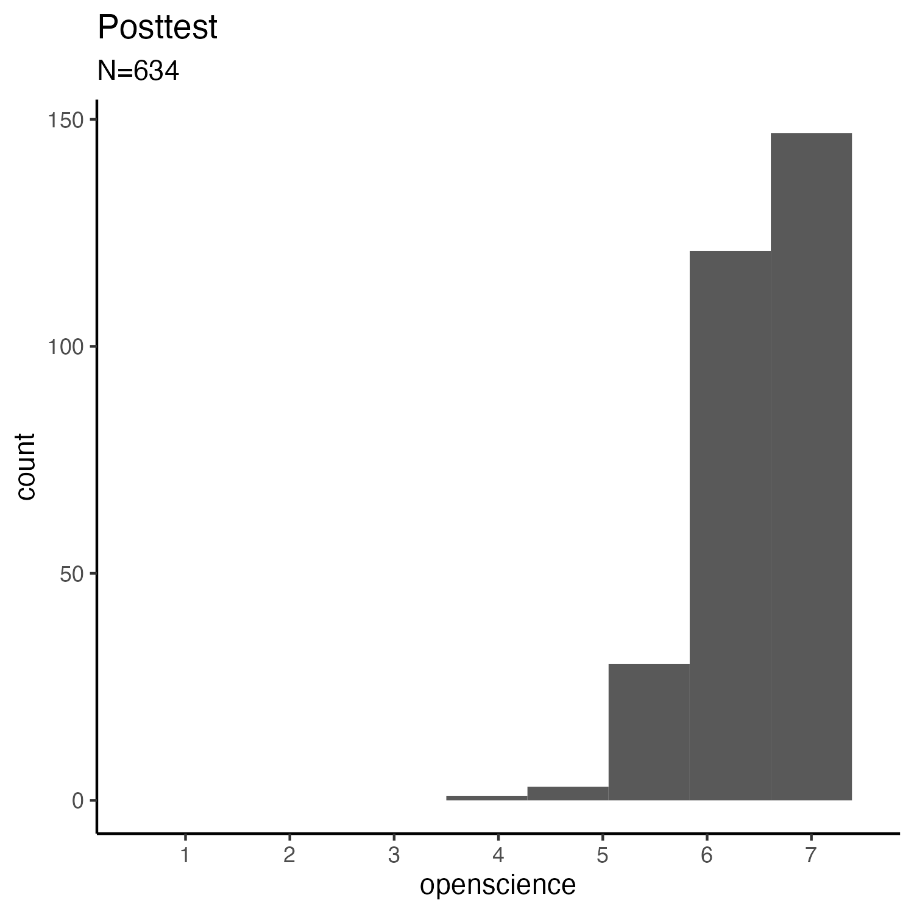

DART Summary
================
Rose Hartman
2025-07-24

> Note that code chunks are not printed in this report in order to keep
> the output tidy. To see all of the code to generate these results,
> open the .Rmd file.

## Study design

The DART program is efficient, targetted data science education for
biomedical researchers. We provide a tailored pathway of learning
“modules” designed to match each learners’ current expertise,
professional needs, and interest, and also supported an online Community
of Practice to give learners the opportunity to work collaboratively and
network. We ran DART twice, each for 16 weeks.

We assessed the effectiveness of DART by measuring self-report data
science ability and agreement with important tenets of open science both
before and after the program. There’s no control group. We used
hierarchical clustering to identify groups of learners with similar
educational needs and built a pathway for each; pathway is treated as a
random effect in the models to account for that grouping structure.

## This report

This report refers to 634 participants in DART meeting the following
criteria (“all” means no filtering):

- wave: all
- institution is CHOP: all
- career stage: all
- identifies as from an underrepresented racial or ethnic group as per
  NIH guidelines: all
- completed pretest surveys: all
- completed posttest surveys: all

## Needs assessment

Respondents were asked to provide three ratings

- expertise (“Your level of expertise”)
- relevance (“Relevance to your work”)
- learn (“Your desire to learn”)

for each of the data science topics, on a scale of 1 = “Very Low” to 5 =
“Very High”.

| Topic | Question Text |
|:---|:---|
| data_viz | Demonstrate, analyze, or communicate your research results through data visualization |
| stats | Conduct statistical analyses on research data |
| data_clean | Clean data in preparation for analysis, including tasks like transformations, calculations, and recoding |
| git | Use a version control system (like git) to keep track of changes in your files |
| ml | Use machine learning techniques to analyze research data |
| text | Analyze text data (clinician notes, open survey responses, etc.) |
| omics | Analyze omics data (genomics, proteomics, transcriptomics, etc.) |
| geospatial | Analyze geospatial data |
| database | Analyze data stored in a large database, such as EHR (electronic health records) |
| r | Write code to analyze data in the R programming language |
| python | Write code to analyze data in the Python programming language |
| sql | Use SQL (structured query language) to access data in a relational database |
| reproducible | Make your research reproducible |
| bash | Use your computer’s command line (also called the terminal or shell) and/or write bash scripts |
| citizen_science | Use citizen science or crowdsourcing to engage the public in your research |
| sdh | Combine data from multiple sources, such as for SDH (social determinants of health) research |
| data_sharing | Meet funder and journal requirements for data storage and data sharing |
| learn_data_science | Figure out which data science techniques and tools will be most useful in your research |
| collaboration | Collaborate with multiple team members on the same dataset or analysis |
| data_mining | Conduct research through data mining (using computational methods to discover patterns in large datasets) |
| use_others_data | Locate and obtain other researchers’ shared data to use in your research, and clean or process it to meet your research needs |
| unsup_ml | Perform unsupervised machine learning such as cluster analysis (organizing data into a small number of groups in which data points within each group are similar in some way while groups themselves are distinct from one another) |
| sup_ml | Perform supervised machine learning such as predictive modeling (predicting an outcome in which the outcome is unknown, based on patterns detected in data for which the outcome is known) |
| automation | Deliver data to an analysis pipeline (some series of tasks that perform data analysis) in an automated way |
| nlp | Use NLP (natural language processing) to analyze text data or metadata |
| image | Analyze image data |
| ehr | Analyze electronic health record (EHR) data |
| longitudinal | Analyze longitudinal data, time series data, or repeated measures data |

Here are their responses collapsed across all topics (i.e. overall
expertise, relevance and desire to learn).

Here are their responses by topic:

## Pretest data science ability and open science values

    ## Warning: Removed 141 rows containing non-finite outside the scale range
    ## (`stat_bin()`).

    ## Warning: Removed 2 rows containing missing values or values outside the scale range
    ## (`geom_bar()`).

    ## Warning: Removed 141 rows containing non-finite outside the scale range (`stat_bin()`).
    ## Removed 2 rows containing missing values or values outside the scale range
    ## (`geom_bar()`).

## Posttest data science ability and open science values

    ## Warning: Removed 331 rows containing non-finite outside the scale range
    ## (`stat_bin()`).

    ## Warning: Removed 2 rows containing missing values or values outside the scale range
    ## (`geom_bar()`).

    ## Warning: Removed 330 rows containing non-finite outside the scale range (`stat_bin()`).
    ## Removed 2 rows containing missing values or values outside the scale range
    ## (`geom_bar()`).

