Explore clusters
================
Rose Hartman
2023-01-17

``` r
needs_assessment_long <- readRDS(here::here("data", "deidentified", "needs_assessment_with_clusters_w1.rds")) |> 
  # reformat to long
  tidyr::pivot_longer(cols = tidyselect::matches("_relevance|_expertise|_learn")) |> 
  # separate topic (e.g. data_viz) from question type (relevance, expertise, or learn)
  tidyr::extract(name, into = c("topic", "question"), regex = "(.*)_([[:lower:]]+)", remove = TRUE) |> 
  dplyr::mutate(question = factor(question, levels = c("relevance", "expertise", "learn")),
                topic = as.factor(topic))
```

## distributions by cluster

``` r
plot_by_theme(needs_assessment_long, cluster = group4)
```

    ## $counts
    ## # A tibble: 4 × 2
    ##   cluster     n
    ##   <fct>   <int>
    ## 1 1          54
    ## 2 2          20
    ## 3 3          13
    ## 4 4          10
    ## 
    ## $data_types


    ## 
    ## $techniques


    ## 
    ## $tools


``` r
plot_by_theme(needs_assessment_long, cluster = group5)
```

    ## $counts
    ## # A tibble: 5 × 2
    ##   cluster     n
    ##   <fct>   <int>
    ## 1 1          27
    ## 2 2          20
    ## 3 3          27
    ## 4 4          13
    ## 5 5          10
    ## 
    ## $data_types


    ## 
    ## $techniques


    ## 
    ## $tools


``` r
plot_by_theme(needs_assessment_long, cluster = group6)
```

    ## $counts
    ## # A tibble: 6 × 2
    ##   cluster     n
    ##   <fct>   <int>
    ## 1 1           9
    ## 2 2          20
    ## 3 3          27
    ## 4 4          13
    ## 5 5          10
    ## 6 6          18
    ## 
    ## $data_types


    ## 
    ## $techniques


    ## 
    ## $tools


``` r
plot_by_theme(needs_assessment_long, cluster = group7)
```

    ## $counts
    ## # A tibble: 7 × 2
    ##   cluster     n
    ##   <fct>   <int>
    ## 1 1           9
    ## 2 2          20
    ## 3 3          27
    ## 4 4           2
    ## 5 5          11
    ## 6 6          10
    ## 7 7          18
    ## 
    ## $data_types


    ## 
    ## $techniques


    ## 
    ## $tools


``` r
plot_by_theme(needs_assessment_long, cluster = group8)
```

    ## $counts
    ## # A tibble: 8 × 2
    ##   cluster     n
    ##   <fct>   <int>
    ## 1 1           9
    ## 2 2          20
    ## 3 3          18
    ## 4 4           2
    ## 5 5          11
    ## 6 6           9
    ## 7 7          10
    ## 8 8          18
    ## 
    ## $data_types


    ## 
    ## $techniques


    ## 
    ## $tools


``` r
plot_by_theme(needs_assessment_long, cluster = group9)
```

    ## $counts
    ## # A tibble: 9 × 2
    ##   cluster     n
    ##   <fct>   <int>
    ## 1 1           9
    ## 2 2          20
    ## 3 3          18
    ## 4 4           2
    ## 5 5          11
    ## 6 6           9
    ## 7 7          10
    ## 8 8          12
    ## 9 9           6
    ## 
    ## $data_types


    ## 
    ## $techniques


    ## 
    ## $tools


## Which topics are most important to each cluster?

for each cluster, rank topics by desire to learn, expertise, or
relevance

### 4 cluster solution

``` r
rank_topics(needs_assessment_long, cluster = group4, n_cluster = 4)
```

    ## [[1]]
    ## [[1]]$expertise


    ## 
    ## [[1]]$relevance


    ## 
    ## [[1]]$learn


    ## 
    ## 
    ## [[2]]
    ## [[2]]$expertise


    ## 
    ## [[2]]$relevance


    ## 
    ## [[2]]$learn


    ## 
    ## 
    ## [[3]]
    ## [[3]]$expertise


    ## 
    ## [[3]]$relevance


    ## 
    ## [[3]]$learn


    ## 
    ## 
    ## [[4]]
    ## [[4]]$expertise


    ## 
    ## [[4]]$relevance


    ## 
    ## [[4]]$learn


### 5 cluster solution

``` r
rank_topics(needs_assessment_long, cluster = group5, n_cluster = 5)
```

    ## [[1]]
    ## [[1]]$expertise


    ## 
    ## [[1]]$relevance


    ## 
    ## [[1]]$learn


    ## 
    ## 
    ## [[2]]
    ## [[2]]$expertise


    ## 
    ## [[2]]$relevance


    ## 
    ## [[2]]$learn


    ## 
    ## 
    ## [[3]]
    ## [[3]]$expertise


    ## 
    ## [[3]]$relevance


    ## 
    ## [[3]]$learn


    ## 
    ## 
    ## [[4]]
    ## [[4]]$expertise


    ## 
    ## [[4]]$relevance


    ## 
    ## [[4]]$learn


    ## 
    ## 
    ## [[5]]
    ## [[5]]$expertise


    ## 
    ## [[5]]$relevance


    ## 
    ## [[5]]$learn


### 6 cluster solution

``` r
rank_topics(needs_assessment_long, cluster = group6, n_cluster = 6)
```

    ## [[1]]
    ## [[1]]$expertise


    ## 
    ## [[1]]$relevance


    ## 
    ## [[1]]$learn


    ## 
    ## 
    ## [[2]]
    ## [[2]]$expertise


    ## 
    ## [[2]]$relevance


    ## 
    ## [[2]]$learn


    ## 
    ## 
    ## [[3]]
    ## [[3]]$expertise


    ## 
    ## [[3]]$relevance


    ## 
    ## [[3]]$learn


    ## 
    ## 
    ## [[4]]
    ## [[4]]$expertise


    ## 
    ## [[4]]$relevance


    ## 
    ## [[4]]$learn


    ## 
    ## 
    ## [[5]]
    ## [[5]]$expertise


    ## 
    ## [[5]]$relevance


    ## 
    ## [[5]]$learn


    ## 
    ## 
    ## [[6]]
    ## [[6]]$expertise


    ## 
    ## [[6]]$relevance


    ## 
    ## [[6]]$learn


### 7 cluster solution

``` r
rank_topics(needs_assessment_long, cluster = group7, n_cluster = 7)
```

    ## [[1]]
    ## [[1]]$expertise


    ## 
    ## [[1]]$relevance


    ## 
    ## [[1]]$learn


    ## 
    ## 
    ## [[2]]
    ## [[2]]$expertise


    ## 
    ## [[2]]$relevance


    ## 
    ## [[2]]$learn


    ## 
    ## 
    ## [[3]]
    ## [[3]]$expertise


    ## 
    ## [[3]]$relevance


    ## 
    ## [[3]]$learn


    ## 
    ## 
    ## [[4]]
    ## [[4]]$expertise


    ## 
    ## [[4]]$relevance


    ## 
    ## [[4]]$learn


    ## 
    ## 
    ## [[5]]
    ## [[5]]$expertise


    ## 
    ## [[5]]$relevance


    ## 
    ## [[5]]$learn


    ## 
    ## 
    ## [[6]]
    ## [[6]]$expertise


    ## 
    ## [[6]]$relevance


    ## 
    ## [[6]]$learn


    ## 
    ## 
    ## [[7]]
    ## [[7]]$expertise


    ## 
    ## [[7]]$relevance


    ## 
    ## [[7]]$learn


### 8 cluster solution

``` r
rank_topics(needs_assessment_long, cluster = group8, n_cluster = 8)
```

    ## [[1]]
    ## [[1]]$expertise

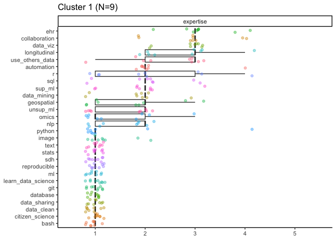

    ## 
    ## [[1]]$relevance

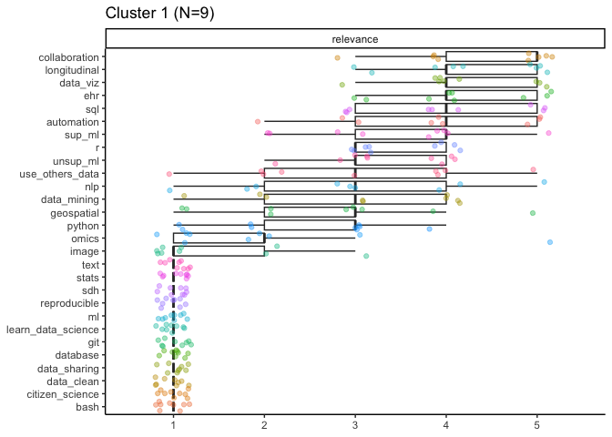

    ## 
    ## [[1]]$learn

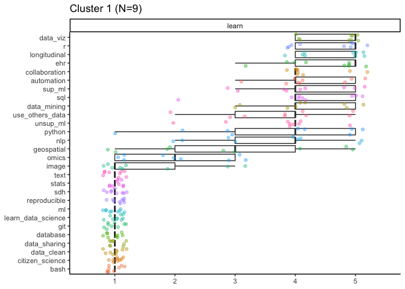

    ## 
    ## 
    ## [[2]]
    ## [[2]]$expertise


    ## 
    ## [[2]]$relevance

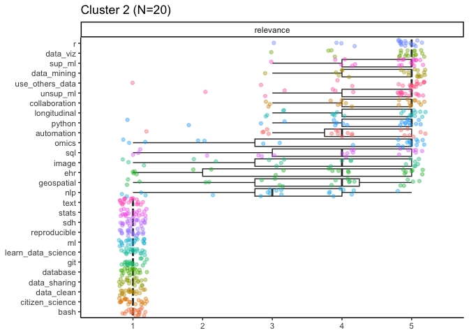

    ## 
    ## [[2]]$learn


    ## 
    ## 
    ## [[3]]
    ## [[3]]$expertise

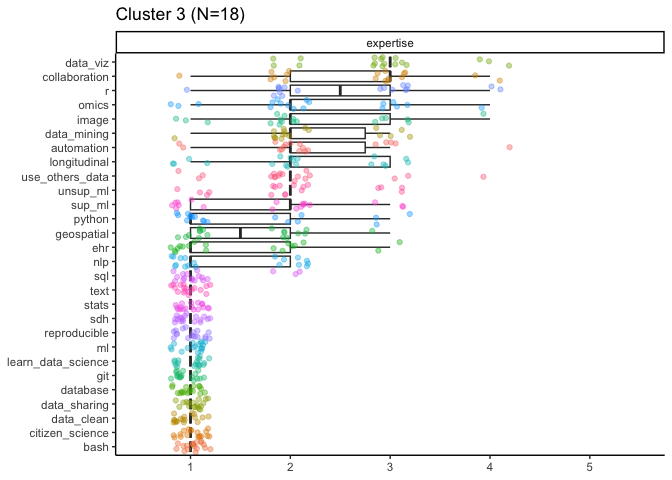

    ## 
    ## [[3]]$relevance

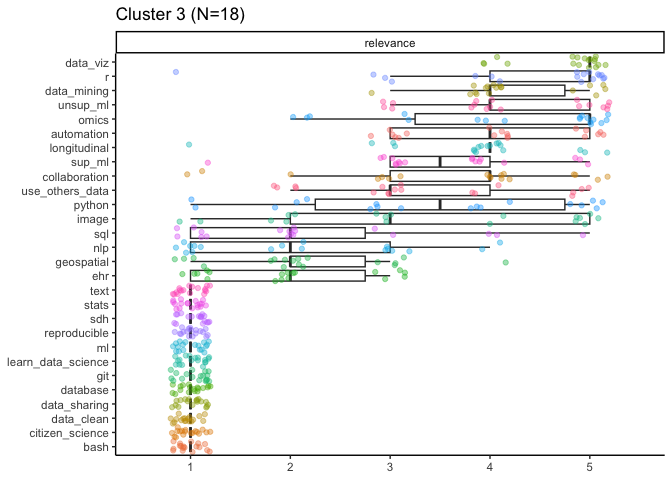

    ## 
    ## [[3]]$learn


    ## 
    ## 
    ## [[4]]
    ## [[4]]$expertise


    ## 
    ## [[4]]$relevance


    ## 
    ## [[4]]$learn


    ## 
    ## 
    ## [[5]]
    ## [[5]]$expertise


    ## 
    ## [[5]]$relevance


    ## 
    ## [[5]]$learn


    ## 
    ## 
    ## [[6]]
    ## [[6]]$expertise

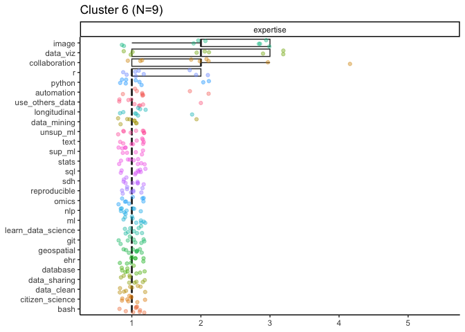

    ## 
    ## [[6]]$relevance

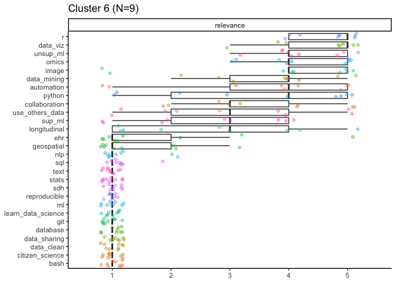

    ## 
    ## [[6]]$learn


    ## 
    ## 
    ## [[7]]
    ## [[7]]$expertise

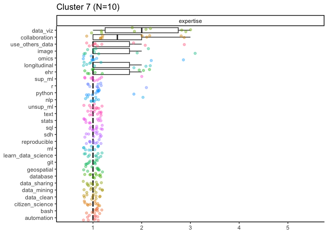

    ## 
    ## [[7]]$relevance

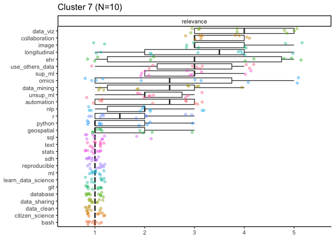

    ## 
    ## [[7]]$learn


    ## 
    ## 
    ## [[8]]
    ## [[8]]$expertise

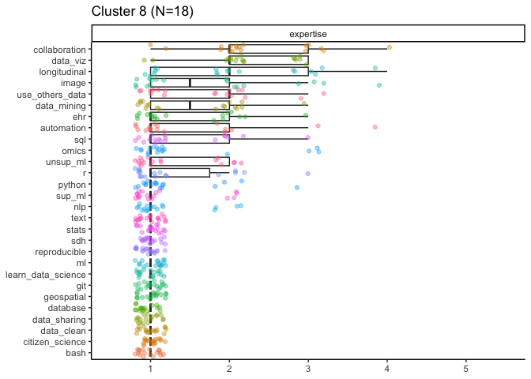

    ## 
    ## [[8]]$relevance


    ## 
    ## [[8]]$learn


### 9 cluster solution

``` r
rank_topics(needs_assessment_long, cluster = group9, n_cluster = 9)
```

    ## [[1]]
    ## [[1]]$expertise


    ## 
    ## [[1]]$relevance


    ## 
    ## [[1]]$learn


    ## 
    ## 
    ## [[2]]
    ## [[2]]$expertise


    ## 
    ## [[2]]$relevance


    ## 
    ## [[2]]$learn


    ## 
    ## 
    ## [[3]]
    ## [[3]]$expertise


    ## 
    ## [[3]]$relevance


    ## 
    ## [[3]]$learn


    ## 
    ## 
    ## [[4]]
    ## [[4]]$expertise


    ## 
    ## [[4]]$relevance


    ## 
    ## [[4]]$learn


    ## 
    ## 
    ## [[5]]
    ## [[5]]$expertise


    ## 
    ## [[5]]$relevance


    ## 
    ## [[5]]$learn


    ## 
    ## 
    ## [[6]]
    ## [[6]]$expertise


    ## 
    ## [[6]]$relevance


    ## 
    ## [[6]]$learn


    ## 
    ## 
    ## [[7]]
    ## [[7]]$expertise


    ## 
    ## [[7]]$relevance


    ## 
    ## [[7]]$learn


    ## 
    ## 
    ## [[8]]
    ## [[8]]$expertise


    ## 
    ## [[8]]$relevance


    ## 
    ## [[8]]$learn


    ## 
    ## 
    ## [[9]]
    ## [[9]]$expertise


    ## 
    ## [[9]]$relevance


    ## 
    ## [[9]]$learn


