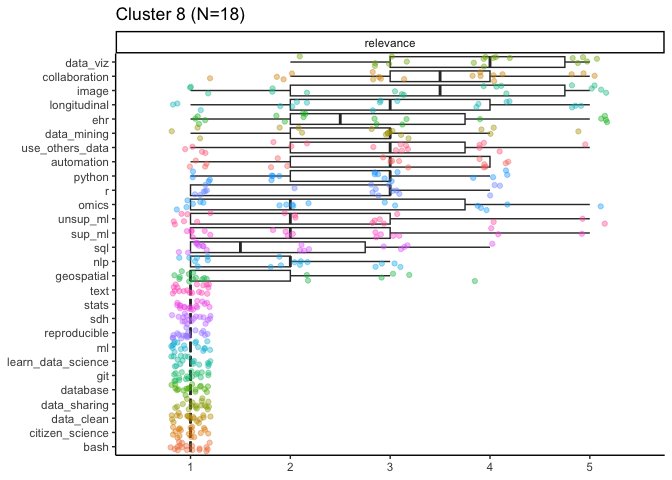

<!--

author:   Rose Hartman
email:    harmtanr1@chop.edu
version:  0.0.0
module_template_version: 3.0.0
language: en
narrator: UK English Female
title: Module Title
comment:  This is a short, focused description of the module.

link:  https://storage.googleapis.com/chop-dbhi-arcus-education-website-assets/css/styles.css

script: https://kit.fontawesome.com/83b2343bd4.js

-->

Note: This report will eventually look best [rendered by liascript](https://liascript.github.io/course/?https://raw.githubusercontent.com/arcus/DART_wave1_analysis/main/reports/notebooks/proposed_pathways.md), but right now it won't work since this is a private repo.

# Proposed pathways for DART Wave 1

For each cluster described here, there are three plots at the beginning showing the **topics in the order that cluster rated them** from highest to lowest for each of current expertise, relevance to work, and desire to learn.

We want to select modules for each cluster that will meet their learning needs and goals, as shown in the highest rated topics for learn and relevance, and are a good fit for their current level of expertise, probably the lower rated expertise topics.  

Note: The plots in this report are generated by `explore_clusters.rmd`.

## Modules for everyone

The only universal module is reproducibility, because we want to use that to set the tone for everyone.

Learning to learn and how to troubleshoot will be included for beginners, but not more experienced learners.
Citizen science will be included wherever it feels like there's interest or some room to fill in a pathway.

## Some questions to consider

- how many modules per pathway? I've been shooting for 16-ish
- ordering: I could very well be misinterpreting/misremembering the "level" of modules (how advanced) --- keep an eye out for silly ordering, like where a very basic module is placed at the end of a sequence when it should be at the beginning.
- language-agnostic modules: Where to fit them wrt the R/python sequences?

  - directories and file paths (15 min)
  - tidy data (45 min)
  - data storage models (30 min)
  - others?

## Cluster 1

This cluster reports higher levels of expertise with EHR and data visualization, but medium-low expertise in R and SQL and low in python, so they may have been working mostly with non-open source software so far.

SQL is rated as highly relevant to their current work (and high interest in learning) --- good opportunity for learning there, hopefully helping them do more things with EHR.

High interest in learning R and data visualization.

### Modules they might like

- SQL: everything we've got!
- Data viz in open source software, then data viz in ggplot2
- R sequence: everything we've got!
- git: at least get them started

### Red pathway (885 min)

**Welcome** (60 min)

- reproducibility (60 min)

**Learn SQL** (220 min)

- sql basics (60 min)
- SQL Intermediate (60 min)
- Database normalization (40 min)
- SQL Joins (60 min)

**Learn R** (365 min)

- R Basics: Transform Data (60 min)
- R Basics: Visualize Data (60 min)
- Reshaping data in R: long and wide (60 min)
- Data viz in open source software (20 min)
- data viz in ggplot2 (60 min)
- missing values in R (45 min)
- R practice (60 min)

**Learn git** (155-165 min)

- Intro to version control (10 min)
- Setting up git (Mac/Windows) (15 - 25 min)
- bash 101 (40 min)
- creating a git repo (60 min)
- exploring history of a git repo (30 min)

**More to Explore** (85 min)

- citizen science (45 min)
- research data management basics (40 min)

## Cluster 2

This cluster has very low to low expertise on most items, except medium expertise in data viz and collaboration, and medium-low in R.

They report very high relevance for almost everything! Especially R and data visualization, and (to a lesser extent but still high) python and SQL.
Very high relevance for machine learning tasks --- seems like python would be useful to lay the groundwork for them in this area.

Extremely high interest in learning basically everything, bless them.

Overall, this group seems like very enthusiastic beginners.
No need to convince them of the importance of these tools and techniques, but they don't have much experience with them yet.
Probably focus on building skill in R and python, but skip bash for now.

### Modules they might like

- Data viz with open source tools, then both seaborn and ggplot2 data viz modules to follow
- Intro content for everything: omics, geospatial, etc.
- R, python, and SQL sequences

### Orange pathway (925 min)

**Welcome** (80 min)

- reproducibility (60 min)
- learning to learn data science (20 min)

**Intro to Python** (110 min)

- demystifying python (20 min)
- python basics: writing python code (60 min)
- how to troubleshoot (30 min)

**Data transformation in R and Python** (270 min)

- R Basics: Transform Data (60 min)
- tidy data (45 min)
- Reshaping data in R: long and wide (60 min)
- Transform data with pandas (60 min)
- missing values in R (45 min)

**Data visualization in R and Python** (200 min)

- R Basics: Visualize Data (60 min)
- data viz in open source software (20 min)
- data viz in ggplot2 (60 min)
- data viz in seaborn (60 min)

**Hands-on Practice** (120 min)

- python practice (60 min)
- R practice (60 min)

**More to Explore** (145 min)

- Statistical tests in open source software (20 min)
- omics orientation (15 min)
- intro to version control (10 min)
- demystifying geospatial data (15 min)
- demystifying sql (40 min)
- citizen science (45 min)

## Cluster 3

This is a group with medium expertise on several topics, including R, data viz, omics, and image analysis.

High relevance for some machine learning tasks, R, data viz, omics, and automation.

High interest in learning omics, but they're not beginners so probably not a good fit for the omics material we have ready now.

This seems like a good bash group --- medium low expertise in automation, but high relevance and high desire to learn.
Also high interest in learning data mining and omics, both of which will benefit from some bash.
Also high interest in collaboration, so git makes sense.
Python seems like a good fit, too --- low expertise, and medium high interest in learning (relevance is spread pretty evenly from low to high).
Also want to learn R.

### Modules they might like

- Bash and git: everything we've got!
- R: Some may need basics, others may be ready to jump right into next level content. Maybe include an "optional" R basics chapter?
- python: start with demystifying, give them everything we've got
- data viz: both R and python

### Yellow pathway (1040 min)

**Welcome** (60 min)

- reproducibility (60 min)

**Learn Python** (185 min)

- demystifying python (20 min)
- python basics: writing python code (60 min)
- tidy data (45 min)
- transforming data with pandas (60 min)

**Command line and Git** (325-335 min)

- Setting up git (Mac/Windows) (15 - 25 min)
- bash 101 (40 min)
- creating a git repo (60 min)
- exploring history of a git repo (30 min)
- bash 102 (30 min)
- bash 103 (30 min)
- bash conditionals and loops (60 min)
- bash scripts (60 min)

**Working with Data in R** (125 min)

- Missing values in R (45 min)
- Reshaping data in R: long and wide (60 min)
- statistical tests in open source software (20 min)

**Data visualization** (140 min)

- data viz in open source software (20 min)
- data viz in ggplot2 (60 min)
- data viz in seaborn (60 min)

**Hands-on Practice** (120 min)

- python practice (60 min)
- R practice (60 min)

**More to Explore** (85 min)

- citizen science (45 min)
- research data management basics (40 min)

## Cluster 4

Very small cluster (just two people).

High expertise across most topics, including omics and ML tasks.
Both gave 5's for automation, so they clearly have some programming skills.
R, python, and SQL expertise are split --- one person (record 203) has 5's for all three, while the other (record 18) has 3, 2, and 1, respectively.  

Very high (5) interest in learning literally everything, except record 18 doesn't want to learn geospatial or NLP (1's).

Overall, 203 is high expertise on almost everything and high interest in learning almost everything --- they would want advanced modules, presumably, which we don't have a lot of.
18 seems like a good fit for R, python, and SQL modules, especially those with more advanced content.

(FWIW, I double checked and 203 rated themselves 2 on both skills check questions in the screener, so...?)

### Modules they might like

This cluster is tricky.
I think 203 just wants as much of a challenge as possible, but there's nothing about their pattern of responses to help us figure out what to prioritize.
So for 18, here's what seems good:

- SQL, everything we've got
- python, skip demystifying but everything else
- Skip R basics, but include all advanced R modules
- bash and git

### Green pathway (955 min)

**Welcome** (60 min)

- reproducibility (60 min)

**Learn SQL** (220 min)

- sql basics (60 min)
- SQL Intermediate (60 min)
- Database normalization (40 min)
- SQL Joins (60 min)

**Data Science in Python** (265 min)

- tidy data (45 min)
- transforming data with pandas (60 min)
- data viz in open source software (20 min)
- data viz in seaborn (60 min)
- statistical tests in open source software (20 min)
- python practice (60 min)

**Command Line and Git** (325-335 min)

- Setting up git (Mac/Windows) (15 - 25 min)
- bash 101 (40 min)
- creating a git repo (60 min)
- exploring history of a git repo (30 min)
- bash 102 (30 min)
- bash 103 (30 min)
- bash conditionals and loops (60 min)
- bash scripts (60 min)

**More to Explore** (85 min)

- citizen science (45 min)
- research data management basics (40 min)

Possibly also good:

- data viz in ggplot2 (60 min)
- Reshaping data in R: long and wide (60 min)

## Cluster 5

Medium to low expertise on most topics --- they're not novices.
R and SQL expertise is medium to low, python lower.
Very little omics.
Relatively high expertise with EHR --- no one in this cluster rated it 1 (very low), and they also have medium expertise in related topics like collaboration, longitudinal data, using others' data, and data mining.

Automation looks like a good opportunity --- low expertise but high relevance for most people.

Very high interest in learning pretty much everything.
Python, definitely --- all rated it 5 for desire to learn despite generally low expertise (relevance at work is spread pretty evenly from 1 to 5).

### Modules they might like

- Python: everything we've got!
- SQL: maybe skip demystifying, but everything else
- Bash
- some R if there's space
- Tidy data (or is it too basic?)
- Database normalization (or is it too basic?)
- git
- geospatial

### Teal pathway (1005 min)

**Welcome** (60 min)

- reproducibility (60 min)

**Learn Python** (260 min)

- demystifying python (20 min)
- python basics: writing python code (60 min)
- transforming data with pandas (60 min)
- data viz in seaborn (60)
- practice python (60 min)

**Learn SQL** (220 min)

- sql basics (60 min)
- SQL Intermediate (60 min)
- Database Normalization (40 min)
- SQL Joins (60 min)

**Command Line and Git** (325-335 min)

- Setting up git (Mac/Windows) (15 - 25 min)
- bash 101 (40 min)
- creating a git repo (60 min)
- exploring history of a git repo (30 min)
- bash 102 (30 min)
- bash 103 (30 min)
- bash conditionals and loops (60 min)
- bash scripts (60 min)

**Geospatial Data** (75 min)

- demystifying geospatial data (15 min)
- encoding geospatial data (15 min)
- elements of maps (45 min)

**More to Explore** (65 min)

- statistical tests in open source software (20 min)
- citizen science (45 min)

## Cluster 6

Very low expertise on most topics, except image analysis (medium to low), data viz (low) and collaboration (low).

Selective --- only rated about half the topics as very high interest in learning (especially R and data viz, but also python and omics).

R, definitely.
Very high relevance at work, very low expertise, and very high interest in learning.
Because they're low expertise in general, make R the core and let them build up skills there, especially data viz (also very high interest).
Include intro python and data viz in seaborn, but skip more involved python content.

### Modules they might like

- R: start at the beginning, give them everything.
- Data viz: intro, r, python
- demystifying modules
- directories and file paths

### Blue pathway (1020 min)

**Welcome** (95 min)

- reproducibility (60 min)
- learning to learn data science (20 min)
- directories and file paths (15 min)

**Intro to R** (180 min)

- R Basics: Intro (60 min)
- R Basics: Transform Data (60 min)
- R Basics: Visualize Data (60 min)

**Using R for data visualization and analysis** (325 min)

- how to troubleshoot (30 min)
- Missing values in R (45 min)
- tidy data (45 min)
- Reshaping Data in R: long and wide (60 min)
- data viz in open source software (20 min)
- data viz in ggplot2 (60 min)
- statistical tests in open source software (20 min)

**Try it in Python** (200 min)

- demystifying python (20 min)
- python basics: writing code (60 min)
- transform data with pandas (60 min)
- data viz in seaborn (60 min)

**Hands-on Practice** (120 min)

- python practice (60 min)
- R practice (60 min)

**More to Explore** (100 min)

- elements of maps (45 min)
- omics orientation (15 min)
- research data management basics (40 min)
- citizen science (45 min)

## Cluster 7

Generally very low expertise on most topics, with the exception of data viz (low).

Also pretty low relevance for most topics except data viz,  collaboration, and image analysis.
Spread on omics from 1-5 for both relevance and desire to learn.
Mostly very low omics expertise.

Medium to low desire to learn for most topics except data viz, collaboration, using others' data, and image analysis (medium high).
They seem unconvinced overall.

### Modules they might like

- demystifying modules
- omics orientation (15 min)

### Indigo pathway (845 min)

**Welcome** (95 min)

- reproducibility (60 min)
- learning to learn data science (20 min)
- directories and file paths (15 min)

**Intro to R** (180 min)

- R Basics: Intro (60 min)
- R Basics: Transform Data (60 min)
- R Basics: Visualize Data (60 min)

**Using R for data visualization and analysis** (385 min)

- how to troubleshoot (30 min)
- Missing values in R (45 min)
- tidy data (45 min)
- Reshaping Data in R: long and wide (60 min)
- data viz in open source software (20 min)
- data viz in ggplot2 (60 min)
- statistical tests in open source software (20 min)
- R practice (60 min)

**More to Explore** (185 min)

- elements of maps (45 min)
- demystifying python (20 min)
- demystifying sql (40 min)
- demystifying geospatial data (15 min)
- omics orientation (15 min)
- research data management basics (40 min)
- intro to version control (10 min)
- citizen science (45 min)

Possibly also good:

- transform data with pandas (60 min)

## Cluster 8

Mostly low to very low expertise, except for collaboration and data viz (low to medium).

Wide spread on relevance for most items.

High or very high interest in learning most topics, especially python and data viz.

Python should be the core: Mostly very low expertise, but very high interest in learning.

### Modules they might like

- python: Start at the beginning and give them everything!
- geospatial: everything we've got!
- demystifying modules, intros for everything

### Violet pathway (920-930 min)

**Welcome** (95 min)

- reproducibility (60 min)
- learning to learn data science (20 min)
- directories and file paths (15 min)

**Learn Data Science in Python** (355 min)

- demystifying python (20 min)
- python basics: writing python code (60 min)
- how to troubleshoot (30 min)
- tidy data (45 min)
- transform data with pandas (60 min)
- data visualization in open source software (20 min)
- data viz in seaborn (60 min)
- python practice (60 min)

**Try it in R** (180 min)

- R Basics: Intro (60 min)
- R Basics: Transform Data (60 min)
- R Basics: Visualize Data (60 min)

**Version Control with Git** (115-125 min)

- intro to version control (10 min)
- Setting up git (Mac/Windows) (15 - 25 min)
- creating a git repo (60 min)
- exploring the history of a git repo (30 min)

**Geospatial Data** (75 min)

- demystifying geospatial data (15 min)
- encoding geospatial data (15 min)
- elements of maps (45 min)

**More to Explore** (100 min)

- demystifying sql (40 min)
- omics orientation (15 min)
- citizen science (45 min)

## About deciding on the clustering solution

The hierarchical clustering analysis produces one hierarchical tree, where each individual participant is their own group at the bottom and everyone is lumped into one group at the top (so the tree is upside down, I guess).

<b style="color: rgb(var(--color-highlight));">Behind the scenes</b> 

You can "cut" the tree horizontally at any point going up the y-axis; a lower cut will give you more groups, and a higher cut will give you fewer groups.
As you move higher, the lower groups come together to form the higher groups (the structure is hierarchical).
So you might cut the tree to give you four groups, A, B, C, and D, but if you cut it lower to get five groups then one of the previous ones will split into two --- maybe group C splits, so now you have A, B, C1, C2, and D.
Groups split and merge as you go up and down, but participants never jump from one branch to another.

I explored solutions with 4-9 clusters.
I was looking at the groups generated by each solution and seeing how well I could fit them to our available modules.
I checked the solution above and below to see if splitting or merging groups made it easier to define pathways.

**tldr** I landed on the eight-group solution; if you go down to a seven-group solution it combines groups 3 and 6 and they feel distinct enough to me to need different pathways, but if you go up to nine groups it splits group 8 into two groups that seem pretty similar in terms of which modules they might need.
