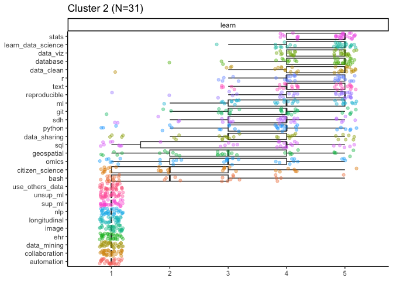
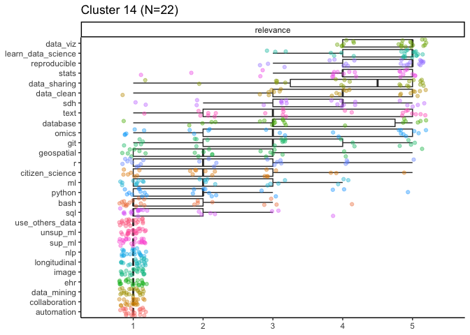

# Proposed pathways for DART Wave 2

For each cluster described here, there are three plots at the beginning showing the **topics in the order that cluster rated them** from highest to lowest for each of current expertise, relevance to work, and desire to learn.

We want to select modules for each cluster that will meet their learning needs and goals, as shown in the highest rated topics for learn and relevance, and are a good fit for their current level of expertise.  

Note: The plots in this report are generated by `explore_clusters.rmd`.

**Wondering about the exact wording of the questions?** 
Check out the [needs assessment](https://github.com/arcus/education_dart_recruitment_comms/blob/main/surveys/needs_assessment/instrument.csv) in the surveys directory on our comms repo. 
(Note that this instrument includes items from wave 1 that weren't shown to wave 2 participants -- the last column indicates which items were hidden. Wave 2 saw from `data_viz` to `learn_data_science`.)

Useful references: 

- our wave 1 pathways, as examples:  https://github.com/arcus/DART_wave1_analysis/blob/main/reports/notebooks/proposed_pathways.md
- a list of all our current modules with times: https://github.com/arcus/NALMS_Not_Another_LMS/blob/main/module_time.txt

## Modules for everyone

The only universal module is reproducibility, because we want to use that to set the tone for everyone.

Learning to learn and how to troubleshoot will be included for beginners, but not more experienced learners.

## Some questions to consider

- Did I spell flower names wrong? I am a terrible speller. 

## Cluster 1

Medium-high expertise group, especially R (~4) and reproducible methods (~4).
Also pretty high on bash, stats, and omics (3-4), and not-novice with python (mostly 2-3).

Very high relevance for reproducible, data viz, stats, data cleaning, learn data science (), R. 
High relevance for omics, python, data sharing, git, bash, ML. 

High interest in learning python (3-5, with mostly 5's), data viz, stats, omics, learn data science, reproducible, ML. 
High-ish interest in data cleaning, R, git, bash, data sharing. 

### Modules they might like

- python, skip demystifying
- seaborn
- genomics tools and methods
- containers
- stats

### aster pathway 

Welcome 

reproducibility 

Using Python for Data Analysis 

python_basics_variables_functions_methods 20 min 
python_basics_lists_dictionaries 
python_basics_loops_conditionals 
python_basics_exercise 
pandas_transform 
data_visualization_in_seaborn 
python_practice 

Containers for Reproducible Research 

demystifying_containers 
docker_101 

Genomics Tools and Methods 

genomics_setup 
genomics_quality_control 

Statistics and Machine Learning 

demystifying_machine_learning 
bias_variance_tradeoff 
intro_to_nhst 
r_summary_stats 
statistical_tests 

More to Explore 

demystifying_large_language_models 
data_management_basics 
demystifying_geospatial_data 
citizen_science 
demystifying_sql 
regular_expressions_basics 

## Cluster 2

Mostly low expertise, except data viz and stats (both ~2). In terms of programming languages, they're mostly novices (1's) on python, SQL, bash, git, and also mostly 1s on R but some people rating it a little higher (~2).

High relevance and desire to learn stats, learn data science, data viz, database, data cleaning, R, and text. 

### Modules they might like

- demystifying
- R sequence, start with intro
- intro to nhst
- statistical tests
- data viz R

### Joy's suggestion:

**985 mins**

* Full Welcome (110 m)
* Foundations in Regex (120 m)
* Full databases (260 m)
* Full R (435 m)
* Foundations in Stats (60 m)

### azalea pathway 

Welcome 

reproducibility 
learning_to_learn 
how_to_troubleshoot 

Text Patterns 

demystifying_regular_expressions 
regular_expressions_basics 
regular_expressions_groups 

Databases 

demystifying_sql 
sql_basics 
sql_intermediate 
database_normalization 
sql_joins

R Language 

r_basics_introduction 
r_basics_visualize_data 
r_basics_transform_data 
r_missing_values 
r_reshape_long_wide
r_summary_stats 
data_visualization_in_ggplot2 
r_practice 

Statistics

intro_to_nhst 
statistical_tests 

## Cluster 3

One of our more "unconvinced" clusters. Low expertise on most topics except data viz, text and stats (all ~2). Seem to be new to programming (mostly 1s on R, python, SQL, and bash).

Medium relevance on most topics; they might be working mostly on non-data science research questions currently and trying to figure out if/how to approach data science. Generally pretty high relevance on learn data science (~4), though, as well as data viz, text, stats, and database. 

### Modules they might like

- regex! let's give them something texty to think about while they learn programming
- R, starting with intro
- intro to nhst
- statistical tests
- data viz in R stuff

### Joy's suggestion:

**910 mins**

* Full Welcome (110 m)
* Machine Learning First Steps (140 m)
* Full R (435 m)
* Full Regex (165 m)
* Foundations in Stats (60 m)

### begonia pathway 

Welcome 

reproducibility 
learning_to_learn 
how_to_troubleshoot 

Machine Learning First Steps 

demystifying_machine_learning 
bias_variance_tradeoff 
demystifying_large_language_models 

R Language 

r_basics_introduction 
r_basics_visualize_data 
r_basics_transform_data 
r_missing_values 
r_reshape_long_wide 60 min 
r_summary_stats 
data_visualization_in_ggplot2 
r_practice 

Text Patterns 

demystifying_regular_expressions 
regular_expressions_basics 
regular_expressions_groups 
regular_expressions_boundaries_anchors 
regular_expressions_lookaheads 

Statistics 60 min 

intro_to_nhst 
statistical_tests 

## Cluster 4

This is one of the most distinct clusters (it appears high in the hierarchical tree).
Generally low-ish expertise except for reproducibility (3-4), stats (~3), and data viz (~3). These might be people with training in tools we don't teach (e.g. Stata, SAS).
They're showing strong enthusiasm for reproducible methods now though! 

Very high relevance for reproducibility, learn data science ("Figure out which data science techniques and tools will be most useful in your research"), data viz, stats. 
High relevance for omics, data sharing, R, data cleaning. 

Very high interest in learning R (expertise ~2, but several 1's as well), stats (~3 expertise), data viz, and learn_data_science (expertise 1-3). 
High interest in data cleaning, ML, omics, and data sharing.
High-ish interest on pretty much everything else. 

### Modules they might like

- R sequence, probably include intro
- data viz in R
- demystifyings on a bunch of different topics
- stats
- containers (for reproducibility)?

### Joy Suggests

**925 minutes**

* Full Welcome (110 m)
* Reproducibility Practices (180 m)
* Statistics (60 min)
* Getting Started with Genomics (305 m)
* R Basics (180 min)
* Survey of Other Topics (90 min)

### camellia pathway 

Welcome 

reproducibility 
learning_to_learn 
how_to_troubleshoot 

Reproducibility Practices 

data_management_basics 
git_intro 
demystifying_containers 
docker_101 
tidy_data 

Statistics 60 min 

intro_to_nhst 
statistical_tests 

Getting Started with Genomics 305

omics_orientation 
bash_command_line_101 
bash_command_line_102 
bash_103_combining_commands 
bash_conditionals_loops 
bash_scripts 
genomics_setup 
genomics_quality_control 

R Basics 

r_basics_introduction 
r_basics_visualize_data 
r_basics_transform_data 

Survey of Other Topics 90 m 

demystifying_python 
demystifying_regular_expressions 
demystifying_sql 

## Cluster 5

Overall medium to medium-low expertise on most topics, not novices. Few 1's on expertise except for SDH, geospatial and citizen science. Otherwise they appear to have pretty broad experience. 

Very high relevance for almost everything except SDH, citizen science, and geospatial. 

Very high interest in most topics, but especially stats, R (expertise ~3), ML, bash (expertise 2-3), python, reproducibility, data viz, and database. 
Mostly very high interest (i.e. lots of 5's, but some spread of 1-4's) in omics, git, data cleaning, text, SQL, data sharing. 

### Modules they might like

- non-intro R
- data viz in R
- data viz with seaborn (maybe this is their only python module, if there's no other space)
- everything stats and ML
- non-intro bash
- omics

### Joy Suggests 

**950 minutes**

* Short Welcome (60 min)
* Full reproducibility (180 min)
* Statistics (60 min)
* Getting Started with Genomics (305 min)
* R Coding Topics (165 min)
* Python Coding Topics (180 min)

### crocus pathway 

Welcome 

reproducibility 

Reproducibility Practices 

data_management_basics 
git_intro 
demystifying_containers 
docker_101 
tidy_data 

Statistics 60 min 

intro_to_nhst 
statistical_tests 

Getting Started with Genomics 305

omics_orientation 
bash_command_line_101 
bash_command_line_102 
bash_103_combining_commands 
bash_conditionals_loops 
bash_scripts 
genomics_setup 
genomics_quality_control 

Machine Learning First Steps 

demystifying_machine_learning 
bias_variance_tradeoff 
demystifying_large_language_models 

R Coding Topics 

r_missing_values 
r_reshape_long_wide 
r_practice 60 min 

Python Coding Topics 

pandas_transform 
data_visualization_in_seaborn 
python_practice 

## Cluster 6

This is one of the most distinct clusters (it appears high in the hierachical tree).
Mostly medium-low expertise group, with focused interest in omics. 

Very high interest in learning omics in particular, and mostly 1s on expertise for it. 
High interest in R (expertise 1-2), stats, data viz. 

### Modules they might like

- everything omics
- r
- bash (they're lukewarm on this per se, but they'll need it for omics)

### daffodil pathway 890

Welcome 
reproducibility 
learning_to_learn 
how_to_troubleshoot 
directories_and_file_paths 
data_management_basics 

Getting Started with Genomics 305
omics_orientation 
bash_command_line_101 
bash_command_line_102 
bash_103_combining_commands 
bash_conditionals_loops 
bash_scripts 
genomics_setup 
genomics_quality_control 

Using R for Data Analysis 
r_basics_introduction 
r_basics_visualize_data
r_basics_transform_data  
r_missing_values 
tidy_data 
r_reshape_long_wide 
r_summary_stats 
r_practice 

## Cluster 7

Medium expertise overall, with medium-high expertise on data cleaning, text, and database. 

Very high relevance for stats, data viz, data cleaning, text, database.
High relevance for data sharing, SDH, R.

Very high interest in learning data viz and stats in particular. 
High interest in R (expertise mostly 1s), database, data clean, SDH. 
High-ish interest in text, SQL. 

### Modules they might like

- r basics
- everything stats
- data viz in R
- regex

### dahlia pathway 865

Welcome 
reproducibility 

Using R for Data Analysis 
r_basics_introduction 
r_basics_visualize_data 
r_basics_transform_data 
r_missing_values 
tidy_data 
r_reshape_long_wide 
r_summary_stats 
data_visualization_in_ggplot2 
r_practice 

Statistics and Machine Learning 140
intro_to_nhst 
statistical_tests 
demystifying_machine_learning 
bias_variance_tradeoff 

Text Patterns 
demystifying_regular_expressions 
regular_expressions_basics 
regular_expressions_groups 
regular_expressions_boundaries_anchors 
regular_expressions_lookaheads 

## Cluster 8

This is one of the most distinct clusters (it appears high in the hierachical tree).
A small cluster (n=4), and they're absolute beginners! 1's on everything for expertise (although remember we impute 1 for missing values on this instrument, so some of these may be true 1's and some could have been left blank).
Also 1's on learn for everything! We've got relevance info to work with, though.

High-ish relevance for stats, reproducibility, data cleaning, ML, and data viz. 

### Modules they might like

- demystifyings
- intro to NHST
- tidy data

### daisy pathway 925

Welcome 
reproducibility 
learning_to_learn 
how_to_troubleshoot 
directories_and_file_paths 

Managing Data 
data_management_basics 
tidy_data 
database_normalization 

Different Kinds of Data 
demystifying_sql 
demystifying_geospatial_data 
citizen_science 
omics_orientation 

Getting Started with R
r_basics_introduction 
r_basics_visualize_data 
r_basics_transform_data 

Statistics and Machine Learning
intro_to_nhst 
statistical_tests 
demystifying_machine_learning 
bias_variance_tradeoff 
demystifying_large_language_models 

## Cluster 9

This is an enthusastic group. :) They rate almost every topic as 5 for both relevance and learn (except bash, sorry bash). 
Medium-high to medium expertise on most topics, but less so on programming skills: R is pretty evenly spread 1-4, SQL and bash 1-3, and python is mostly 1s. 
Either they're used to working with other programming tools (e.g. Stata, Matlab) or they're pretty new to programming. 
They rate themselves higher expertise on reproducibility, data cleaning, database, SDH, data viz, data sharing, and learn data science. 
Most have at least some experience with text, stats, R, and geospatial. 

High interest in learning almost everything, but especially learn data science, stats, data viz, data clean, git, reproducible, and data sharing. 

### Modules they might like

- R, definitely
- data viz in R
- tidy data
- git!
- geospatial
- database_normalization

### geranium pathway 835

Welcome 
reproducibility 

Using git for Version Control 160-170
git_intro 
git_setup_mac_and_linux 
git_setup_windows 
bash_command_line_101 
git_creation_and_tracking 
git_history_of_project 

Using R for Data Analysis 
r_basics_introduction 
r_basics_visualize_data
r_basics_transform_data  
r_missing_values 
tidy_data 
r_reshape_long_wide 
r_summary_stats 
data_visualization_in_ggplot2 
r_practice 60 min 
intro_to_nhst 
statistical_tests 

Geospatial Data 
demystifying_geospatial_data 
elements_of_maps 
geocode_lat_long 

## Cluster 10

Overall medium expertise, R users (~3, but there are people at both 1 and 5). 
Pretty high expertise in data cleaning (3-4), stats (3-4), and data viz (~3). 

They rate data cleaning very high on relevance. 

Very interested in learning database (expertise 2-3), git (expertise 2-3), data viz, SQL (expertise 1-3), python (expertise 1-3).

### Modules they might like

- git sequence
- database_normalization
- SQL, eveything we've got!
- python
- seaborn data viz

### iris pathway

Total 1065-

Welcome 

reproducibility 

Databases 

demystifying_sql 
sql_basics 
sql_intermediate 
database_normalization 
sql_joins 60m 

Python 

demystifying_python 
python_basics_variables_functions_methods 20 min 
python_basics_lists_dictionaries 
python_basics_loops_conditionals 
python_basics_exercise 
pandas_transform 
data_visualization_in_seaborn 
python_practice 

Statistics and ML 

statistical_tests 
demystifying_machine_learning 
bias_variance_tradeoff 
intro_to_nhst 

Reproducibility Practices 

data_management_basics 
demystifying_containers 
docker_101 
tidy_data 

Learn git 155-

git_intro 
git_setup_mac_and_linux 
git_setup_windows 
bash_command_line_101 
git_creation_and_tracking 
git_history_of_project 

## Cluster 11

Medium-high expertise across the board, very few 1's for expertise, plenty of 4's and 5's. 
Especially high in data cleaning, SQL, and reproducibility.

git shows up quite high for relevance, as does SQL, stats, data viz, and data cleaning. 

High interest in learning most things, especially stats (expertise is mostly 2-4 on stats), data viz (expertise 3-4), ML (expertise ~3), data cleaning (expertise 4-5), reproducibility (expertise ~4), python (expertise 3-4), and omics (expertise 2-3). 

This is a group that would probably like some modules we don't have ready, especially non-intro stats and ML content. 

### Modules they might like

- genomics
- statistical tests
- data viz (prob python)
- ML? too basic?
- Intro to NHST? too basic?

### jasmine pathway

Total 

Welcome 

reproducibility 

Statistics 

demystifying_machine_learning 
bias_variance_tradeoff 
intro_to_nhst 
statistical_tests 

Data analysis in Python 

pandas_transform 
data_visualization_in_seaborn 
python_practice 

Containers for Reproducible Research 

demystifying_containers 
docker_101 

Genomics and the command line 

omics_orientation 
bash_command_line_101 
bash_command_line_102 
bash_103_combining_commands 
bash_conditionals_loops 
bash_scripts 
genomics_setup 
genomics_quality_control 

Text Patterns 

demystifying_regular_expressions 
regular_expressions_basics 
regular_expressions_groups 
regular_expressions_boundaries_anchors 
regular_expressions_lookaheads 

## Cluster 12

Generally medium-low expertise, with the exception of reproducibility and data viz (both ~3), and stats and bash (both mostly 2-3). 

In terms of languages, R is ~2 (although there are plenty of 1's), python is mostly 1's but there's some spread with a number of 2's and 3's, too. R and python both rated as highly relevant by most people. 

Reproducibilty, data viz, stats, and omics all rated as highly relevant. 

Very high interest in learning omics. 
High interest in stats, data viz, reproducibility, data cleaning, R, python, git and ML.  

### Modules they might like

- genomics tools and methods
- R and python

### lavender pathway

Total 1385-

Welcome 

reproducibility 

Python 

demystifying_python 
python_basics_variables_functions_methods 20 min 
python_basics_lists_dictionaries 
python_basics_loops_conditionals 
python_basics_exercise 
pandas_transform 
data_visualization_in_seaborn 
python_practice 

Genomics and the command line 

bash_command_line_101 
bash_command_line_102 
bash_103_combining_commands 
bash_conditionals_loops 
bash_scripts 
genomics_setup 
genomics_quality_control 

Statistics 

demystifying_machine_learning 
bias_variance_tradeoff 
intro_to_nhst 
statistical_tests 

Learn R 

r_basics_introduction 
r_basics_visualize_data 
r_basics_transform_data 
r_missing_values 
tidy_data 
r_reshape_long_wide 
data_visualization_in_ggplot2 
r_practice 

Learn git (160-170 min)

git_intro 
git_setup_mac_and_linux 
git_setup_windows 
bash_command_line_101 
git_creation_and_tracking 
git_history_of_project 

## Cluster 13

Medium high expertise (3-4) on many topics, especially SDH, text, stats, reproducibility, data viz and data cleaning. 

Mediumish relevance on most topics. 

Very interested in learning git (expertise ~3)! 
Also data viz (expertise ~3)! 
Also almost everything else :) 

As to programming languages, R seems like the way to go (expertise 2-3 ish, vs python which has a lot of 1's). R relevance is on the low side, though (mostly 1-3), so good idea to start with the basics. 

### Modules they might like

- lots of r stuff, but maybe skip intro
- data viz
- git!
- containers? because collaborating

### lily pathway

Total 995-

Welcome 

reproducibility 

Learn R 

r_basics_visualize_data 
r_basics_transform_data 
r_missing_values 
tidy_data 
r_reshape_long_wide 
data_visualization_in_ggplot2 
r_summary_stats 
r_practice 

Learn git (160-170 min)

git_intro 
git_setup_mac_and_linux 
git_setup_windows 
bash_command_line_101 
git_creation_and_tracking 
git_history_of_project 

Containers for Reproducible Research 

demystifying_containers 
docker_101 

Text Patterns 

demystifying_regular_expressions 
regular_expressions_basics 
regular_expressions_groups 
regular_expressions_boundaries_anchors 
regular_expressions_lookaheads 

More to explore 80

demystifying_large_language_models 
citizen_science 
demystifying_geospatial_data 

## Cluster 14

Medium-low expertise in general, appear to be programming novices. 
Higher for reproducibility, data viz, data sharing (all ~3), more like 2-3 for data cleaning, stats, text, and database. 
Mostly 1s for other topics, including R, SQL, python, and bash.

High relevance and learn for data viz, learn data science, reproducible, and stats. 
Low interest in learning python, SQL, and bash, some lukewarm interest in R (pretty even spread 1-5). 
Solid medium interest in learning git (3).

### Modules they might like

- git sequence
- R basics
- intro to nhst
- statistical tests
- data viz
- demystifyings

### lilac pathway

Total 915-925 minutes

Welcome 

reproducibility 
learning_to_learn 
how_to_troubleshoot 

Learn git 155-

git_intro 
git_setup_mac_and_linux 
git_setup_windows 
bash_command_line_101 
git_creation_and_tracking 
git_history_of_project 

Learn R 

r_basics_introduction 
r_basics_visualize_data 
r_basics_transform_data 

Statistics 

r_summary_stats 
intro_to_nhst 
demystifying_machine_learning 
bias_variance_tradeoff 
statistical_tests 

Managing data 

data_management_basics 
data_storage_models 
tidy_data 
database_normalization 

Different kinds of data 

demystifying_sql 
demystifying_geospatial_data 
demystifying_regular_expressions 
citizen_science 
omics_orientation 

## Cluster 15

Medium to medium-low expertise in general. 
Medium expertise (~3) in stats, reproducibility, data viz, learn data science, and data cleaning. 
Python and bash users (expertise 2-4). 

High relevance and learn for stats, data viz, and python especially, and to a lesser extent git, data cleaning, and bash. Some non-zero expertise, relevance and learn for citizen science, so they might be a good cluster for that module. 

### Modules they might like

- python, probably skip demystifying
- stats and data viz content, especially in python
- git sequence
- citizen science

### lotus pathway

Total: 

Welcome 

reproducibility 

Python for Data Science 270 min 

python_basics_variables_functions_methods 20 min 
python_basics_lists_dictionaries 
python_basics_loops_conditionals 
python_basics_exercise 
pandas_transform 
data_visualization_in_seaborn 
python_practice 

Statistics 

intro_to_nhst 
demystifying_machine_learning 
bias_variance_tradeoff 
statistical_tests 

Learn git 155-

git_intro 
git_setup_mac_and_linux 
git_setup_windows 
bash_command_line_101 
git_creation_and_tracking 
git_history_of_project 

Shell Scripts 180 minutes

bash_command_line_102 
bash_103_combining_commands 
bash_conditionals_loops 
bash_scripts 

More to Explore 

citizen_science 
demystifying_large_language_models 

## Cluster 16

Mostly low expertise except reproducible, stats, and data viz (~3). 
As to languages, R expertise spread 1-4, SQL split pretty evenly between 1s and 3s, bash 1-3, python mostly 1s. 

High relevance only for stats, reproducibility, data viz, and data cleaning; maybe they're used to working in other stats software. 

This is a group who knows what they want! Very high interest in learning stats, R, SQL, data viz, ML, and slightly less so python (mostly 5's but a couple 1s and 3s). So let's give them that!

### Modules they might like

- all the stats
- all the R (probably start with intro) including data viz
- all the SQL
- all the python (start with demystifying) including data viz
- demystifying ML

### magnolia pathway

Total: 1150

NOTE: this is way over what we were planning, but many of them will breeze through intro stuff, and they did seem to want EVERYTHING...

Welcome 

reproducibility 

Learn R 

r_basics_introduction 
r_basics_visualize_data 
r_basics_transform_data 
r_missing_values 
tidy_data 
r_reshape_long_wide 
r_summary_stats 
r_practice 

Statistics 

intro_to_nhst 
demystifying_machine_learning 
bias_variance_tradeoff 
statistical_tests 

Databases 

demystifying_sql 
sql_basics 
sql_intermediate 
database_normalization 
sql_joins 60m

Learn Python 270

python_basics_variables_functions_methods 20 min 
python_basics_lists_dictionaries 
python_basics_loops_conditionals 
python_basics_exercise 
pandas_transform 
data_visualization_in_seaborn 
python_practice 

## Cluster 17

This is one of the most distinct clusters (it appears high in the hierachical tree).
Generally low expertise, but medium-low on data cleaning, stats, data viz, and reproducibility.

Very high relevance on almost everything, and rated almost everything a 5 for desire to learn, bless them. 

Because R is rated as higher relevance for most of them than python, let's start there. 
If we're looking to fill space in their pathway, they may be good ones for the regex sequence, too, since a sizeable minority of them report > 1 expertise with text.

### Modules they might like

- R stuff, starting with basics
- demystifyings
- geospatial
- citizen science

### marigold pathway

Total: 

Welcome 

reproducibility 

Learn R 

r_basics_introduction 
r_basics_visualize_data 
r_basics_transform_data 
r_missing_values 
tidy_data 
r_reshape_long_wide 
r_summary_stats 
r_practice 

Statistics 

intro_to_nhst 
demystifying_machine_learning 
bias_variance_tradeoff 
statistical_tests 

Version Control (155-165 min)

git_intro 
git_setup_mac_and_linux 
git_setup_windows 
bash_command_line_101 
git_creation_and_tracking 
git_history_of_project 

More to Explore 

demystifying_sql 
demystifying_regular_expressions 
citizen_science 
demystifying_geospatial_data 
demystifying_large_language_models 

## Cluster 18

Pretty low expertise on most topics. More R than python, but it's still mostly 1s. 

High relevance for text and database (maybe EHR folks?), also data cleaning. 

High interest in database, data cleaning, R, and text. 

### Modules they might like

- R, starting with basics
- tidy data
- database_normalization
- SQL
- regex

### peony pathway (1015 mins)

#### Welcome (125 mins)

* reproducibility 
* learning_to_learn 
* tidy_data 

#### Getting Started with R (435 mins)
* r_basics_introduction 
* r_basics_visualize_data 
* r_basics_transform_data 
* how_to_troubleshoot 
* r_missing_values 
* r_reshape_long_wide 60 min 
* data_visualization_in_ggplot2 
* r_practice 

#### Pattern Matching in Text (195 min)

* demystifying_regular_expressions 
* regular_expressions_basics 
* regular_expressions_groups 
* regular_expressions_boundaries_anchors 
* regular_expressions_lookaheads 

#### Working with Databases (260 min) 

* demystifying_sql 
* sql_basics 
* sql_intermediate 
* database_normalization 
* sql_joins 

## Cluster 19

This is a very small cluster (just 4 people), and pretty distinct (it appears back when we split from 12 to 13 clusters). 

They have high R expertise (~5), also high stats, omics, bash, and data viz.
Low experience only really on text, SDH and citizen science. 

All 5's for relevance for omics, and 4-5 for R relevance; these appear to be experienced omics researchers, and they use R. They're split on bash (three of them have 5's for relevance and expertise, the other has a 2 for relevance and 3 for expertise). 

Very interested in learning text (expertise 1-2)! 
And SQL (expertise is spread on this 2-5), python, and ML. 
Some interest in git (expertise ~3, learn is mostly 4 and 5), so maybe put that content in if we need to fill space.

### Modules they might like

- regex, definitely
- SQL
- more advanced python
- ML
- maybe git sequence

### tulip pathway (935 mins)
This group could be one that flies through their content based on incoming expertise ratings, so if we want to pad their numbers to be even higher, we could possibly add a More to explore at the end that gives them a bunch of demystifying-type content of a variety of things that perhaps they don't have interest in learning at a deep level, but might enjoy learning more about it shallowly? 

#### Reproducibility (140 mins)
( I know these folks didn't necessarily rank reproducibility as something they want to learn more about/ already ranked themselves as high expertise, _but_ I think it's possible that they could be high on reproducibility and still not yet be using containerization, depending on how they interpret our question? ) 

* reproducibility 
* demystifying_containers 
* docker_101 

#### Text Patterns (165 min)
* demystifying_regular_expressions 
* regular_expressions_basics 
* regular_expressions_groups 
* regular_expressions_boundaries_anchors 
* regular_expressions_lookaheads 

#### Databases (220 min)

* sql_basics 60 min 
* sql_intermediate 
* database_normalization 
* sql_joins 

#### Python (180 min)

* pandas_transform 1 hour 
* data_visualization_in_seaborn 60 min 
* python_practice 

#### Machine Learning (140 min)

* demystifying_large_language_models 
* demystifying_machine_learning 
* bias_variance_tradeoff 20 min 

#### git (90 mins)
( I think the earlier content in git might be too easy for them, so I hedged and only put in these two. I'm also not convinced this won't also be below their level? )
git_creation_and_tracking 
git_history_of_project 30 min 

## About deciding on the clustering solution

The hierarchical clustering analysis produces one hierarchical tree, where each individual participant is their own group at the bottom and everyone is lumped into one group at the top (so the tree is upside down, I guess).

You can "cut" the tree horizontally at any point going up the y-axis; a lower cut will give you more groups, and a higher cut will give you fewer groups.
As you move higher, the lower groups come together to form the higher groups (the structure is hierarchical).
So you might cut the tree to give you four groups, A, B, C, and D, but if you cut it lower to get five groups then one of the previous ones will split into two --- maybe group C splits, so now you have A, B, C1, C2, and D.
Groups split and merge as you go up and down, but participants never jump from one branch to another.

I explored solutions with 4-20 clusters. 
I didn't want to go above 20 clusters because 1) an average of 20 people per cluster is sort of the lowest I'm willing to go in terms of statistical power, and 2) designing more than 20 pathways feels like too big of a lift to get done in a couple days. 

I was looking at the groups generated by each solution and seeing how well I could fit them to our available modules.
I checked the solution above and below to see if splitting or merging groups made it easier to define pathways.

**tldr** I landed on the 19-group solution; if you go down to a 18-group solution it combines clusters 11 and 13, which feel distinct enough to me to need different pathways (especially since 13 seems like they'd benefit from the R and git sequences, and 11 not so much). If you go up to 20 groups, it splits cluster 12 but those two groups don't seem to have really distinct needs. 

