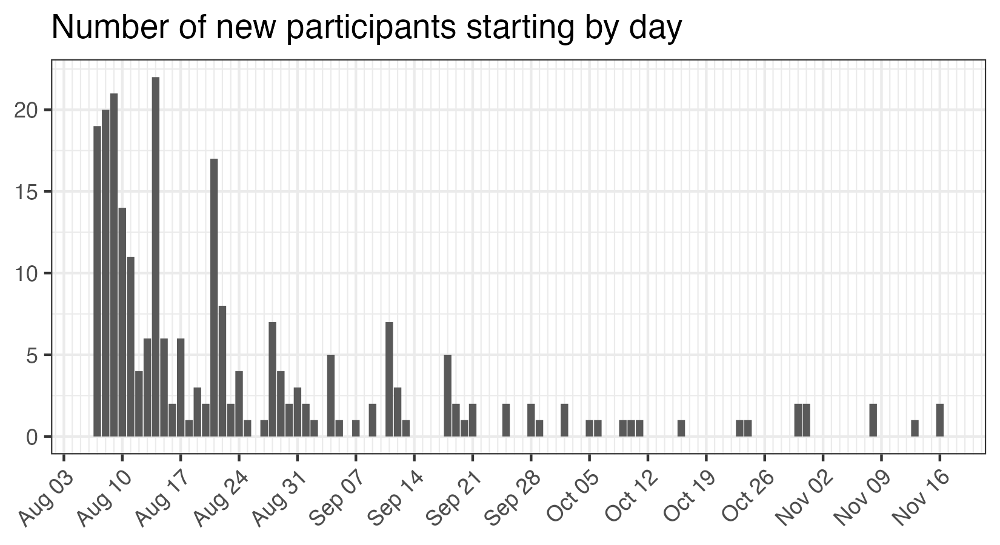
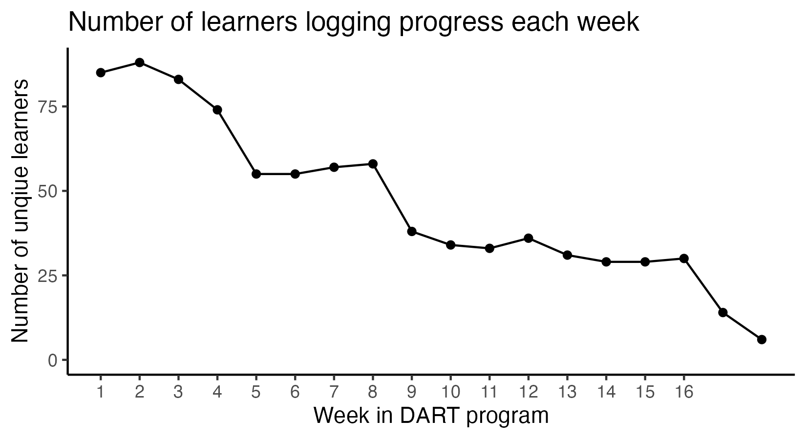
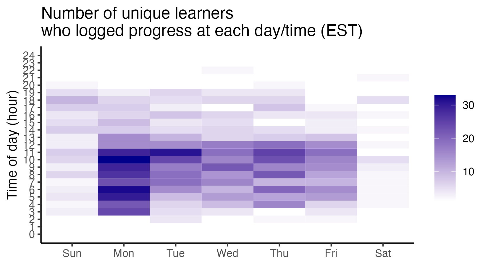

```{r setup, include=FALSE}
knitr::opts_chunk$set(echo = FALSE)
library(ggplot2)
theme_set(theme_classic())

# if the figures directory doesn't exist, create it
dir.create(here::here("reports"), showWarnings = FALSE)
dir.create(here::here("reports", "figures"), showWarnings = FALSE)
```

`r if(!knitr::opts_chunk$get()$echo) ">Note that code chunks are not printed in this report in order to keep the output tidy. To see all of the code to generate these results, open the .Rmd file."`


```{r load_data}
# these data files are created in 09_clean_nalms_data.R
basic_info <- readRDS(here::here("data", "interim", "nalms_basic_info.rds"))

# number of participants assigned to each pathway and number of modules per pathway
pathway_info <- readRDS(here::here("data", "interim", "nalms_pathway_info.rds"))

# full (cleaned) nalms pathway data
nalms_full <- readRDS(here::here("data", "interim", "nalms_full.rds"))

# summaries for each redcap instance
nalms_summary <- readRDS(here::here("data", "interim", "nalms_summary.rds")) |> 
  dplyr::left_join(pathway_info, by = "pathway")
```

```{r activity_data}
activity_data <- nalms_summary |> 
  # only participant-logged progress
  dplyr::filter(redcap_repeat_instance > 1) |> 
  # omit instances where no new modules were marked complete
  dplyr::filter(modules_diff != 0) |> 
  # make sure the rows are in order
  dplyr::arrange(record_id, redcap_repeat_instance) |> 
  # compute time since last progress logged
  dplyr::group_by(record_id) |> 
  dplyr::mutate(time_diff = timestamp - dplyr::lag(timestamp),
                # convert time_diff from seconds to hours
                time_diff = as.numeric(time_diff)/3600) |> 
  # extract time of day and day of week from the timestamp, as well as what week in the program it is
  dplyr::mutate(hour = lubridate::hour(timestamp),
                weekday = lubridate::wday(timestamp, label = TRUE),
                week_in_program = lubridate::week(timestamp) - lubridate::week("2023-08-07") + 1)  |> 
  dplyr::ungroup() |> 
  # add in reference information about each pathway
  dplyr::left_join(pathway_info, by = "pathway")
```

## Overview

How many people have only one instance (i.e. they've never logged progress)?

```{r}
nalms_full |> 
  dplyr::group_by(record_id, pathway) |> 
  dplyr::summarise(instance = max(redcap_repeat_instance), .groups = "drop") |> 
  dplyr::filter(instance == 1) |> 
  nrow()
```

When did participants first log progress?

```{r}
p1 <- nalms_summary |> 
  dplyr::filter(redcap_repeat_instance == 2) |> 
  dplyr::mutate(date = lubridate::date(timestamp)) |> 
  ggplot(aes(x=date)) +
  geom_bar() + labs(x = NULL, 
                    y = NULL, 
                    title = "Number of new participants starting by day") + 
  scale_x_date(date_breaks = "7 days", 
               date_minor_breaks = "1 days",
               date_labels = "%b %d") + 
  theme_bw() + 
  theme(axis.text.x = element_text(angle = 45, hjust = 1))

ggsave(filename = "participants_start_dates.png", 
       plot = p1,
       path = here::here("reports", "figures"),
       width = 5.5, height = 3, units = "in")
```



## Engagement by week

```{r}
p2 <- activity_data |> 
  dplyr::count(week_in_program, record_id) |> 
  dplyr::count(week_in_program) |> 
  ggplot(aes(x=week_in_program, y=n)) + 
  geom_line() + 
  geom_point() + 
  scale_x_continuous(breaks = 1:16) + 
  scale_y_continuous(limits = c(0,NA)) + 
  labs(y = "Number of unqiue learners",
       x = "Week in DART program",
       title = "Number of learners logging progress each week")

ggsave(filename = "participants_logging_progress_by_week.png", 
       plot = p2,
       path = here::here("reports", "figures"),
       width = 5.5, height = 3, units = "in")
```



```{r}
p2 <- nalms_summary |> 
  dplyr::mutate(week_in_program = lubridate::week(timestamp) - lubridate::week("2023-08-07") + 1) |> 
  dplyr::group_by(record_id, pathway, pathway_n_modules, week_in_program) |> 
  dplyr::summarize(n_modules_done = max(n_modules_done)) |> 
  tidyr::pivot_wider(names_from = week_in_program, values_from = n_modules_done) |> 
  tidyr::pivot_longer(-c(record_id, pathway, pathway_n_modules), 
                      names_to = "week_in_program",
                      values_to = "n_modules_done") |> 
  dplyr::mutate(week_in_program = as.numeric(week_in_program)) |> 
  dplyr::arrange(record_id, week_in_program) |> 
  tidyr::fill(n_modules_done)
  dplyr::mutate(perc_comp = n_modules_done/pathway_n_modules,
                perc_comp_binned = cut(perc_comp, 10))
  ggplot(aes(x=week_in_program, fill = perc_comp_binned)) + 
  geom_bar()
  
  dplyr::count(week_in_program, record_id) |> 
  dplyr::count(week_in_program) |> 
  ggplot(aes(x=week_in_program, y=n)) + 
  geom_line() + 
  geom_point() + 
  scale_x_continuous(breaks = 1:16) + 
  scale_y_continuous(limits = c(0,NA)) + 
  labs(y = "Number of unqiue learners",
       x = "Week in DART program",
       title = "Number of learners logging progress each week")

ggsave(filename = "pathway_progress_by_week.png", 
       plot = p2,
       path = here::here("reports", "figures"),
       width = 5.5, height = 3, units = "in")
```


## Participation by pathway

Which pathways have the highest rates of people logging progress?

```{r}
nalms_full |> 
  dplyr::group_by(record_id, pathway) |> 
  dplyr::summarise(instance = max(redcap_repeat_instance), .groups = "drop") |> 
  dplyr::mutate(any_progress = ifelse(instance == 1, 0, 1)) |> 
  dplyr::group_by(pathway) |> 
  dplyr::summarise(n_tot_learners = dplyr::n(), prop_any_progress = mean(any_progress), .groups = "drop") |> 
  dplyr::arrange(desc(prop_any_progress)) |> 
  knitr::kable(digits = 2)
```

## Patterns in time: hours and days


```{r}
p3 <- activity_data |> 
  dplyr::count(weekday, hour, record_id) |> 
  dplyr::count(weekday, hour) |> 
  ggplot(aes(x=weekday, y=hour, fill=n)) + 
  geom_tile() + 
  scale_fill_gradient(low = "white", high = "darkblue", na.value="transparent") + 
  scale_y_continuous(breaks = 0:24, limits = c(0, 24)) + 
  theme_classic() +
  labs(title ="Number of unique learners\nwho logged progress at each day/time (EST)", 
       x=NULL, 
       y="Time of day (hour)",
       fill = NULL)
ggsave(filename = "nalms_learners_by_day_and_time.png", 
       plot = p3,
       path = here::here("reports", "figures"),
       width = 5.5, height = 3, units = "in")
```


