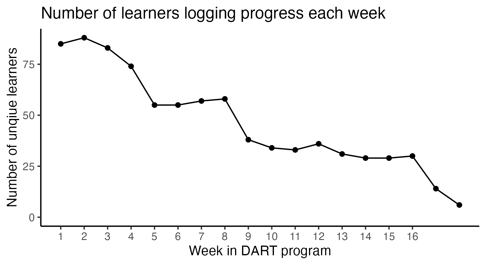

NALMS exploration
================
Rose Hartman
2023-12-08

> Note that code chunks are not printed in this report in order to keep
> the output tidy. To see all of the code to generate these results,
> open the .Rmd file.

## Overview

How many people have only one instance (i.e. they’ve never logged
progress)?

    ## [1] 176

When did participants first log progress?

## Engagement by week

## Participation by pathway

Which pathways have the highest rates of people logging progress?

| pathway  | n_tot_learners | prop_any_progress |
|:---------|---------------:|------------------:|
| lilac    |              8 |              0.88 |
| iris     |             23 |              0.83 |
| magnolia |              9 |              0.78 |
| dahlia   |             17 |              0.76 |
| aster    |             32 |              0.69 |
| marigold |             35 |              0.66 |
| camellia |             44 |              0.64 |
| jasmine  |             18 |              0.61 |
| lotus    |             10 |              0.60 |
| daffodil |             26 |              0.58 |
| peony    |              7 |              0.57 |
| lily     |             22 |              0.55 |
| begonia  |             30 |              0.53 |
| crocus   |             41 |              0.51 |
| daisy    |              4 |              0.50 |
| lavender |             39 |              0.44 |
| azalea   |             31 |              0.42 |
| geranium |             19 |              0.32 |
| tulip    |              4 |              0.25 |

## Patterns in time: hours and days

