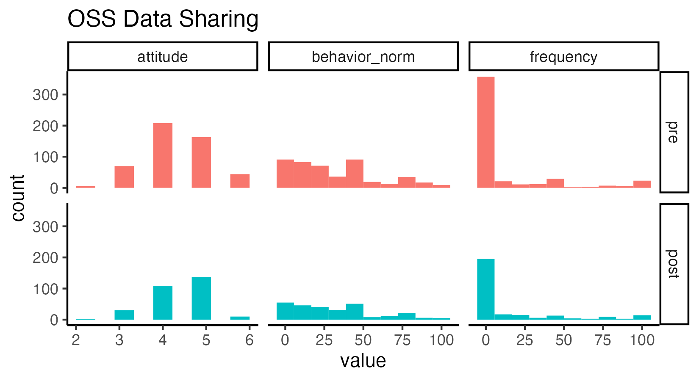
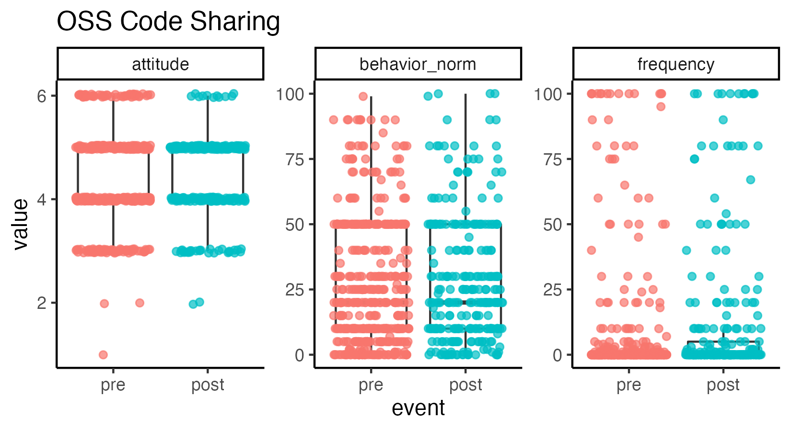

## Some notes about this report

This report pools Wave 1 and Wave 2 data, since the OSS forms were identical across both.
It also uses as much data as is available for each comparison, rather than defining a consistent dataset that would be used throughout the report. 

So, for example, if a participant filled out the pretest but not posttest OSS forms, that participant's data would show up in the means calculated for pretest and in histograms, etc. showing pretest data, but they would be excluded from the paired pre/post t-tests and the line plots showing change from pre to post.
Items on these forms were not marked as required, so there are also more complex patterns of missingness possible (such as a participant responding to the attitude question but leaving the behavior norms question blank); again, data are presented whenever we have them. 
So the N's jump around test to test and plot to plot.

```{r setup, include=FALSE}
knitr::opts_chunk$set(echo = FALSE)
library(ggplot2)

# load custom functions for plotting
source(here::here("src", "scripts", "functions_plotting.R"))

# if the figures directory doesn't exist, create it
dir.create(here::here("reports"), showWarnings = FALSE)
dir.create(here::here("reports", "figures"), showWarnings = FALSE)
```

`r if(!knitr::opts_chunk$get()$echo) ">Note that code chunks are not printed in this report in order to keep the output tidy. To see all of the code to generate these results, open the .Rmd file."`

```{r load_data}
# created by 05_clean_pre_test.R and 06_clean_post_test.R
oss_code_pre <- readRDS(here::here("data", "interim", "oss_code_pre.rds")) |> 
  dplyr::mutate(event = "pre")
oss_code_post <- readRDS(here::here("data", "interim", "oss_code_post.rds")) |> 
  dplyr::mutate(event = "post")
oss_data_pre <- readRDS(here::here("data", "interim", "oss_data_pre.rds")) |> 
  dplyr::mutate(event = "pre")
oss_data_post <- readRDS(here::here("data", "interim", "oss_data_post.rds"))  |> 
  dplyr::mutate(event = "post")

oss_code <- dplyr::bind_rows(oss_code_pre, oss_code_post)
oss_data <- dplyr::bind_rows(oss_data_pre, oss_data_post) 
```

## Exploration of changes pre to post

```{r data_long}
oss_code_long <- oss_code |> 
  dplyr::select(record_id, event, attitude = code_sharing_attitude_1, frequency = code_sharing_frequency_1, behavior_norm = code_behavior_norm_1) |> 
  tidyr::pivot_longer(-c(record_id, event)) |> 
  dplyr::mutate(event = factor(event, levels = c("pre", "post")))

oss_data_long <- oss_data |> 
  dplyr::select(record_id, event, attitude = data_sharing_attitude_1, frequency = data_sharing_frequency_1, behavior_norm = data_behavior_norm_1) |> 
  tidyr::pivot_longer(-c(record_id, event)) |> 
  dplyr::mutate(event = factor(event, levels = c("pre", "post")))
```


```{r}
oss_code_by_event <- oss_code_long |> 
  tidyr::pivot_wider(names_from = event, values_from = value)


oss_code_by_event |> 
  dplyr::group_by(name) |> 
  dplyr::summarize(pre = mean(pre, na.rm = TRUE),
                   post = mean(post, na.rm = TRUE)) |> 
  knitr::kable(caption="OSS Code Sharing")
```

```{r}
oss_data_by_event <- oss_data_long |> 
  tidyr::pivot_wider(names_from = event, values_from = value)


oss_data_by_event |> 
  dplyr::group_by(name) |> 
  dplyr::summarize(pre = mean(pre, na.rm = TRUE),
                   post = mean(post, na.rm = TRUE))|> 
  knitr::kable(caption="OSS Data Sharing")
```

```{r run_ttests}
run_ttests <- function(df, groups = "name"){
  names <-  unique(dplyr::pull(df, groups))
  
  # create an empty storage vector
  result <- vector(mode = "list", length = length(names))
  names(result) <- names
  
  # run t-test for each group
  for(name in names){
    this_df <- df[dplyr::pull(df, groups) == name, ]
    result[[name]] <- t.test(this_df$post, this_df$pre, paired = TRUE)
  }
  return(result)
}
```

Is there significant change pre to post in the OSS Code Sharing items?

```{r ttests_code}
run_ttests(oss_code_by_event)
```

Is there significant change pre to post in the OSS Data Sharing items?

```{r ttest_data}
run_ttests(oss_data_by_event)
```

```{r plot_data}
p1 <- oss_data_long |> 
  ggplot(aes(x=value, fill = event)) + 
  geom_histogram(bins = 10, show.legend = FALSE) + 
  facet_grid(event~ name, scales = "free_x") + 
  labs(title = "OSS Data Sharing")
ggsave(filename = "oss_data_sharing_hist.png", 
       plot = p1,
       path = here::here("reports", "figures"),
       width = 5.5, height = 3, units = "in")
  
p2 <- oss_data_long |> 
  ggplot(aes(x = event, y = value)) +
  geom_boxplot(outlier.shape = NA) +
  geom_jitter(aes(color = event), show.legend = FALSE,
              alpha = .7) +
  facet_wrap(~ name, scales = "free_y") + 
  labs(title = "OSS Data Sharing")
ggsave(filename = "oss_data_sharing_box.png", 
       plot = p2,
       path = here::here("reports", "figures"),
       width = 5.5, height = 3, units = "in")

p3 <- oss_data_long |> 
  ggplot(aes(x = event, y = value, group = record_id)) +
  geom_line(alpha = .3, position = position_jitter(width = 0, height = NULL)) + 
  facet_wrap(~ name, scales = "free_y") + 
  labs(title = "OSS Data Sharing")
ggsave(filename = "oss_data_sharing_line.png", 
       plot = p3,
       path = here::here("reports", "figures"),
       width = 5.5, height = 3, units = "in")
```




```{r plot_code}
p4 <- oss_code_long |> 
  ggplot(aes(x=value, fill = event)) + 
  geom_histogram(bins = 10, show.legend = FALSE) + 
  facet_grid(event~ name, scales = "free_x") + 
  labs(title = "OSS Code Sharing")
ggsave(filename = "oss_code_sharing_hist.png", 
       plot = p4,
       path = here::here("reports", "figures"),
       width = 5.5, height = 3, units = "in")
  
p5 <- oss_code_long |> 
  ggplot(aes(x = event, y = value)) +
  geom_boxplot(outlier.shape = NA) +
  geom_jitter(aes(color = event), show.legend = FALSE,
              alpha = .7) +
  facet_wrap(~ name, scales = "free_y") + 
  labs(title = "OSS Code Sharing")
ggsave(filename = "oss_code_sharing_box.png", 
       plot = p5,
       path = here::here("reports", "figures"),
       width = 5.5, height = 3, units = "in")

p6 <- oss_code_long |> 
  ggplot(aes(x = event, y = value, group = record_id)) +
  geom_line(alpha = .3, position = position_jitter(width = 0, height = NULL)) + 
  facet_wrap(~ name, scales = "free_y") + 
  labs(title = "OSS Code Sharing")
ggsave(filename = "oss_code_sharing_line.png", 
       plot = p6,
       path = here::here("reports", "figures"),
       width = 5.5, height = 3, units = "in")
```





