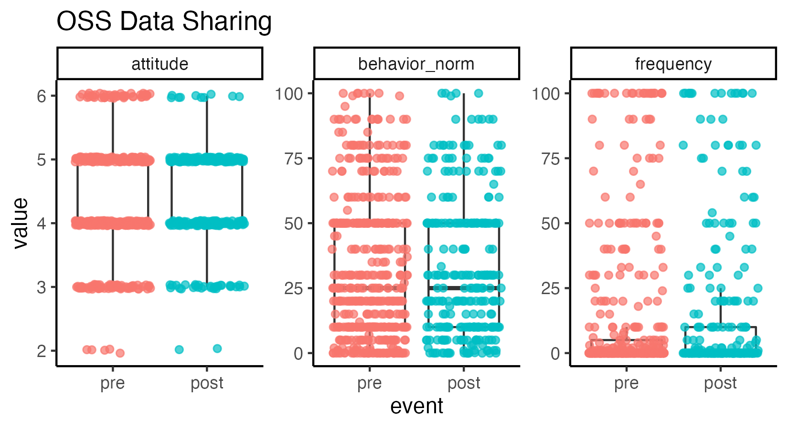
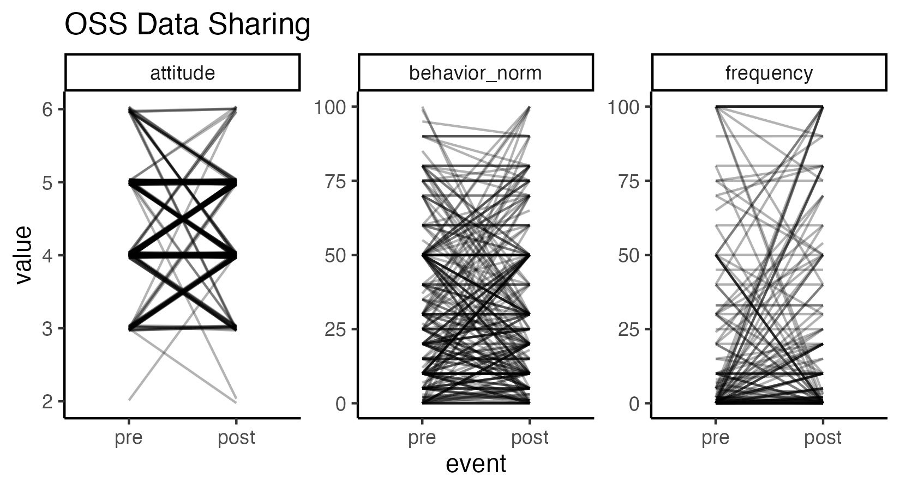
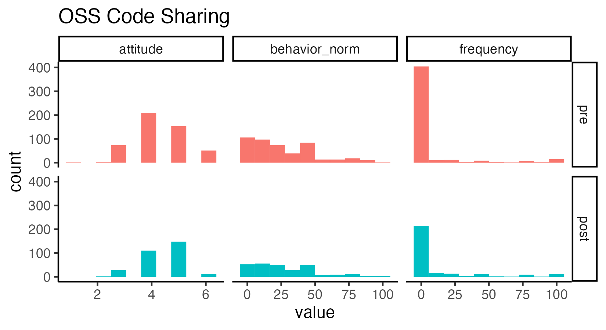

Open Scholarship Survey Exploration
================
Rose Hartman
2024-01-12

## Some notes about this report

This report pools Wave 1 and Wave 2 data, since the OSS forms were
identical across both. It also uses as much data as is available for
each comparison, rather than defining a consistent dataset that would be
used throughout the report.

So, for example, if a participant filled out the pretest but not
posttest OSS forms, that participant’s data would show up in the means
calculated for pretest and in histograms, etc. showing pretest data, but
they would be excluded from the paired pre/post t-tests and the line
plots showing change from pre to post. Items on these forms were not
marked as required, so there are also more complex patterns of
missingness possible (such as a participant responding to the attitude
question but leaving the behavior norms question blank); again, data are
presented whenever we have them. So the N’s jump around test to test and
plot to plot.

> Note that code chunks are not printed in this report in order to keep
> the output tidy. To see all of the code to generate these results,
> open the .Rmd file.

## Exploration of changes pre to post

| name          |       pre |      post |
|:--------------|----------:|----------:|
| attitude      |  4.356415 |  4.461538 |
| behavior_norm | 27.063596 | 28.279562 |
| frequency     |  7.339056 | 11.418440 |

OSS Code Sharing

| name          |      pre |      post |
|:--------------|---------:|----------:|
| attitude      |  4.34898 |  4.427083 |
| behavior_norm | 32.93763 | 32.427437 |
| frequency     | 12.68577 | 14.974910 |

OSS Data Sharing

Is there significant change pre to post in the OSS Code Sharing items?

    ## $attitude
    ## 
    ##  Paired t-test
    ## 
    ## data:  this_df$post and this_df$pre
    ## t = 1.7149, df = 298, p-value = 0.08739
    ## alternative hypothesis: true difference in means is not equal to 0
    ## 95 percent confidence interval:
    ##  -0.01480246  0.21547135
    ## sample estimates:
    ## mean of the differences 
    ##               0.1003344 
    ## 
    ## 
    ## $frequency
    ## 
    ##  Paired t-test
    ## 
    ## data:  this_df$post and this_df$pre
    ## t = 2.9793, df = 273, p-value = 0.003149
    ## alternative hypothesis: true difference in means is not equal to 0
    ## 95 percent confidence interval:
    ##  1.391503 6.812876
    ## sample estimates:
    ## mean of the differences 
    ##                 4.10219 
    ## 
    ## 
    ## $behavior_norm
    ## 
    ##  Paired t-test
    ## 
    ## data:  this_df$post and this_df$pre
    ## t = 1.4402, df = 258, p-value = 0.151
    ## alternative hypothesis: true difference in means is not equal to 0
    ## 95 percent confidence interval:
    ##  -0.731995  4.717323
    ## sample estimates:
    ## mean of the differences 
    ##                1.992664

Is there significant change pre to post in the OSS Data Sharing items?

    ## $attitude
    ## 
    ##  Paired t-test
    ## 
    ## data:  this_df$post and this_df$pre
    ## t = 1.8759, df = 286, p-value = 0.06169
    ## alternative hypothesis: true difference in means is not equal to 0
    ## 95 percent confidence interval:
    ##  -0.00514855  0.21420778
    ## sample estimates:
    ## mean of the differences 
    ##               0.1045296 
    ## 
    ## 
    ## $frequency
    ## 
    ##  Paired t-test
    ## 
    ## data:  this_df$post and this_df$pre
    ## t = 1.9991, df = 273, p-value = 0.04659
    ## alternative hypothesis: true difference in means is not equal to 0
    ## 95 percent confidence interval:
    ##  0.0442911 5.7805264
    ## sample estimates:
    ## mean of the differences 
    ##                2.912409 
    ## 
    ## 
    ## $behavior_norm
    ## 
    ##  Paired t-test
    ## 
    ## data:  this_df$post and this_df$pre
    ## t = 0.34595, df = 266, p-value = 0.7297
    ## alternative hypothesis: true difference in means is not equal to 0
    ## 95 percent confidence interval:
    ##  -2.602200  3.711564
    ## sample estimates:
    ## mean of the differences 
    ##               0.5546816

    ## Warning: Removed 103 rows containing non-finite values (stat_bin).

    ## Warning: Removed 103 rows containing non-finite values (stat_boxplot).

    ## Warning: Removed 103 rows containing missing values (geom_point).

    ## Warning: Removed 53 row(s) containing missing values (geom_path).

    ## Warning: Removed 120 rows containing non-finite values (stat_bin).

    ## Warning: Removed 120 rows containing non-finite values (stat_boxplot).

    ## Warning: Removed 120 rows containing missing values (geom_point).

    ## Warning: Removed 55 row(s) containing missing values (geom_path).

