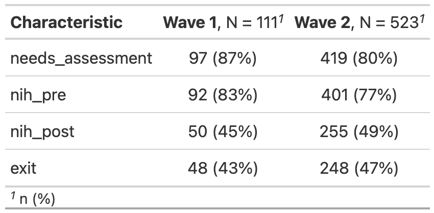
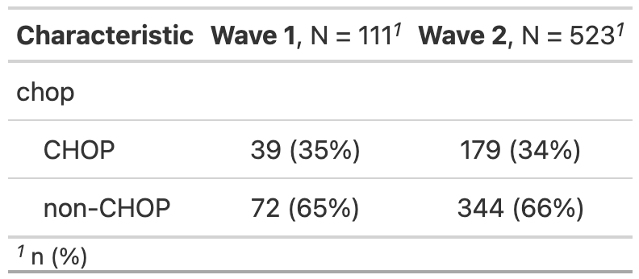
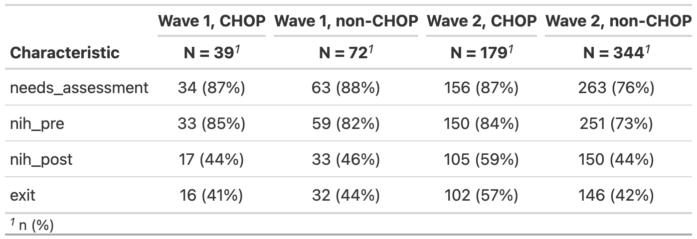

Pariticpant counts and attrition
================
Rose Hartman
2024-03-21

> Note that code chunks are not printed in this report in order to keep
> the output tidy. To see all of the code to generate these results,
> open the .Rmd file.

## How many total participants invited for each wave?

| wave   |   n |
|:-------|----:|
| Wave 1 | 111 |
| Wave 2 | 523 |

## How many participants completed each assessment phase for each wave?

## CHOP vs other institutions

