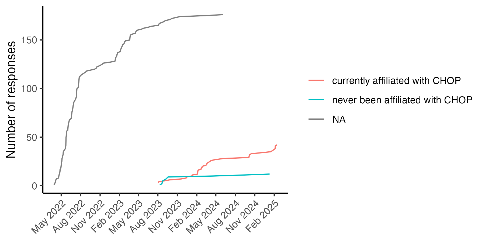

Quick Module Feedback Exploration
================
Rose Hartman

``` r
# load custom functions for plotting
library(ggplot2)
theme_set(theme_classic())
source(here::here("src", "scripts", "functions_plotting.R"))

# if the figures directory doesn't exist, create it
dir.create(here::here("reports"), showWarnings = FALSE)
dir.create(here::here("reports", "figures"), showWarnings = FALSE)

knitr::opts_chunk$set(
  echo = TRUE
)
```

``` r
quick_module_feedback <- readRDS(here::here("data", "deidentified", "quick_module_feedback.rds")) |> 
  # disregard revisions in version number (roll up counts by major and minor only)
  # separate version into major, minor, and revision numbers
  tidyr::separate(version, into = c("version_major", "version_minor", "revision"), sep = "[.]", remove = TRUE, convert = TRUE) |> 
  # make factors
  dplyr::mutate(learning_objectives = factor(learning_objectives,
                                             levels = c("yes", "no")),
                tools = factor(tools, 
                               levels = c(1,0), 
                               labels = c("yes","no")),
                time = factor(time, 
                              levels=c(0,1,2), 
                              labels=c("Too short -- it took me longer", "About right", "Too long -- I finished more quickly")),
                difficulty = factor(difficulty, 
                                    levels=c(1,2,3), 
                                    labels=c("Too complex / difficult", "Just right", "Too simple / easy")),
                research_participant_yn = factor(research_participant_yn, 
                                                 levels = c(0,1),
                                                 labels = c("no", "yes")))
```

``` r
library(ggplot2)
library(dplyr)
```

    ## 
    ## Attaching package: 'dplyr'

    ## The following objects are masked from 'package:stats':
    ## 
    ##     filter, lag

    ## The following objects are masked from 'package:base':
    ## 
    ##     intersect, setdiff, setequal, union

``` r
library(lubridate)
```

    ## 
    ## Attaching package: 'lubridate'

    ## The following objects are masked from 'package:base':
    ## 
    ##     date, intersect, setdiff, union

### Mean values for all modules

These plots show estimates of mean values for each module on each
question.

**Note**: These plots only show data from the most recent version (major
and minor, ignoring revisions) for each module, and they only report on
modules that have at least 5 responses for that version.

``` r
plot_data <- quick_module_feedback |> 
  # use just the most recent version for each module 
  group_by(module_id) |> 
  dplyr::slice_max(version_major, n=1) |> 
  dplyr::slice_max(version_minor, n=1) |> 
  # filter to just records where the latest version has at least cutoff responses
  dplyr::add_count(module_id, version_major, version_minor) |> 
  dplyr::filter(n >= params$cutoff) |> 
  ungroup() |> 
  dplyr::select(module_id, learning_objectives, difficulty, time, tools) |> 
  dplyr::mutate(dplyr::across(-module_id, as.numeric)) |> 
  # reformat to long for easier plotting
  tidyr::pivot_longer(-module_id) |> 
  group_by(module_id, name) |> 
  dplyr::summarise(mean=mean(value, na.rm = TRUE),
                   max = quantile(value, probs = .95, na.rm = TRUE),
                   min = quantile(value, probs = .05, na.rm = TRUE),
                   .groups = "drop") 
  
(plot_data |> 
  filter(name == "difficulty") |> 
  na.omit() |> 
  ggplot(aes(y=forcats::fct_reorder(module_id, mean))) + 
  # geom_pointrange(aes(x=mean, xmin=min, xmax=max), alpha = .5) +
  geom_point(aes(x=mean)) + 
  scale_x_continuous(limits=c(1,3), breaks=1:3) + 
  labs(x="Difficulty\n1 = too difficult, 3 = too easy", y=NULL) + 
  geom_vline(xintercept=2, linetype=2)) |> 
  # the save_and_print function is defined in functions_plotting.R
  save_and_print(filename = "qmf_modules_by_difficulty.png",
                 width = 5,
                 height = 7.5)
```

<!-- -->

``` r
(plot_data |> 
  filter(name == "time") |> 
  na.omit() |> 
  ggplot(aes(y=forcats::fct_reorder(module_id, mean))) + 
  # geom_pointrange(aes(x=mean, xmin=min, xmax=max), alpha = .5) +
  geom_point(aes(x=mean)) + 
  scale_x_continuous(limits=c(1,3), breaks=1:3) + 
  labs(x="Time estimate was...\n1 = too short, 3 = too long", y=NULL) + 
  geom_vline(xintercept=2, linetype=2)) |> 
  # the save_and_print function is defined in functions_plotting.R
  save_and_print(filename = "qmf_modules_by_time.png",
                 width = 5,
                 height = 7.5)
```

<!-- -->

``` r
(plot_data |> 
  filter(name == "learning_objectives") |> 
  na.omit() |> 
  ggplot(aes(y=forcats::fct_reorder(module_id, mean))) + 
  # geom_pointrange(aes(x=mean, xmin=min, xmax=max), alpha = .5) +
  geom_point(aes(x=mean)) + 
  scale_x_continuous(limits=c(NA,2), breaks=c(1,2)) + 
  labs(x="Learning objectives\n1 = met, 2 = not met", y=NULL) + 
  geom_vline(xintercept=1, linetype=2)) |> 
  # the save_and_print function is defined in functions_plotting.R
  save_and_print(filename = "qmf_modules_by_lo.png",
                 width = 5,
                 height = 7.5)
```

<!-- -->

``` r
(plot_data |> 
  filter(name == "tools") |> 
  na.omit() |> 
  ggplot(aes(y=forcats::fct_reorder(module_id, mean))) + 
  # geom_pointrange(aes(x=mean, xmin=min, xmax=max), alpha = .5) +
  geom_point(aes(x=mean)) + 
  scale_x_continuous(limits=c(NA,2), breaks = c(1,2)) + 
  labs(x="Met expectations re tools\nneeded to complete module\n1=yes, 2=no", y=NULL) + 
  geom_vline(xintercept=1, linetype=2)) |> 
  # the save_and_print function is defined in functions_plotting.R
  save_and_print(filename = "qmf_modules_by_tools.png",
                 width = 5,
                 height = 7.5)
```

<!-- -->

# Who is responding?

``` r
(quick_module_feedback |> 
   mutate(date = ymd(date)) |> 
   arrange(date) |>
   count(date, research_participant_yn) |> 
   group_by(research_participant_yn) |> 
   mutate(tot = cumsum(n)) |> 
   ggplot(aes(y = tot, x = date)) + 
   geom_line() + 
   facet_wrap(~research_participant_yn, scales = "free_y") + 
   scale_x_date(date_breaks = "3 months",
                date_labels = "%b %Y") +
   theme(axis.text.x = element_text(angle = 45, vjust = 1, hjust=1)) + 
   labs(y = "Number of responses",
        x = NULL)) |> 
  # the save_and_print function is defined in functions_plotting.R
  save_and_print(filename = "qmf_over_time.png",
                 width = 6,
                 height = 3)
```

<!-- -->

## CHOP affiliation

Only non-research participants

``` r
(quick_module_feedback |> 
   filter(research_participant_yn == "no") |> 
   mutate(date = ymd(date)) |> 
   arrange(date) |>
   count(date, chop_affiliation) |> 
   group_by(chop_affiliation) |> 
   mutate(tot = cumsum(n)) |> 
   ggplot(aes(y = tot, x = date, color=chop_affiliation)) + 
   geom_line() + 
   scale_x_date(date_breaks = "3 months",
                date_labels = "%b %Y") +
   theme(axis.text.x = element_text(angle = 45, vjust = 1, hjust=1)) + 
   labs(color = NULL, 
        y = "Number of responses",
        x = NULL)) |> 
  # the save_and_print function is defined in functions_plotting.R
  save_and_print(filename = "qmf_chop_affilitation_over_time.png",
                 width = 6,
                 height = 3)
```

<!-- -->

# Arcus use

Only non-research participants.

1.  I’ve heard of Arcus but I don’t use it
2.  I’ve used Arcus self-service tools from the Arcus website
3.  I have an active or completed Arcus scientific project
4.  I’m considering or have requested an Arcus scientific project
5.  I’ve been working with Arcus personnel
