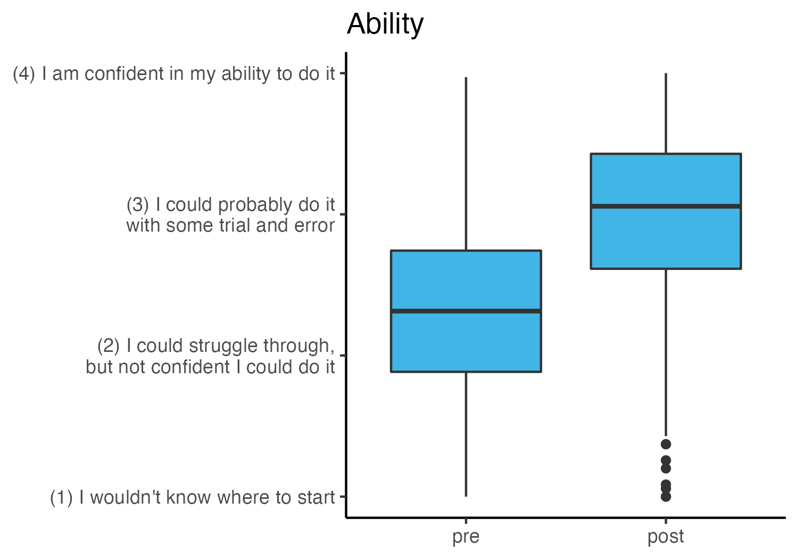

```{r setup, include=FALSE}
knitr::opts_chunk$set(echo = FALSE)
library(ggplot2)

# load custom functions for plotting
source(here::here("src", "scripts", "functions_plotting.R"))

# if the figures directory doesn't exist, create it
dir.create(here::here("reports"), showWarnings = FALSE)
dir.create(here::here("reports", "figures"), showWarnings = FALSE)
```

`r if(!knitr::opts_chunk$get()$echo) ">Note that code chunks are not printed in this report in order to keep the output tidy. To see all of the code to generate these results, open the .Rmd file."`

```{r load_data}
quick_module_feedback <- readRDS(here::here("data", "raw", "quick_module_feedback.rds")) |> 
  dplyr::mutate(date = lubridate::floor_date(feedback_timestamp, unit = "days")) |> 
  tidyr::replace_na(list(research_participant_yn = 0, 
                         pilot_participant = "no")) |> 
  dplyr::mutate(type = dplyr::case_when(research_participant_yn == 1 ~ "Study Participants",
                                                  pilot_participant == "yes" ~ "Study Participants", 
                                                  research_participant_yn == 0 & pilot_participant == "no" ~ "Other Users"))
```

## Feedback over time

Each time a learner reads one of our modules, they are invited at the end to submit anonymous feedback.
The number of feedback response forms submitted can provide us with an (under) estimate of the number of learners we're reaching with our modules. 

```{r feedback_over_time}
program_dates <- as.Date(c("2023-01-30", "2023-03-27", "2023-05-22", "2023-08-07", "2023-09-30", "2023-11-27"))
names(program_dates) <- c("w1_start", "w1_mid", "w1_end", "w2_start", "w2_mid", "w2_end")

p1 <- quick_module_feedback |> 
  dplyr::count(date) |> 
  dplyr::mutate(total = cumsum(n),
                date = as.Date(date)) |> 
  ggplot(aes(x=date, y=total)) + 
  labs(x=NULL, y = "Number of responses", title = "Cumulative total feedback responses submitted") +
  annotate("rect", fill = chop_blue, alpha = 0.3, 
        xmin = program_dates["w1_start"], 
        xmax = program_dates["w1_end"],
        ymin = -Inf, ymax = Inf)  + 
  annotate("rect", fill = chop_blue, alpha = 0.3, 
        xmin = program_dates["w2_start"], 
        xmax = program_dates["w2_end"],
        ymin = -Inf, ymax = Inf)  + 
  geom_line(color = chop_darkblue) + 
  scale_x_date(date_breaks = "3 months", date_labels = "%b %Y") + 
  theme(axis.text.x = element_text(angle = 45, vjust = 1, hjust=1)) + 
  annotate("text", x = program_dates[c("w1_mid", "w2_mid")], y = 500, label = c("Wave 1", "Wave 2")) 

ggsave(filename = "feedback_over_time.png", 
       plot = p1,
       path = here::here("reports", "figures"),
       width = 5, height = 4, units = "in")
```


Our modules are public, so anyone can access them. 
In the feedback survey, respondents are asked to indicate if they're a study participant or not. 
What does the pattern of responses look like for people who found us through means other than participation in the DART study?

```{r feedback_over_time_nonparticipants}
p2 <- quick_module_feedback |> 
  dplyr::count(type, date) |> 
  dplyr::mutate(total = cumsum(n),
                date = as.Date(date)) |> 
  ggplot(aes(x=date, y=total)) + 
  labs(x=NULL, y = "Number of responses", title = "Cumulative total feedback responses submitted") +
  annotate("rect", fill = chop_blue, alpha = 0.3, 
        xmin = program_dates["w1_start"], 
        xmax = program_dates["w1_end"],
        ymin = -Inf, ymax = Inf)  + 
  annotate("rect", fill = chop_blue, alpha = 0.3, 
        xmin = program_dates["w2_start"], 
        xmax = program_dates["w2_end"],
        ymin = -Inf, ymax = Inf)  + 
  geom_line(color = chop_darkblue)  + 
  scale_x_date(date_breaks = "3 months", date_labels = "%b %Y") + 
  theme(axis.text.x = element_text(angle = 45, vjust = 1, hjust=1)) +  
  facet_wrap(~type, scales = "free_y")

ggsave(filename = "feedback_over_time_nonparticipants.png", 
       plot = p2,
       path = here::here("reports", "figures"),
       width = 8, height = 4, units = "in")
```


## Impact of DART program on researchers' data science skills

We ask researchers to self-report their level of ability on a range of data science skills both before and after participating in DART. 

In the Wave 1 data, we see a statistically significant improvement in participants' self-reported data science ability pre to post, with an average change of .8 on the scale from 1 to 4. 
The mean standardized change (the corresponding measure of effect size) is 1.5, meaning on average participants' rating went up 1.5 standard deviations from pretest to posttest, a large effect.

```{r}
# plot generated by the R3ISE_symposium.Rmd file
```




Wave 2 is still underway so we can't analyze those data yet but will be able to in the coming weeks. 

Note that our hypotheses for this study were all preregistered. 
You can view [our preregistration on the Open Science Foundation](https://osf.io/zmnr6/?view_only=2d26a411c57d49aca1754b8920e57a71). 

## Our reach

Who are the DART learners, and where are they located?

### Career stage and formal training

About half of our participants hold PhDs (53%). 
The largest group of learners we reach is research staff (33% of our participants), many of whom do not hold terminal degrees in their field, followed by early career trainees like postdocs, MD residents, and MD fellows (30%). 

```{r}
# plot generated by describe_participants.Rmd
```


### Institutions


