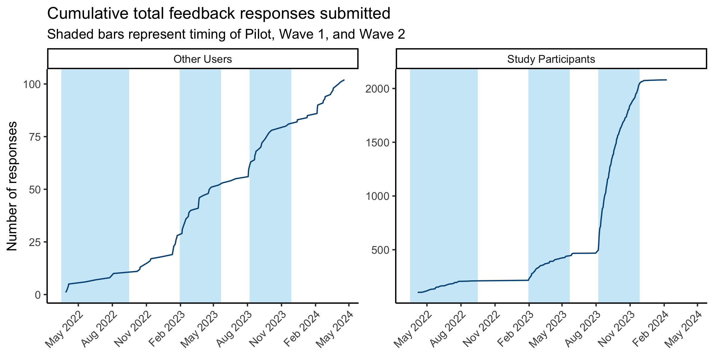
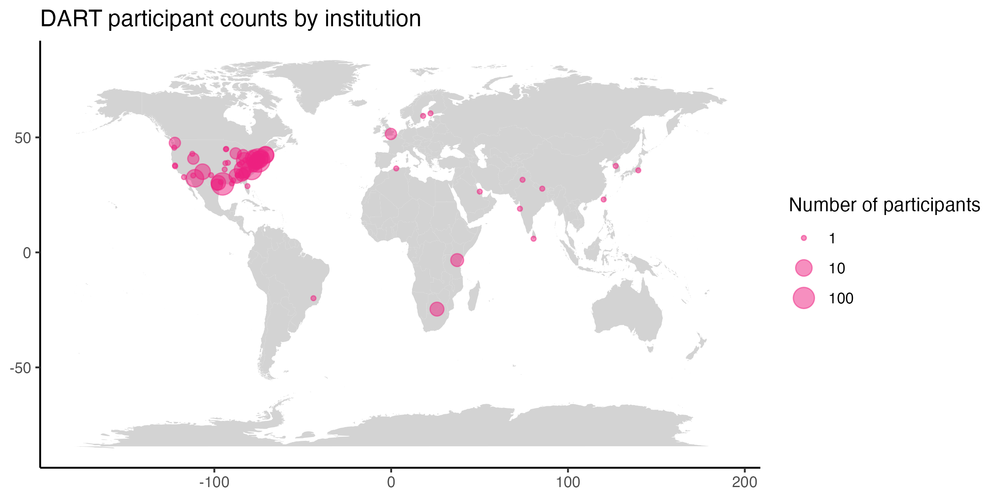
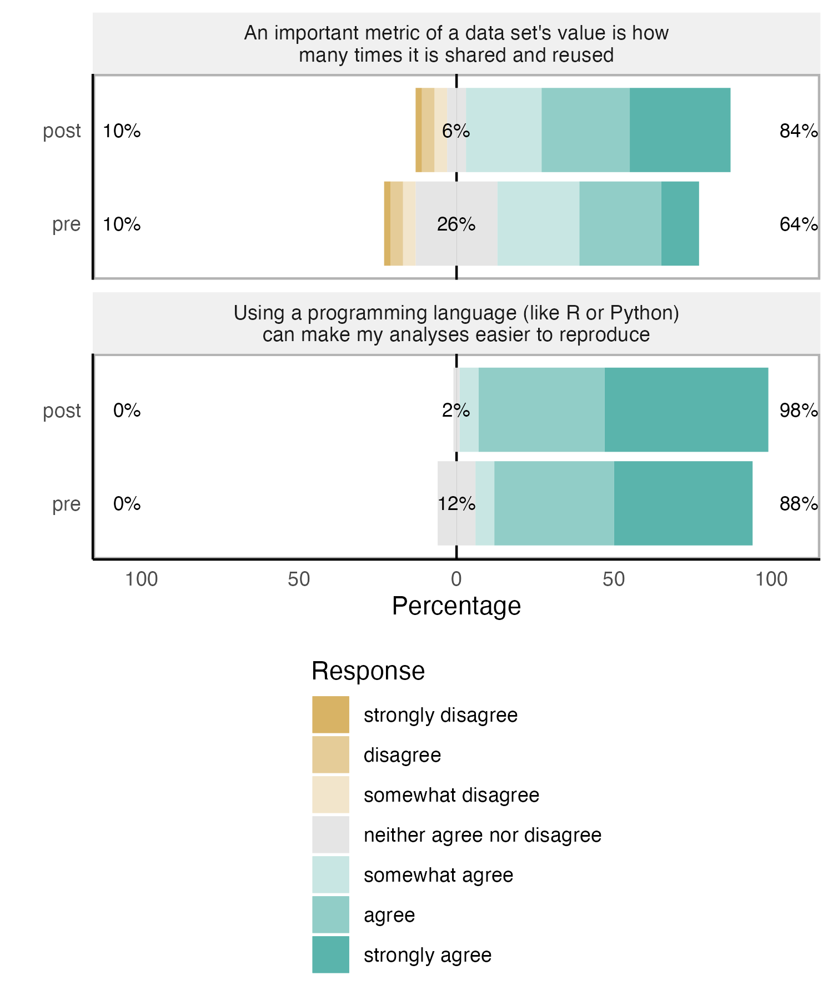
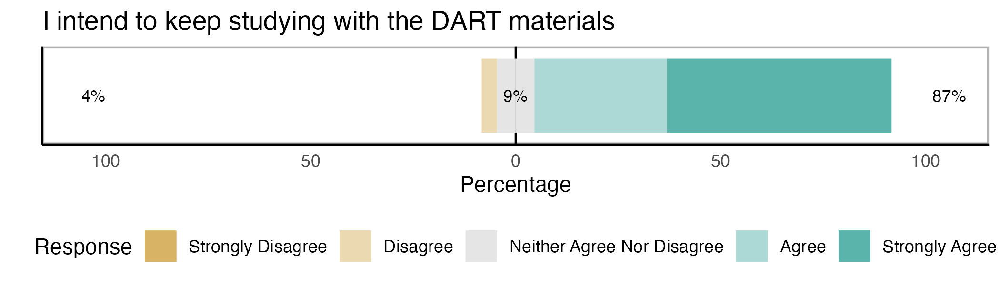

```{r setup, include=FALSE}
knitr::opts_chunk$set(echo = FALSE)
library(ggplot2)

# load custom functions for plotting
source(here::here("src", "scripts", "functions_plotting.R"))

# if the figures directory doesn't exist, create it
dir.create(here::here("reports"), showWarnings = FALSE)
dir.create(here::here("reports", "figures"), showWarnings = FALSE)
```

`r if(!knitr::opts_chunk$get()$echo) ">Note that code chunks are not printed in this report in order to keep the output tidy. To see all of the code to generate these results, open the .Rmd file."`

```{r load_data}
# created by 08_clean_quick_module_feedback.R
quick_module_feedback <- readRDS(here::here("data", "deidentified", "quick_module_feedback.rds")) 

# created by 07_clean_exit_survey.R
exit_survey <- readRDS(here::here("data", "deidentified", "exit_survey.rds")) |> 
  dplyr::left_join(readr::read_csv(here::here("participant_waves.csv"), show_col_types = FALSE), 
                   by = "record_id")
```

## Feedback over time

Each time a learner reads one of our modules, they are invited at the end to submit anonymous feedback.
The number of feedback response forms submitted can provide us with an (under) estimate of the number of learners we're reaching with our modules. 

```{r feedback_over_time}
program_dates <- as.Date(c("2022-03-16", "2022-06-10", "2022-09-15", 
                           "2023-01-30", "2023-03-27", "2023-05-22", 
                           "2023-08-07", "2023-09-30", "2023-11-27"))
names(program_dates) <- c("pilot_start", "pilot_mid", "pilot_end", 
                          "w1_start", "w1_mid", "w1_end", 
                          "w2_start", "w2_mid", "w2_end")

p1 <- quick_module_feedback |> 
  dplyr::count(date) |> 
  dplyr::mutate(total = cumsum(n),
                date = as.Date(date)) |> 
  ggplot(aes(x=date, y=total)) + 
  labs(x=NULL, y = "Number of responses", title = "Cumulative total feedback responses submitted") + 
  annotate("rect", fill = chop_blue, alpha = 0.3, 
        xmin = program_dates["pilot_start"], 
        xmax = program_dates["pilot_end"],
        ymin = -Inf, ymax = Inf) +
  annotate("rect", fill = chop_blue, alpha = 0.3, 
        xmin = program_dates["w1_start"], 
        xmax = program_dates["w1_end"],
        ymin = -Inf, ymax = Inf)   + 
  annotate("rect", fill = chop_blue, alpha = 0.3, 
        xmin = program_dates["w2_start"], 
        xmax = program_dates["w2_end"],
        ymin = -Inf, ymax = Inf)  + 
  geom_line(color = chop_darkblue) + 
  scale_x_date(date_breaks = "3 months", date_labels = "%b %Y") + 
  theme(axis.text.x = element_text(angle = 45, vjust = 1, hjust=1)) + 
  annotate("text", x = program_dates[c("pilot_mid", "w1_mid", "w2_mid")], y = 500, label = c("Pilot", "Wave 1", "Wave 2")) 

ggsave(filename = "feedback_over_time.png", 
       plot = p1,
       path = here::here("reports", "figures"),
       width = 5, height = 4, units = "in")
```


Our modules are public, so anyone can access them. 
In the feedback survey, respondents are asked to indicate if they're a study participant or not. 
What does the pattern of responses look like for people who found us through means other than participation in the DART study?

```{r feedback_over_time_nonparticipants}
p2 <- quick_module_feedback |> 
  dplyr::count(type, date) |> 
  dplyr::mutate(total = cumsum(n),
                date = as.Date(date)) |> 
  ggplot(aes(x=date, y=total)) + 
  labs(x=NULL, 
       y = "Number of responses", 
       title = "Cumulative total feedback responses submitted", 
       subtitle = "Shaded bars represent timing of Pilot, Wave 1, and Wave 2") +
  annotate("rect", fill = chop_blue, alpha = 0.3, 
        xmin = program_dates["pilot_start"], 
        xmax = program_dates["pilot_end"],
        ymin = -Inf, ymax = Inf)  + 
  annotate("rect", fill = chop_blue, alpha = 0.3, 
        xmin = program_dates["w1_start"], 
        xmax = program_dates["w1_end"],
        ymin = -Inf, ymax = Inf)  + 
  annotate("rect", fill = chop_blue, alpha = 0.3, 
        xmin = program_dates["w2_start"], 
        xmax = program_dates["w2_end"],
        ymin = -Inf, ymax = Inf) + 
  geom_line(color = chop_darkblue)  + 
  scale_x_date(date_breaks = "3 months", date_labels = "%b %Y") + 
  theme(axis.text.x = element_text(angle = 45, vjust = 1, hjust=1)) +  
  facet_wrap(~type, scales = "free_y")

ggsave(filename = "feedback_over_time_nonparticipants.png", 
       plot = p2,
       path = here::here("reports", "figures"),
       width = 8, height = 4, units = "in")
```



### Feedback submitted by month

```{r}
feedback_by_month <- quick_module_feedback |> 
  dplyr::mutate(year = lubridate::year(feedback_timestamp),
                month = lubridate::month(feedback_timestamp)) |> 
  dplyr::count(year, month)
```

During our first year, we received an average of `r round(mean(head(feedback_by_month,12)$n), 1)` feedback submissions per month. That has grown to an average of `r round(mean(tail(feedback_by_month,3)$n), 1)` per month over the last quarter.  


## Impact of DART program on researchers' data science skills

We ask researchers to self-report their level of ability on a range of data science skills both before and after participating in DART. 

In the Wave 1 data, we see a statistically significant improvement in participants' self-reported data science ability pre to post, with an average change of .8 on the scale from 1 to 4. 
The mean standardized change (the corresponding measure of effect size) is 1.5, meaning on average participants' rating went up 1.5 standard deviations from pretest to posttest, a large effect.

```{r}
# plot generated by the R3ISE_symposium.Rmd file
```


Wave 2 is still underway so we can't analyze those data yet but will be able to in the coming weeks. 

Note that our hypotheses for this study were all preregistered. 
You can view [our preregistration on the Open Science Foundation](https://osf.io/zmnr6/?view_only=2d26a411c57d49aca1754b8920e57a71). 

## Our reach

Who are the DART learners, and where are they located?

### Career stage and formal training

About half of our participants hold PhDs (53%). 
The largest group of learners we reach is research staff (33% of our participants), many of whom do not hold terminal degrees in their field, followed by early career trainees like postdocs, MD residents, and MD fellows (30%). 

```{r}
# see tables generated by participant_description.Rmd
```


### Race and gender?

```{r}

```


### Institutions

```{r participant_geocodes}
# created by 04_clean_demographics.R
participant_geocodes <- readRDS(here::here("data", "deidentified", "participant_geocodes.rds"))
  
world <- ggplot2::map_data("world")

p3 <- participant_geocodes |> 
  # count number of participants at each location (unique combo of lat and lon)
  # this creates a column n, which will determine the size of the dot on the map
  dplyr::count(lat, long) |> 
  # remove institutions with no location
  na.omit() |> 
  ggplot() + 
  geom_map(data = world, map = world, aes(x=long, y=lat, map_id = region), fill = "lightgrey") + 
  geom_point(aes(x=long, y=lat, size = n), alpha=.5, color = chop_pink) + 
  scale_size_continuous(trans = "log10") + 
  labs(title = "DART participant counts by institution", size = "Number of participants", x=NULL, y=NULL)

ggsave(filename = "participant_geocodes.png", 
       plot = p3,
       path = here::here("reports", "figures"),
       width = 8, height = 4, units = "in")
```



# Reproducibility skills and attitudes

Hundreds of learners have acquired rigor and reproducibility skills thanks to our efforts, and soon post-intervention data may demonstrate changes to learner skills and, crucially, to their attitudes – an important aspect of creating agents for more transparent science.   


```{r}
# plots created by R3ISE_symposium.Rmd
```





```{r exit_survey}
exit_survey |> 
  dplyr::select(fit_relevance, continue_dart) |> 
  summary()

fit_relevance_n_agree <- sum(as.numeric(exit_survey$fit_relevance) > 3, na.rm = TRUE)
perc_fit_relevance <- 100 * round(fit_relevance_n_agree/nrow(exit_survey), 2)

n_agree_continue_dart <- sum(as.numeric(exit_survey$continue_dart) > 3, na.rm = TRUE)
perc_continue_dart <- 100 * round(n_agree_continue_dart/dplyr::count(exit_survey, wave)$n[2], 2)
```

Across both Wave 1 and Wave 2, `r fit_relevance_n_agree` research participants (`r perc_fit_relevance`% of those who completed the final survey) agreed or strongly agreed with the statement "I learned things from my assigned modules that I can apply in my research."
For Wave 2, we added the item "I intend to keep studying with the DART materials," to which `r n_agree_continue_dart` participants (`r perc_continue_dart`% of Wave 2 respondents) agreed or strongly agreed.

```{r single_likert}
single_likert <- function(df, item, item_text, show_guide = TRUE){
  plot <- df |> 
  dplyr::select({{item}}) |> 
  as.data.frame() |> 
  likert::likert() |> 
  plot() + 
  labs(title = item_text) + 
  theme(axis.text.y = element_blank())
    
  if(!show_guide) {
    plot <- plot + 
      guides(fill = "none") + 
      # remove "Percentage" label
      labs(y=NULL) + 
      # remove the percent axis numbers
      theme(axis.text.x = element_blank())
  }
  return(plot)
}
```


```{r exit_likert}
p1 <- single_likert(exit_survey, 
                    fit_relevance, 
                    item_text = "I learned things from my assigned modules that I can apply in my research",
                    show_guide = FALSE)
ggsave("exit_fit_relevance_likert.png", 
       p1, 
       path = here::here("reports", "figures"),
       width = 7, height = 1.15, units = "in") 

p2 <- single_likert(exit_survey, 
                    continue_dart, 
                    item_text = "I intend to keep studying with the DART materials",
                    show_guide = TRUE)

ggsave("exit_continue_dart_likert.png", 
       p2, 
       path = here::here("reports", "figures"),
       width = 7, height = 2, units = "in") 
```





```{r echo=TRUE}
# modules that focus on reproducibility skills
reproducibility_modules <- c("reproducibility, generalizability, and reuse", 
                             "r basics introduction", 
                             "intro to version control",
                             "getting started with docker for research",
                             "demystifying containers",
                             "demystifying python",
                             "statistical tests in open source software",
                             "research data management basics",
                             "using the redcap api")
```

In our feedback form, we ask learners to indicate if they feel the module met the learning objectives ("Were all the stated learning objectives sufficiently addressed in the content?"). 
To get an (under) estimate of how many learners have acquired research reproducibility skills through DART, let's count the number of responses indicating "yes" learning objectives were met on modules that deal primarily with reproducibility skills. 

```{r}
quick_module_feedback |> 
  dplyr::mutate(reproducibility_skills = ifelse(module_name %in% reproducibility_modules, "yes", "no"),
                reproducibility_skills = as.factor(reproducibility_skills)) |> 
  dplyr::count(reproducibility_skills, learning_objectives) 
```
