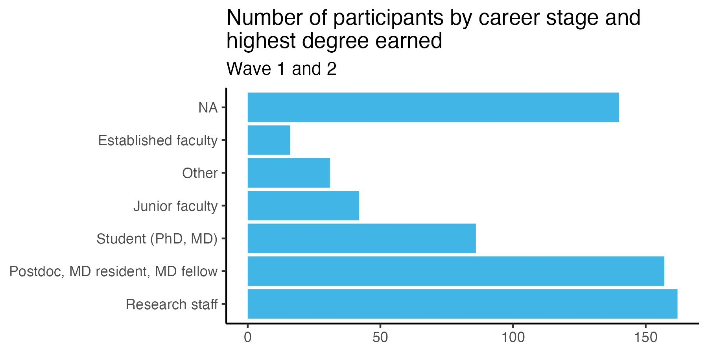

Rigor Champions Impact
================
Rose Hartman
2023-11-17

> Note that code chunks are not printed in this report in order to keep
> the output tidy. To see all of the code to generate these results,
> open the .Rmd file.

## Feedback over time

Each time a learner reads one of our modules, they are invited at the
end to submit anonymous feedback. The number of feedback response forms
submitted can provide us with an (under) estimate of the number of
learners we’re reaching with our modules.

Our modules are public, so anyone can access them. In the feedback
survey, respondents are asked to indicate if they’re a study participant
or not. What does the pattern of responses look like for people who
found us through means other than participation in the DART study?

## Impact of DART program on researchers’ data science skills

We ask researchers to self-report their level of ability on a range of
data science skills both before and after participating in DART.

In the Wave 1 data, we see a statistically significant improvement in
participants’ self-reported data science ability pre to post, with an
average change of .8 on the scale from 1 to 4. The mean standardized
change (the corresponding measure of effect size) is 1.5, meaning on
average participants’ rating went up 1.5 standard deviations from
pretest to posttest, a large effect.

Wave 2 is still underway so we can’t analyze those data yet but will be
able to in the coming weeks.

Note that our hypotheses for this study were all preregistered. You can
view [our preregistration on the Open Science
Foundation](https://osf.io/zmnr6/?view_only=2d26a411c57d49aca1754b8920e57a71).

## Our reach

Who are the DART learners, and where are they located?

### Career stage and formal training

About half of our participants hold PhDs (53%). The largest group of
learners we reach is research staff (33% of our participants), many of
whom do not hold terminal degrees in their field, followed by early
career trainees like postdocs, MD residents, and MD fellows (30%).

### Institutions

    ## Warning: Ignoring unknown aesthetics: x, y

