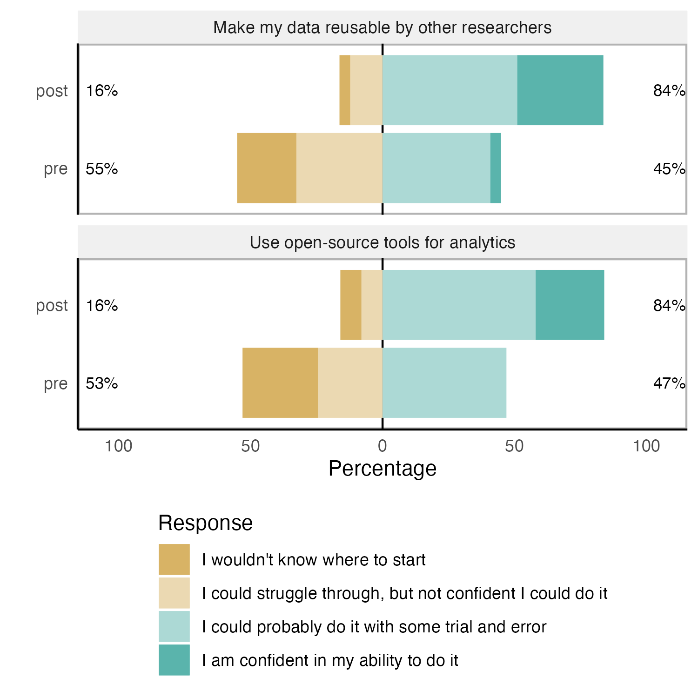
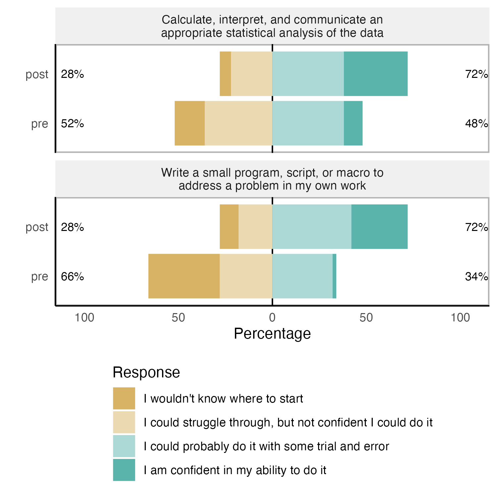

Rigor Champions Impact
================
Rose Hartman
2023-12-12

> Note that code chunks are not printed in this report in order to keep
> the output tidy. To see all of the code to generate these results,
> open the .Rmd file.

## Feedback over time

Each time a learner reads one of our modules, they are invited at the
end to submit anonymous feedback. The number of feedback response forms
submitted can provide us with an (under) estimate of the number of
learners we’re reaching with our modules.


Our modules are public, so anyone can access them. In the feedback
survey, respondents are asked to indicate if they’re a study participant
or not. What does the pattern of responses look like for people who
found us through means other than participation in the DART study?


### Feedback submitted by month

During our first year, we received an average of 23 feedback submissions
per month. That has grown to an average of 169.3 per month over the last
quarter.

## Impact of DART program on researchers’ data science skills

We ask researchers to self-report their level of ability on a range of
data science skills both before and after participating in DART.

In the Wave 1 data, we see a statistically significant improvement in
participants’ self-reported data science ability pre to post, with an
average change of .8 on the scale from 1 to 4. The mean standardized
change (the corresponding measure of effect size) is 1.5, meaning on
average participants’ rating went up 1.5 standard deviations from
pretest to posttest, a large effect.


Wave 2 is still underway so we can’t analyze those data yet but will be
able to in the coming weeks.

Note that our hypotheses for this study were all preregistered. You can
view [our preregistration on the Open Science
Foundation](https://osf.io/zmnr6/?view_only=2d26a411c57d49aca1754b8920e57a71).

## Our reach

Who are the DART learners, and where are they located?

### Career stage and formal training

About half of our participants hold PhDs (53%). The largest group of
learners we reach is research staff (33% of our participants), many of
whom do not hold terminal degrees in their field, followed by early
career trainees like postdocs, MD residents, and MD fellows (30%).

### Race and gender?

### Institutions

    ## Warning: Ignoring unknown aesthetics: x, y


# Reproducibility skills and attitudes

Hundreds of learners have acquired rigor and reproducibility skills
thanks to our efforts, and soon post-intervention data may demonstrate
changes to learner skills and, crucially, to their attitudes – an
important aspect of creating agents for more transparent science.

 


    ##                     fit_relevance                    continue_dart
    ##  Strongly Disagree         :  1   Strongly Disagree         :  0  
    ##  Disagree                  :  6   Disagree                  :  8  
    ##  Neither Agree Nor Disagree: 62   Neither Agree Nor Disagree: 20  
    ##  Agree                     :124   Agree                     : 75  
    ##  Strongly Agree            : 79   Strongly Agree            :124  
    ##  NA's                      :  9   NA's                      : 54

Across both Wave 1 and Wave 2, 203 research participants (72% of those
who completed the final survey) agreed or strongly agreed with the
statement “I learned things from my assigned modules that I can apply in
my research.” For Wave 2, we added the item “I intend to keep studying
with the DART materials,” to which 199 participants (85% of Wave 2
respondents) agreed or strongly agreed.


``` r
# modules that focus on reproducibility skills
reproducibility_modules <- c("reproducibility, generalizability, and reuse", 
                             "r basics introduction", 
                             "intro to version control",
                             "getting started with docker for research",
                             "demystifying containers",
                             "demystifying python",
                             "statistical tests in open source software",
                             "research data management basics",
                             "using the redcap api")
```

In our feedback form, we ask learners to indicate if they feel the
module met the learning objectives (“Were all the stated learning
objectives sufficiently addressed in the content?”). To get an (under)
estimate of how many learners have acquired research reproducibility
skills through DART, let’s count the number of responses indicating
“yes” learning objectives were met on modules that deal primarily with
reproducibility skills.

    ## # A tibble: 6 × 3
    ##   reproducibility_skills learning_objectives     n
    ##   <fct>                  <fct>               <int>
    ## 1 no                     no                     38
    ## 2 no                     yes                  1397
    ## 3 no                     <NA>                   15
    ## 4 yes                    no                     20
    ## 5 yes                    yes                   575
    ## 6 yes                    <NA>                    8
