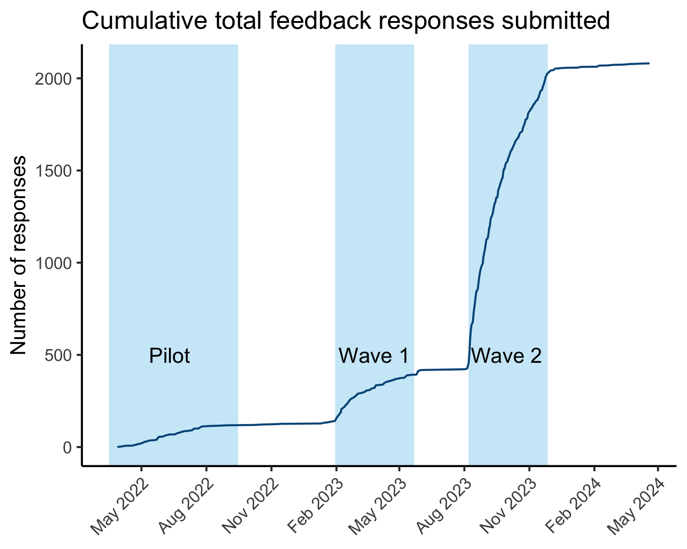

Rigor Champions Impact
================
Rose Hartman
2023-11-16

> Note that code chunks are not printed in this report in order to keep
> the output tidy. To see all of the code to generate these results,
> open the .Rmd file.

## Feedback over time

Each time a learner reads one of our modules, they are invited at the
end to submit anonymous feedback. The number of feedback response forms
submitted can provide us with an (under) estimate of the number of
learners we’re reaching with our modules.

Our modules are public, so anyone can access them. In the feedback
survey, respondents are asked to indicate if they’re a study participant
or not. What does the pattern of responses look like for people who
found us through means other than participation in the DART study?

