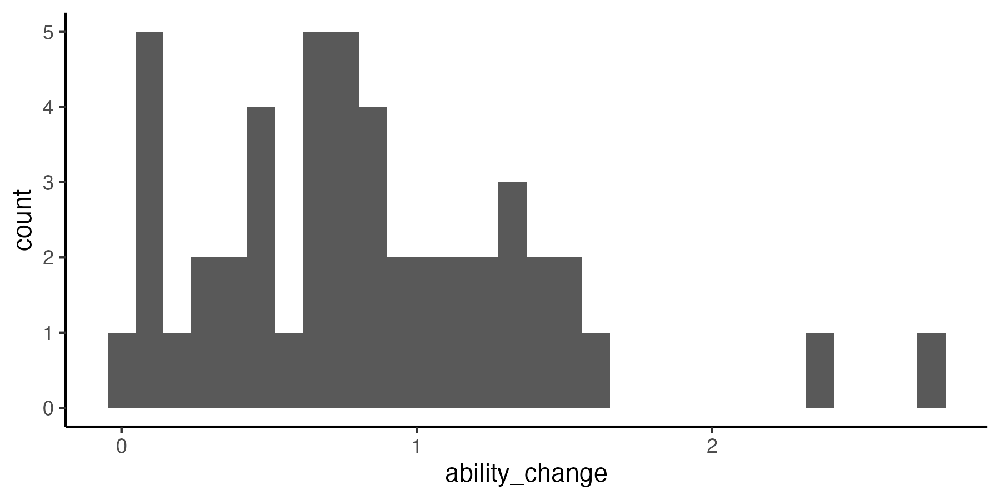
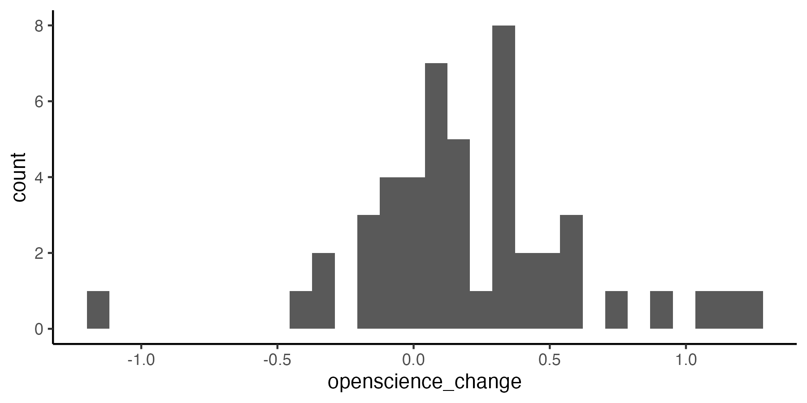
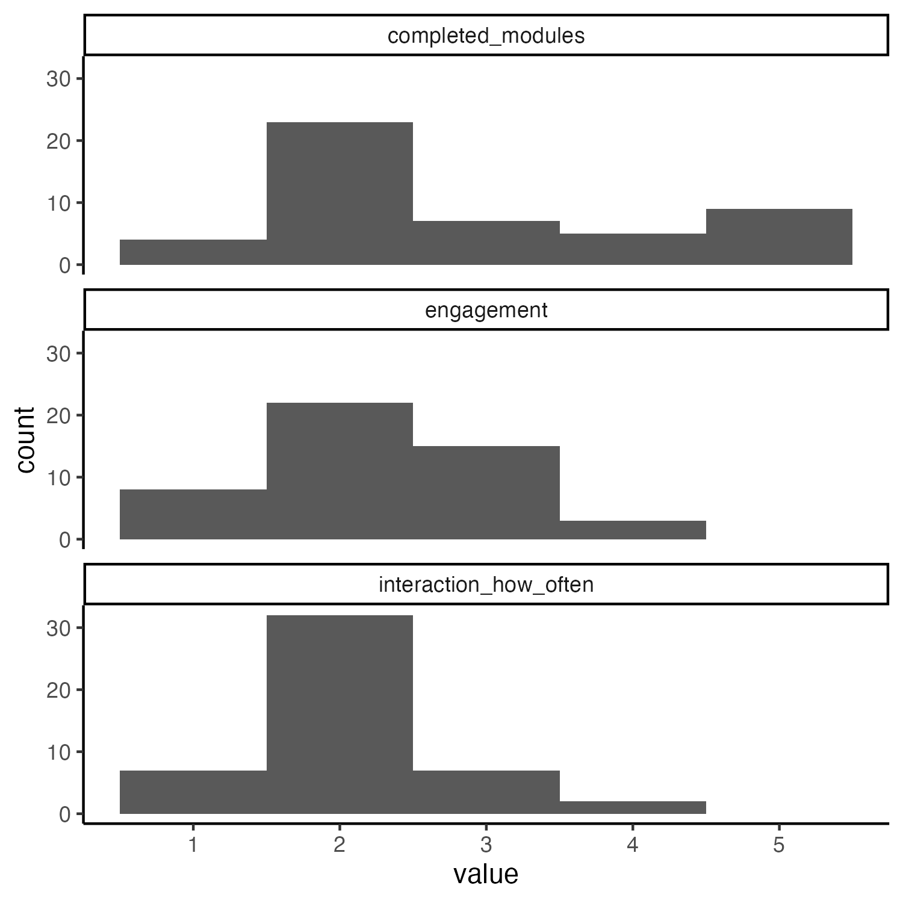
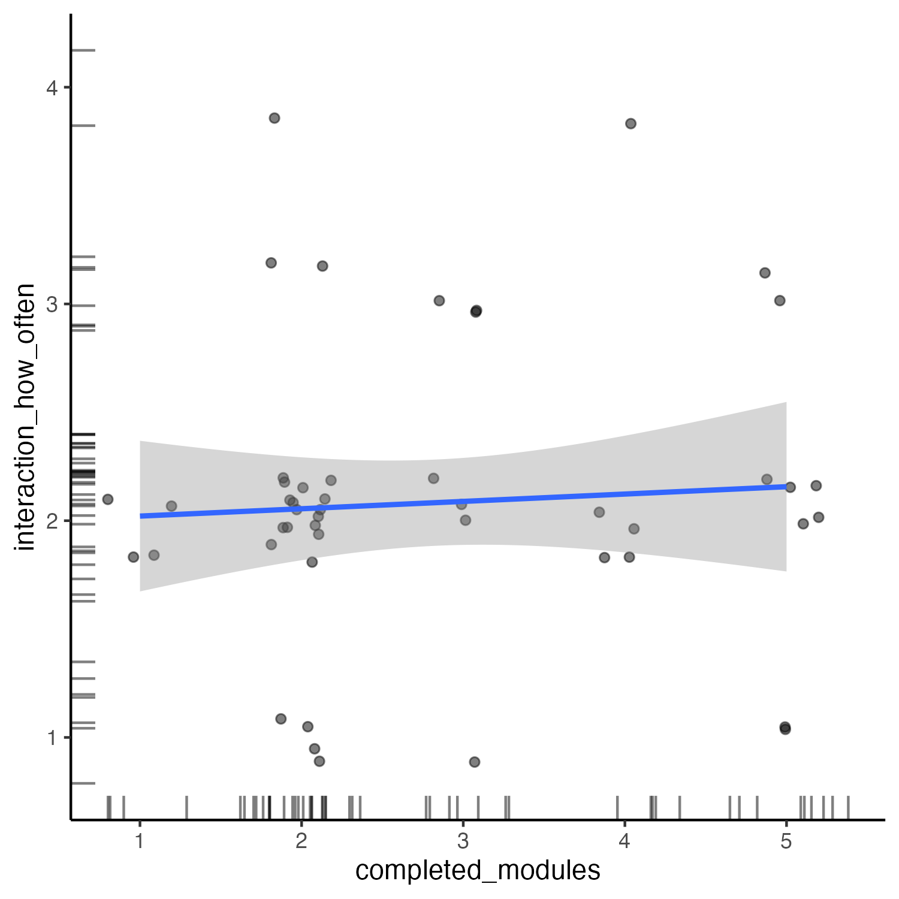
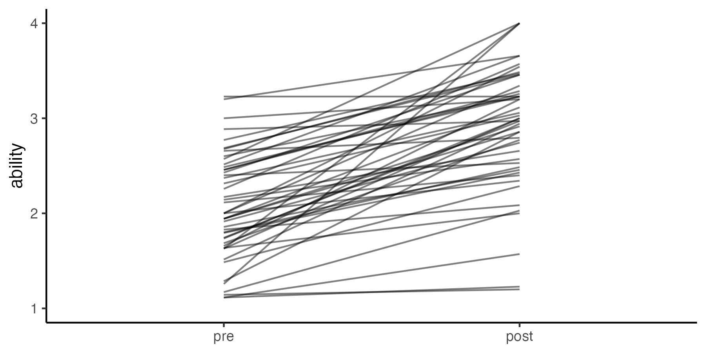
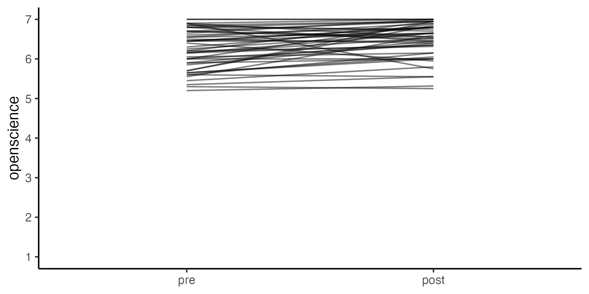
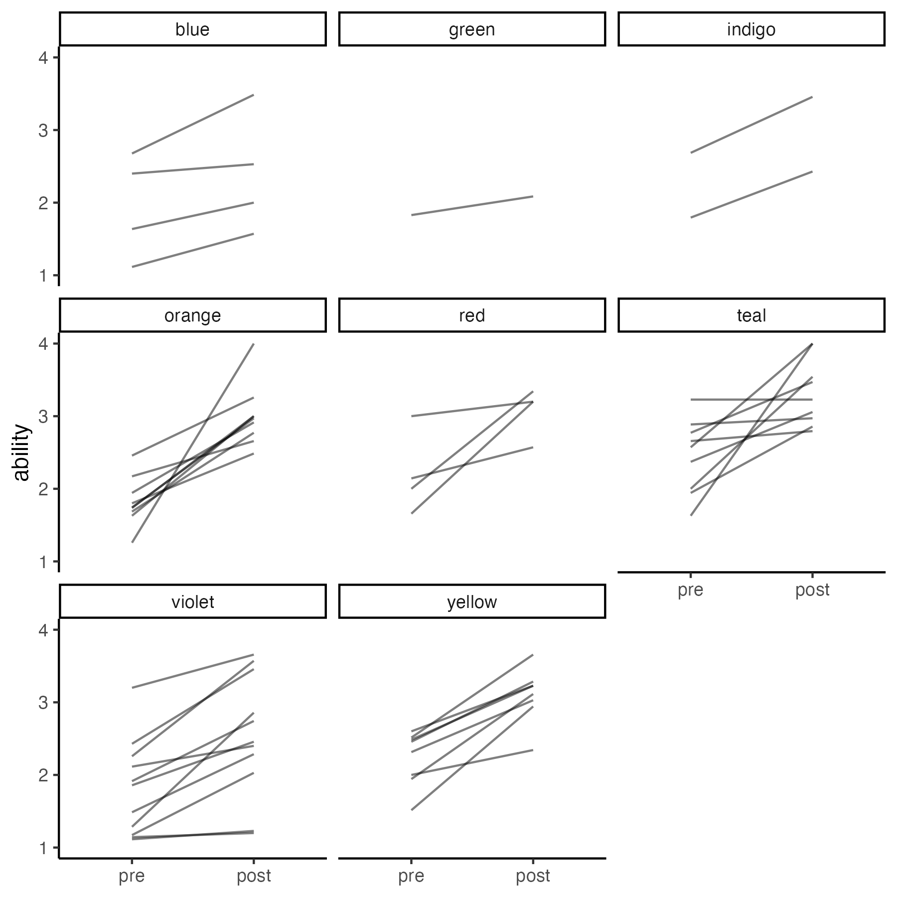
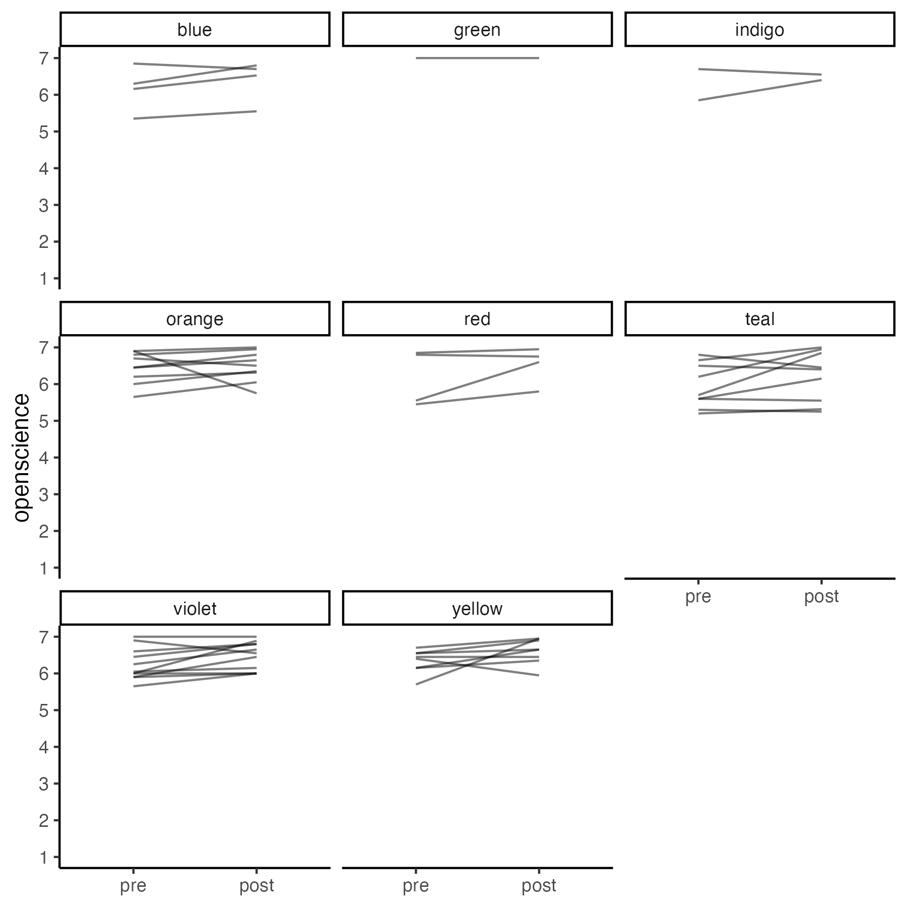

Hypothesis Testing
================
Rose Hartman
2023-06-15

``` r
# load custom functions for plotting
library(ggplot2)
theme_set(theme_classic())
source(here::here("src", "scripts", "functions_plotting.R"))

# if the figures directory doesn't exist, create it
dir.create(here::here("reports"), showWarnings = FALSE)
dir.create(here::here("reports", "figures"), showWarnings = FALSE)

knitr::opts_chunk$set(
  echo = TRUE
)
```

This report runs the hypothesis tests as specified in [our
preregistration on
OSF](https://osf.io/zmnr6/?view_only=2d26a411c57d49aca1754b8920e57a71).
The text descriptions preceeding the analyses in this report (except for
this opening text) are copied directly from the preregistration.

Note that all of our [surveys are available on
GH](https://github.com/arcus/education_dart_recruitment_comms/tree/main/surveys),
including the exact wording of questions and options.

``` r
waves <- readr::read_csv(here::here("participant_waves.csv"), show_col_types = FALSE)

nih_pre <- readRDS(here::here("data", "deidentified", "nih_pre.rds")) |> 
  dplyr::left_join(waves, by = "record_id") |> 
  dplyr::filter(wave == 1) |> 
  dplyr::mutate(event = "pre")
nih_post <- readRDS(here::here("data", "deidentified", "nih_post.rds")) |> 
  dplyr::left_join(waves, by = "record_id") |> 
  dplyr::filter(wave == 1)|> 
  dplyr::mutate(event = "post")
nih <- dplyr::bind_rows(nih_post, nih_pre)

exit <- readRDS(here::here("data", "deidentified", "exit_survey.rds")) |> 
  dplyr::left_join(waves, by = "record_id") |> 
  dplyr::filter(wave == 1)

# get pathway assignments
pathways <- readr::read_csv(here::here("participant_pathways.csv"), show_col_types = FALSE)
```

### Variables

> ability_pre and ability_post are the mean of participants’ ratings
> (assessed pre- or post-program, respectively) on the following items
> from survey2: all items under the instructions “please rate your
> ability to complete the following tasks”.

> openscience_pre and openscience_post are the mean of participants’
> ratings (assessed pre- or post-program, respectively) on the following
> items from survey2: all items under the heading “please rate your
> level of agreement with the following statements”

``` r
nih <- nih |> 
  # make factors numeric, so we can calculate means
  dplyr::mutate(dplyr::across(tidyselect::where(is.factor), as.numeric)) |> 
  dplyr::rowwise() |> 
  dplyr::mutate(ability = mean(dplyr::c_across(findable:atomize), na.rm = TRUE),
                openscience = mean(dplyr::c_across(data_storage_1:code_efficient), na.rm = TRUE))
```

> Measurements from the exit survey will be combined into an engagement
> index capturing learners’ level of engagement in the program. The two
> items “How many of your assigned learning modules did you complete?”
> and “How often did you engage with other learners in the program?”
> will be averaged to create the engagement index.

``` r
engagement <- exit |> 
  # make factors numeric, so we can calculate means
  dplyr::mutate(dplyr::across(tidyselect::where(is.factor), as.numeric)) |> 
  dplyr::rowwise() |> 
  dplyr::mutate(engagement = mean(c(completed_modules, interaction_how_often), na.rm = TRUE)) |> 
  # only keep record_id and the engagement index
  dplyr::select(record_id, engagement, completed_modules, interaction_how_often)
```

``` r
# combine engagement with nih data, drop variables we don't need, get it in wide format for easier comparison
data <- nih |> 
  dplyr::select(record_id, event, ability, openscience) |> 
  tidyr::pivot_longer(cols = c(ability, openscience)) |> 
  tidyr::pivot_wider(id_cols = record_id, names_from = c(name, event), values_from = value) |> 
  dplyr::left_join(engagement, by = "record_id") |> 
  dplyr::left_join(pathways, by = "record_id") |> 
  # calculate change scores
  dplyr::mutate(ability_change = ability_post - ability_pre,
                openscience_change = openscience_post - openscience_pre) |> 
  dplyr::select(record_id, pathway, engagement, completed_modules, interaction_how_often, ends_with("change"), ends_with("pre"), ends_with("post")) |> 
  # only keep cases that have data for all three key variables
  dplyr::filter(!is.na(engagement) & !is.na(ability_change) & !is.na(openscience_change))

# save this file in case we want it handy for other notebooks
saveRDS(data, file = here::here("data", "interim", "data_for_hyp_testing_w1.rds"))
```

## Hypotheses

> 1.  Learners’ self-ratings of their own ability to perform data
>     science tasks will increase over the course of the program (pre to
>     post).
> 2.  Learners’ self-ratings of their agreement with important tenets of
>     open science will increase over the course of the program (pre to
>     post).
> 3.  Change in 1 and 2 will be stronger for learners who report higher
>     levels of engagement in the program.

> All central hypotheses tested with mixed effects change-score models,
> with a random effect of cluster (change = post - pre), one model on
> change scores for ability and one on change scores for open science
> tenets. Another model including the effect of engagement as a
> covariate. For example:
>
> `lme4::lmer(change ~ 1 + (1|cluster), data)`
>
> `lme4::lmer(change ~ 1 + engagement + (1 + engagement|cluster), data)`
>
> Follow up analyses will include each of the two engagement items as
> covariates separately.
>
> If models with random slopes do not converge, drop the random slopes
> and include only a random intercept for cluster.
>
> If random intercepts model does not converge, run linear model with
> cluster as a fixed effect:
>
> `lm(change ~ -1 + cluster, data = data)`
>
> `lm(change ~ cluster*engagement, data = data)`
>
> Initial plain dependent samples t-test ignoring grouping by cluster,
> mostly as descriptive analysis:
>
> `t.test(x=data$pre, y=data$post, paired = TRUE)`

### H1: Learners’ self-ratings of their own ability to perform data science tasks will increase over the course of the program

``` r
(h1_t <- t.test(x=data$ability_post, y=data$ability_pre, paired = TRUE))
```

    ## 
    ##  Paired t-test
    ## 
    ## data:  data$ability_post and data$ability_pre
    ## t = 10.184, df = 47, p-value = 1.772e-13
    ## alternative hypothesis: true mean difference is not equal to 0
    ## 95 percent confidence interval:
    ##  0.6746013 1.0067267
    ## sample estimates:
    ## mean difference 
    ##        0.840664

``` r
mean(data$ability_change, na.rm = TRUE) # average change
```

    ## [1] 0.840664

``` r
sd(data$ability_change, na.rm = TRUE) # standard deviation
```

    ## [1] 0.5719008

``` r
# hist of change scores
(data |> 
  dplyr::filter(!is.na(engagement)) |> 
  ggplot(aes(x=ability_change)) + 
  geom_histogram()) |> 
  # the save_and_print function is defined in functions_plotting.R
  save_and_print(filename = "ability_change_hist_w1.png",
                 width = 6,
                 height = 3)
```

    ## `stat_bin()` using `bins = 30`. Pick better value with `binwidth`.

<!-- -->

Random intercepts model:

``` r
h1_randomint <- lme4::lmer(ability_change ~ 1 + (1|pathway), data)
summary(h1_randomint)
```

    ## Linear mixed model fit by REML ['lmerMod']
    ## Formula: ability_change ~ 1 + (1 | pathway)
    ##    Data: data
    ## 
    ## REML criterion at convergence: 84.7
    ## 
    ## Scaled residuals: 
    ##     Min      1Q  Median      3Q     Max 
    ## -1.4803 -0.6952 -0.1216  0.5906  3.2841 
    ## 
    ## Random effects:
    ##  Groups   Name        Variance Std.Dev.
    ##  pathway  (Intercept) 0.004468 0.06684 
    ##  Residual             0.323256 0.56856 
    ## Number of obs: 48, groups:  pathway, 8
    ## 
    ## Fixed effects:
    ##             Estimate Std. Error t value
    ## (Intercept)  0.83760    0.08643   9.691

### H2: Learners’ self-ratings of their agreement with important tenets of open science will increase over the course of the program

``` r
(h2_t <- t.test(x=data$openscience_post, y=data$openscience_pre, paired = TRUE))
```

    ## 
    ##  Paired t-test
    ## 
    ## data:  data$openscience_post and data$openscience_pre
    ## t = 3.5646, df = 47, p-value = 0.0008494
    ## alternative hypothesis: true mean difference is not equal to 0
    ## 95 percent confidence interval:
    ##  0.09290062 0.33361010
    ## sample estimates:
    ## mean difference 
    ##       0.2132554

``` r
mean(data$openscience_change, na.rm = TRUE) # average change
```

    ## [1] 0.2132554

``` r
sd(data$openscience_change, na.rm = TRUE) # standard deviation
```

    ## [1] 0.4144879

``` r
# hist of change scores
(data |> 
  dplyr::filter(!is.na(engagement)) |> 
  ggplot(aes(x=openscience_change)) + 
  geom_histogram()) |> 
  # the save_and_print function is defined in functions_plotting.R
  save_and_print(filename = "openscience_change_hist_w1.png",
                 width = 6,
                 height = 3)
```

    ## `stat_bin()` using `bins = 30`. Pick better value with `binwidth`.

<!-- -->

``` r
h2_randomint <- lme4::lmer(openscience_change ~ 1 + (1|pathway), data)
```

    ## boundary (singular) fit: see help('isSingular')

``` r
# boundary (singular) fit: see ?isSingular
```

``` r
h2_fe <- lm(openscience_change ~ -1 + pathway, data)
summary(h2_fe)
```

    ## 
    ## Call:
    ## lm(formula = openscience_change ~ -1 + pathway, data = data)
    ## 
    ## Residuals:
    ##      Min       1Q   Median       3Q      Max 
    ## -1.18509 -0.24214 -0.00625  0.23660  0.97533 
    ## 
    ## Coefficients:
    ##               Estimate Std. Error t value Pr(>|t|)  
    ## pathwayblue    0.22961    0.21788   1.054   0.2983  
    ## pathwaygreen   0.00000    0.43575   0.000   1.0000  
    ## pathwayindigo  0.20000    0.30812   0.649   0.5200  
    ## pathwayorange  0.03509    0.14525   0.242   0.8104  
    ## pathwayred     0.36250    0.21788   1.664   0.1040  
    ## pathwayteal    0.26287    0.14525   1.810   0.0779 .
    ## pathwayviolet  0.23535    0.13138   1.791   0.0808 .
    ## pathwayyellow  0.27467    0.15406   1.783   0.0822 .
    ## ---
    ## Signif. codes:  0 '***' 0.001 '**' 0.01 '*' 0.05 '.' 0.1 ' ' 1
    ## 
    ## Residual standard error: 0.4358 on 40 degrees of freedom
    ## Multiple R-squared:  0.2595, Adjusted R-squared:  0.1115 
    ## F-statistic: 1.753 on 8 and 40 DF,  p-value: 0.116

### H3: Change in 1 and 2 will be stronger for learners who report higher levels of engagement in the program

``` r
h3_ab <- lm(ability_change ~ engagement, data = data)
summary(h3_ab)
```

    ## 
    ## Call:
    ## lm(formula = ability_change ~ engagement, data = data)
    ## 
    ## Residuals:
    ##      Min       1Q   Median       3Q      Max 
    ## -0.76478 -0.39244 -0.07794  0.29335  2.12820 
    ## 
    ## Coefficients:
    ##             Estimate Std. Error t value Pr(>|t|)  
    ## (Intercept)   0.2609     0.2747   0.950   0.3471  
    ## engagement    0.2358     0.1070   2.205   0.0325 *
    ## ---
    ## Signif. codes:  0 '***' 0.001 '**' 0.01 '*' 0.05 '.' 0.1 ' ' 1
    ## 
    ## Residual standard error: 0.5498 on 46 degrees of freedom
    ## Multiple R-squared:  0.09557,    Adjusted R-squared:  0.07591 
    ## F-statistic: 4.861 on 1 and 46 DF,  p-value: 0.03251

``` r
h3_os <- lm(openscience_change ~ engagement, data = data)
summary(h3_os)
```

    ## 
    ## Call:
    ## lm(formula = openscience_change ~ engagement, data = data)
    ## 
    ## Residuals:
    ##      Min       1Q   Median       3Q      Max 
    ## -1.36469 -0.21901 -0.04058  0.17443  1.05256 
    ## 
    ## Coefficients:
    ##             Estimate Std. Error t value Pr(>|t|)
    ## (Intercept)  0.12841    0.20891   0.615    0.542
    ## engagement   0.03451    0.08136   0.424    0.673
    ## 
    ## Residual standard error: 0.4182 on 46 degrees of freedom
    ## Multiple R-squared:  0.003897,   Adjusted R-squared:  -0.01776 
    ## F-statistic:  0.18 on 1 and 46 DF,  p-value: 0.6734

``` r
# pathway as a fixed effect
h1_fe <- lm(ability_change ~ -1 + pathway, data = data)
h3_fe_ab <- lm(ability_change ~ -1 + pathway*engagement, data = data)
anova(h1_fe, h3_fe_ab)
```

    ## Analysis of Variance Table
    ## 
    ## Model 1: ability_change ~ -1 + pathway
    ## Model 2: ability_change ~ -1 + pathway * engagement
    ##   Res.Df     RSS Df Sum of Sq      F  Pr(>F)   
    ## 1     40 13.1173                               
    ## 2     33  7.2302  7    5.8871 3.8386 0.00371 **
    ## ---
    ## Signif. codes:  0 '***' 0.001 '**' 0.01 '*' 0.05 '.' 0.1 ' ' 1

``` r
h3_fe_os <- lm(openscience_change ~ -1 + pathway*engagement, data = data)
anova(h2_fe, h3_fe_os)
```

    ## Analysis of Variance Table
    ## 
    ## Model 1: openscience_change ~ -1 + pathway
    ## Model 2: openscience_change ~ -1 + pathway * engagement
    ##   Res.Df    RSS Df Sum of Sq     F Pr(>F)
    ## 1     40 7.5952                          
    ## 2     33 6.9013  7   0.69396 0.474 0.8463

Random intercepts:

``` r
h3_randomint_ab <- lme4::lmer(ability_change ~ 1 + engagement + (1|pathway), data) # fails to converge
```

    ## Warning in checkConv(attr(opt, "derivs"), opt$par, ctrl = control$checkConv, :
    ## Model failed to converge with max|grad| = 0.00442315 (tol = 0.002, component 1)

``` r
h3_randomint_os <- lme4::lmer(openscience_change ~ 1 + engagement + (1|pathway), data) # singular
```

    ## boundary (singular) fit: see help('isSingular')

Random slopes model:

``` r
h3_randomslope <- lme4::lmer(ability_change ~ 1 + engagement + (1 + engagement|pathway), data) # singular fit (i.e. we can't estimate this model)
```

    ## boundary (singular) fit: see help('isSingular')

``` r
h3_randomslope_os <- lme4::lmer(openscience_change ~ 1 + engagement + (1 + engagement|pathway), data) # singular fit (i.e. we can't estimate this model)
```

    ## boundary (singular) fit: see help('isSingular')

``` r
# drop participants from green pathway (n=1) and indigo (n=2)
h3_randomslope <- lme4::lmer(ability_change ~ 1 + engagement + (1 + engagement|pathway), dplyr::filter(data, pathway != "green" & pathway != "indigo")) # singular fit
```

    ## boundary (singular) fit: see help('isSingular')

``` r
# drop participants from green pathway (n=1) and indigo (n=2)
h3_randomslope_os <- lme4::lmer(openscience_change ~ 1 + engagement + (1 + engagement|pathway), dplyr::filter(data, pathway != "green" & pathway != "indigo")) # singular fit
```

    ## boundary (singular) fit: see help('isSingular')

## tldr

Our hypotheses, from the preregistration:

> 1.  Learners’ self-ratings of their own ability to perform data
>     science tasks will increase over the course of the program (pre to
>     post).
> 2.  Learners’ self-ratings of their agreement with important tenets of
>     open science will increase over the course of the program (pre to
>     post).
> 3.  Change in 1 and 2 will be stronger for learners who report higher
>     levels of engagement in the program.

H1 is supported by the data. A random intercepts model with pathway as
random effect shows a significant improvement in participants’
self-rated ability on data science tasks from pretest to post (see table
below). A paired t-test, ignoring the grouping structure altogether,
also shows a significant improvement in participants’ self-rated ability
on data science tasks from pretest to post, t(47) = 10.18, p \< .001
(mean (SD) change is 0.84 (0.57) on a 4-point scale from 1 “I wouldn’t
know where to start” to 4 “I am confident in my ability to do it”).

<table style="text-align:center">
<tr>
<td colspan="2" style="border-bottom: 1px solid black">
</td>
</tr>
<tr>
<td style="text-align:left">
</td>
<td>
<em>Dependent variable:</em>
</td>
</tr>
<tr>
<td>
</td>
<td colspan="1" style="border-bottom: 1px solid black">
</td>
</tr>
<tr>
<td style="text-align:left">
</td>
<td>
ability_change
</td>
</tr>
<tr>
<td colspan="2" style="border-bottom: 1px solid black">
</td>
</tr>
<tr>
<td style="text-align:left">
Constant
</td>
<td>
0.838<sup>\*\*\*</sup>
</td>
</tr>
<tr>
<td style="text-align:left">
</td>
<td>
(0.086)
</td>
</tr>
<tr>
<td style="text-align:left">
</td>
<td>
</td>
</tr>
<tr>
<td colspan="2" style="border-bottom: 1px solid black">
</td>
</tr>
<tr>
<td style="text-align:left">
Observations
</td>
<td>
48
</td>
</tr>
<tr>
<td style="text-align:left">
Log Likelihood
</td>
<td>
-42.350
</td>
</tr>
<tr>
<td style="text-align:left">
Akaike Inf. Crit.
</td>
<td>
90.700
</td>
</tr>
<tr>
<td style="text-align:left">
Bayesian Inf. Crit.
</td>
<td>
96.313
</td>
</tr>
<tr>
<td colspan="2" style="border-bottom: 1px solid black">
</td>
</tr>
<tr>
<td style="text-align:left">
<em>Note:</em>
</td>
<td style="text-align:right">
<sup>*</sup>p\<0.1; <sup>**</sup>p\<0.05; <sup>***</sup>p\<0.01
</td>
</tr>
</table>

H2 is not clearly supported by the data, although there’s some
suggestion of a trend in the predicted direction. The planned random
intercepts model was singular and therefore couldn’t be estimated. Our
pre-registered contingency plan in this case was to run a linear model
with pathway as a fixed effect instead, which shows no significant
improvement in agreement with open science values in any of the 8
pathways R² = .26, F(8, 40) = 1.75, p = .116. A paired t-test, ignoring
the grouping structure altogether, shows a significant improvement in
participants’ self-rated level of agreement with open science values
from pretest to post, t(47) = 3.56, p \< .001 (mean (SD) change is 0.21
(0.41) on a 7-point scale from 1 “strongly disagree” to 7 “strongly
agree”). An examination of the raw scores for open science items reveals
a probable ceiling effect; the mean open science score at pretest was
already 6.25 on a scale from 1 to 7, so there was no room to improve for
many participants.

<table style="text-align:center">
<tr>
<td colspan="2" style="border-bottom: 1px solid black">
</td>
</tr>
<tr>
<td style="text-align:left">
</td>
<td>
<em>Dependent variable:</em>
</td>
</tr>
<tr>
<td>
</td>
<td colspan="1" style="border-bottom: 1px solid black">
</td>
</tr>
<tr>
<td style="text-align:left">
</td>
<td>
openscience_change
</td>
</tr>
<tr>
<td colspan="2" style="border-bottom: 1px solid black">
</td>
</tr>
<tr>
<td style="text-align:left">
pathwayblue
</td>
<td>
0.230
</td>
</tr>
<tr>
<td style="text-align:left">
</td>
<td>
(0.218)
</td>
</tr>
<tr>
<td style="text-align:left">
</td>
<td>
</td>
</tr>
<tr>
<td style="text-align:left">
pathwaygreen
</td>
<td>
0.000
</td>
</tr>
<tr>
<td style="text-align:left">
</td>
<td>
(0.436)
</td>
</tr>
<tr>
<td style="text-align:left">
</td>
<td>
</td>
</tr>
<tr>
<td style="text-align:left">
pathwayindigo
</td>
<td>
0.200
</td>
</tr>
<tr>
<td style="text-align:left">
</td>
<td>
(0.308)
</td>
</tr>
<tr>
<td style="text-align:left">
</td>
<td>
</td>
</tr>
<tr>
<td style="text-align:left">
pathwayorange
</td>
<td>
0.035
</td>
</tr>
<tr>
<td style="text-align:left">
</td>
<td>
(0.145)
</td>
</tr>
<tr>
<td style="text-align:left">
</td>
<td>
</td>
</tr>
<tr>
<td style="text-align:left">
pathwayred
</td>
<td>
0.363
</td>
</tr>
<tr>
<td style="text-align:left">
</td>
<td>
(0.218)
</td>
</tr>
<tr>
<td style="text-align:left">
</td>
<td>
</td>
</tr>
<tr>
<td style="text-align:left">
pathwayteal
</td>
<td>
0.263<sup>\*</sup>
</td>
</tr>
<tr>
<td style="text-align:left">
</td>
<td>
(0.145)
</td>
</tr>
<tr>
<td style="text-align:left">
</td>
<td>
</td>
</tr>
<tr>
<td style="text-align:left">
pathwayviolet
</td>
<td>
0.235<sup>\*</sup>
</td>
</tr>
<tr>
<td style="text-align:left">
</td>
<td>
(0.131)
</td>
</tr>
<tr>
<td style="text-align:left">
</td>
<td>
</td>
</tr>
<tr>
<td style="text-align:left">
pathwayyellow
</td>
<td>
0.275<sup>\*</sup>
</td>
</tr>
<tr>
<td style="text-align:left">
</td>
<td>
(0.154)
</td>
</tr>
<tr>
<td style="text-align:left">
</td>
<td>
</td>
</tr>
<tr>
<td colspan="2" style="border-bottom: 1px solid black">
</td>
</tr>
<tr>
<td style="text-align:left">
Observations
</td>
<td>
48
</td>
</tr>
<tr>
<td style="text-align:left">
R<sup>2</sup>
</td>
<td>
0.260
</td>
</tr>
<tr>
<td style="text-align:left">
Adjusted R<sup>2</sup>
</td>
<td>
0.111
</td>
</tr>
<tr>
<td style="text-align:left">
Residual Std. Error
</td>
<td>
0.436 (df = 40)
</td>
</tr>
<tr>
<td style="text-align:left">
F Statistic
</td>
<td>
1.753 (df = 8; 40)
</td>
</tr>
<tr>
<td colspan="2" style="border-bottom: 1px solid black">
</td>
</tr>
<tr>
<td style="text-align:left">
<em>Note:</em>
</td>
<td style="text-align:right">
<sup>*</sup>p\<0.1; <sup>**</sup>p\<0.05; <sup>***</sup>p\<0.01
</td>
</tr>
</table>

H3 is partially supported in the data. Engagement significantly predicts
change in self-rated ability (R² = .10, F(1, 46) = 4.86, p = .033) but
not change in level of agreement with open science values (R² = .00,
F(1, 46) = 0.18, p = .673), ignoring the grouping by pathways. A linear
model with pathway as a fixed effect shows no significant effect of
engagement on open science values for any of the pathways (F(7, 33) =
0.47, p = .846), but there is some evidence of an effect of engagement
on change in ability in a model with pathway as a fixed effect (F(7, 33)
= 3.84, p = .004). This result is ambiguous, however, because the
significant interaction between engagement and pathway appears to be
driven by respondents in a single pathway (“teal” pathway, n=9), rather
than being a more general effect.  
Mixed effects models including engagement (with random intercepts only,
or with random intercepts and random slopes for engagement) do not
converge for either the ability or open science outcome.

One possible explanation of the lack of an effect of engagement is the
quality of the engagement index itself. It is the average of
participants’ reported amount of interaction with other participants
(`interaction_how_often`) and amount of completed modules
(`completed_modules`), but overall reported interaction with other
participants was very low (mean = 2.08 on a scale of 1=Never, 2=Very
little, 3=Sometimes, 4=Frequently, 5=Very frequently) and the
correlation between completed modules and interaction with other
participants was small (r=.06). We had expected interaction with other
participants and completion of modules to be highly correlated, both
indicating an overall level of engagement with the program, but that is
not the case. Qualitative feedback from some participants speaks to
frustration with a lack opportunities to connect with other
participants, and a lack of response from other participants when
interaction was attempted; these barriers to interaction may have
undermined the effectiveness of that measure as an indicator of
engagement. In retrospect, using `completed_modules` alone may have been
a better proxy for participants’ engagement in the program. An
alternative approach would be to build a more complete model of the
engagement construct, with more measures capturing engagement and better
internal consistency among items.

## Discussion

### plots

``` r
plot_data <- data |> 
  tidyr::pivot_longer(cols=tidyselect::starts_with(c("ability","openscience"))) |> 
  tidyr::separate(name, into=c("measure", "event"), sep="_") |> 
  tidyr::pivot_wider(names_from = measure, values_from = value) |> 
  dplyr::mutate(event = factor(event, levels = c("pre", "post", "change")))
```

How about those engagement scores?

- `interaction_how_often` = How often did you engage with other DART
  participants in the program? (1, Never \| 2, Very little \| 3,
  Sometimes \| 4, Frequently \| 5, Very frequently)
- `completed_modules` = How many of the assigned learning modules on
  your pathway did you complete? (1, None at all \| 2, A few \| 3, About
  half \| 4, Most \| 5, All)

``` r
(engagement |> 
  tidyr::pivot_longer(cols = -record_id) |> 
  ggplot(aes(x=value)) + 
  geom_histogram(bins=5) + 
  facet_wrap(~name, ncol=1)) |> 
  # the save_and_print function is defined in functions_plotting.R
  save_and_print(filename = "engagement_hist_w1.png",
                 width = 5,
                 height = 5)
```

<!-- -->

``` r
(engagement |> 
  ggplot(aes(x=completed_modules, y=interaction_how_often)) + 
  geom_jitter(width = .2, height = .2, alpha=.5) + 
  geom_rug(position = "jitter", alpha=.5) + 
  stat_smooth(method = "lm")) |> 
  # the save_and_print function is defined in functions_plotting.R
  save_and_print(filename = "engagement_scatter_w1.png",
                 width = 5,
                 height = 5)
```

    ## `geom_smooth()` using formula = 'y ~ x'

<!-- -->

``` r
# 1, I wouldn't know where to start | 2, I could struggle through, but not confident I could do it | 3, I could probably do it with some trial and error | 4, I am confident in my ability to do it 
(plot_data |> 
  dplyr::filter(event %in% c("pre", "post")) |> 
  ggplot(aes(x=event, y=ability, group = record_id)) + 
  geom_line(alpha = .5) + 
  scale_y_continuous(breaks = 1:4, limits = c(1,4)) + 
  labs(x=NULL)) |> 
  # the save_and_print function is defined in functions_plotting.R
  save_and_print(filename = "ability_change_lines_w1.png",
                 width = 6,
                 height = 3)
```

<!-- -->

``` r
# 1, strongly disagree | 2, disagree | 3, somewhat disagree | 4, neither agree nor disagree | 5, somewhat agree | 6, agree | 7, strongly agree
(plot_data |> 
  dplyr::filter(event %in% c("pre", "post")) |> 
  ggplot(aes(x=event, y=openscience, group = record_id)) + 
  geom_line(alpha = .5) + 
  scale_y_continuous(breaks = 1:7, limits = c(1,7)) + 
  labs(x=NULL)) |> 
  # the save_and_print function is defined in functions_plotting.R
  save_and_print(filename = "openscience_change_lines_w1.png",
                 width = 6,
                 height = 3)
```

<!-- -->

``` r
# 1, I wouldn't know where to start | 2, I could struggle through, but not confident I could do it | 3, I could probably do it with some trial and error | 4, I am confident in my ability to do it 
(plot_data |> 
  dplyr::filter(event %in% c("pre", "post")) |> 
  ggplot(aes(x=event, y=ability, group = record_id)) + 
  geom_line(alpha = .5) + 
  scale_y_continuous(breaks = 1:4, limits = c(1,4)) + 
  labs(x=NULL) + 
  facet_wrap(~pathway)) |> 
  # the save_and_print function is defined in functions_plotting.R
  save_and_print(filename = "ability_change_by_pathway_w1.png",
                 width = 6,
                 height = 6)
```

<!-- -->

``` r
# 1, strongly disagree | 2, disagree | 3, somewhat disagree | 4, neither agree nor disagree | 5, somewhat agree | 6, agree | 7, strongly agree
(plot_data |> 
  dplyr::filter(event %in% c("pre", "post")) |> 
  ggplot(aes(x=event, y=openscience, group = record_id)) + 
  geom_line(alpha = .5) + 
  scale_y_continuous(breaks = 1:7, limits = c(1,7)) + 
  labs(x=NULL) + 
  facet_wrap(~pathway))|> 
  # the save_and_print function is defined in functions_plotting.R
  save_and_print(filename = "openscience_change_by_pathway_w1.png",
                 width = 6,
                 height = 6)
```

<!-- -->

### n per cluster

``` r
# only n=1 in green pathway, n=2 in indigo
data |> 
  dplyr::count(pathway) |> 
  knitr::kable()
```

| pathway |   n |
|:--------|----:|
| blue    |   4 |
| green   |   1 |
| indigo  |   2 |
| orange  |   9 |
| red     |   4 |
| teal    |   9 |
| violet  |  11 |
| yellow  |   8 |

In order to estimate models with pathway as a random effect, we need
bigger n in all groups.
