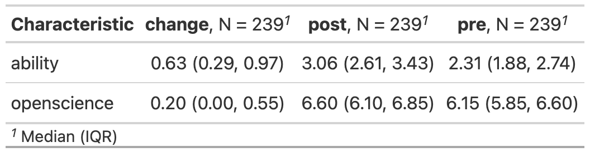
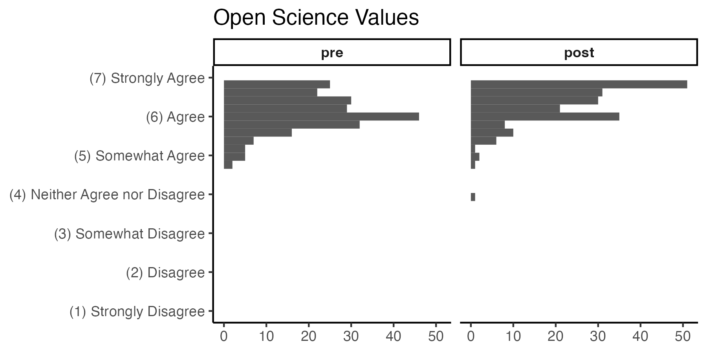
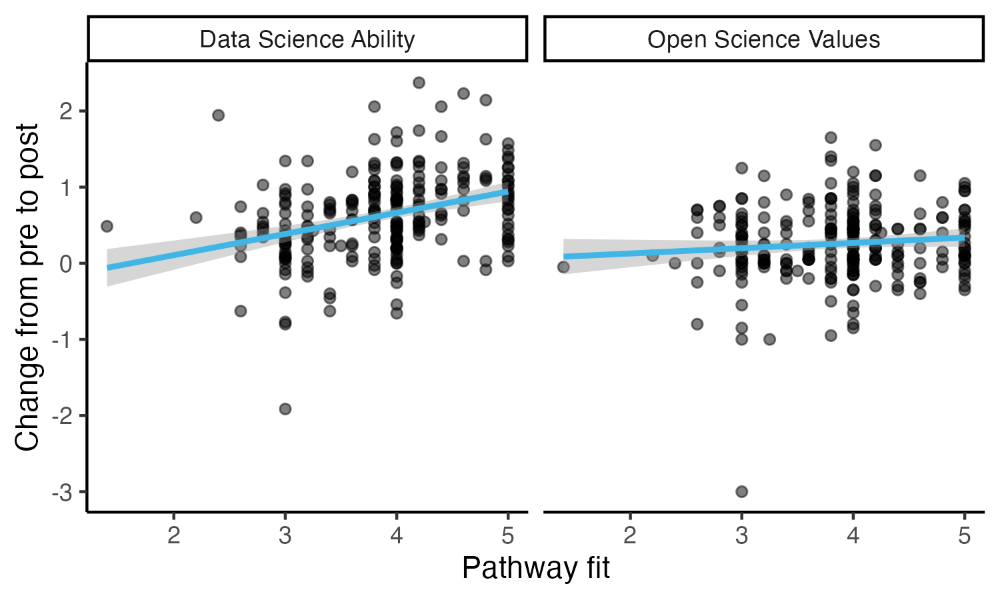
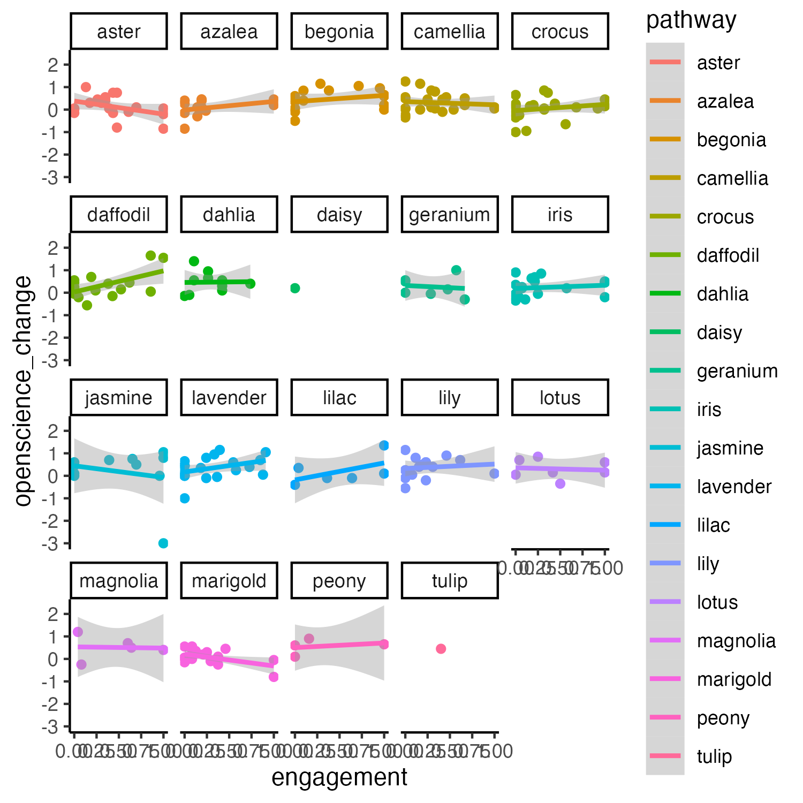
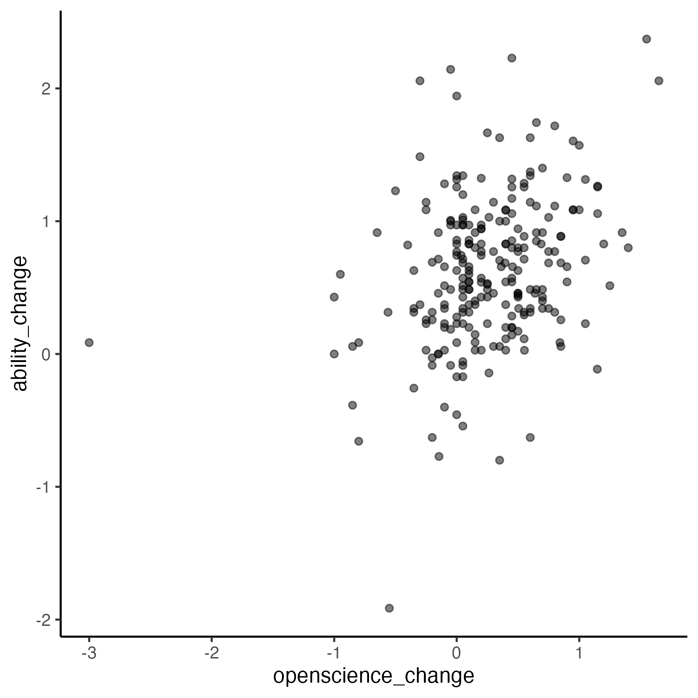

Wave 2 Hypothesis Testing
================
Rose Hartman
2024-02-29

> Note that code chunks are not printed in this report in order to keep
> the output tidy. To see all of the code to generate these results,
> open the .Rmd file.

This report executes the tests from [our
preregistration](https://osf.io/zmnr6). Text that appears as quotes in
this report is taken verbatim from the preregistration.

## Hypotheses to test

> 1.  Learners’ self-ratings of their own ability to perform data
>     science tasks will increase over the course of the program (pre to
>     post).
> 2.  Learners’ self-ratings of their agreement with important tenets of
>     open science will increase over the course of the program (pre to
>     post).
> 3.  Change in 1 and 2 will be stronger for learners who report higher
>     levels of engagement in the program.
>
> Additional hypotheses:
>
> 4.  Change in 1 and 2 will be higher for learners who report higher
>     levels of agreement with the statement “Self-paced asynchronous
>     studying works well for me in general”
> 5.  Change in 1 and 2 will be higher for learners who report higher
>     average levels of agreement with the statements about the
>     appropriateness of their assigned pathway (“The skills and topics
>     I was hoping to learn were covered in my modules”, “My assigned
>     modules worked together well as a learning pathway”, “My assigned
>     modules were appropriate to my skill level”, “I learned things
>     from my assigned modules that I can apply in my research”, and
>     “The assigned modules for my pathway were relevant to my learning
>     goals”)

This data includes 401 records for the NIH items (ability and open
science variables) at pretest, and 255 at post test. There are 248 exit
survey records (asynchronous learning preference and pathway fit
variables). There are 419 NALMS records (used to calculate engagement),
but note that only 243 actually show any activity from participants.

## Define variables

From our preregistration:

> For all mean scores, the mean will be computed on available data
> (i.e. using na.rm = TRUE).

> ability_pre and ability_post are the mean of participants’ ratings
> (assessed pre- or post-program, respectively) on the following items
> from survey2: all items under the instructions “please rate your
> ability to complete the following tasks”.
>
> openscience_pre and openscience_post are the mean of participants’
> ratings (assessed pre- or post-program, respectively) on the following
> items from survey2: all items under the heading “please rate your
> level of agreement with the following statements”

> Engagement is defined as number of modules marked complete out of
> total modules assigned as of the last day of the program (12am Eastern
> 2023-11-27).

> Asynchronous learning preference is participants’ level of agreement
> (1strongly disagree - 5 strongly agree) with the statement “Self-paced
> asynchronous studying works well for me in general”.

> Pathway fit is the mean of participants’ level of agreement (1strongly
> disagree - 5 strongly agree) with the following five statements: “The
> skills and topics I was hoping to learn were covered in my modules”,
> “My assigned modules worked together well as a learning pathway”, “My
> assigned modules were appropriate to my skill level”, “I learned
> things from my assigned modules that I can apply in my research”, “The
> assigned modules for my pathway were relevant to my learning goals”)

Here is a quick summary of the fields that will be used in this analysis
(scroll right to see the rest):

|     | record_id     | pathway      | ability_post  | ability_pre   | openscience_post | openscience_pre | ability_change  | openscience_change | engagement     | pathway_fit   | asynch        |
|:----|:--------------|:-------------|:--------------|:--------------|:-----------------|:----------------|:----------------|:-------------------|:---------------|:--------------|:--------------|
|     | Min. : 3.0    | camellia: 26 | Min. :1.000   | Min. :1.000   | Min. :4.000      | Min. :4.800     | Min. :-1.9143   | Min. :-3.0000      | Min. :0.0000   | Min. :1.400   | Min. :1.000   |
|     | 1st Qu.:349.0 | crocus : 24  | 1st Qu.:2.614 | 1st Qu.:1.884 | 1st Qu.:6.100    | 1st Qu.:5.850   | 1st Qu.: 0.2899 | 1st Qu.: 0.0000    | 1st Qu.:0.0000 | 1st Qu.:3.225 | 1st Qu.:3.000 |
|     | Median :508.0 | lavender: 20 | Median :3.057 | Median :2.314 | Median :6.600    | Median :6.150   | Median : 0.6286 | Median : 0.2000    | Median :0.2381 | Median :4.000 | Median :4.000 |
|     | Mean :474.6   | aster : 19   | Mean :2.949   | Mean :2.325   | Mean :6.445      | Mean :6.187     | Mean : 0.6248   | Mean : 0.2575      | Mean :0.3329   | Mean :3.862   | Mean :3.644   |
|     | 3rd Qu.:648.0 | marigold: 19 | 3rd Qu.:3.429 | 3rd Qu.:2.743 | 3rd Qu.:6.850    | 3rd Qu.:6.600   | 3rd Qu.: 0.9714 | 3rd Qu.: 0.5500    | 3rd Qu.:0.5527 | 3rd Qu.:4.200 | 3rd Qu.:5.000 |
|     | Max. :823.0   | iris : 18    | Max. :4.000   | Max. :3.971   | Max. :7.000      | Max. :7.000     | Max. : 2.3714   | Max. : 1.6500      | Max. :1.0000   | Max. :5.000   | Max. :5.000   |
|     |               | (Other) :113 |               |               |                  |                 |                 |                    |                |               |               |

# Preregistered hypothesis tests

From our preregistration:

> All central hypotheses tested with mixed effects change-score models,
> with a random effect of cluster (change = post - pre), one model on
> change scores for ability and one on change scores for open science
> tenets. Another model including the effect of moderators as a
> covariate. For example:
>
>     lme4::lmer(change ~ 1 + (1|cluster), data)
>     lme4::lmer(change ~ 1 + engagement + (1 + engagement|cluster), data)
>     lme4::lmer(change ~ 1 + asynch + (1 + asynch|cluster), data)
>     lme4::lmer(change ~ 1 + pathway_fit + (1 + pathway_fit|cluster), data)
>
> If models with random slopes do not converge, drop the random slopes
> and include only a random intercept for cluster.
>
> If random intercepts model does not converge, run linear model with
> cluster as a fixed effect, and omitting cluster altogether:
>
>     lm(change ~ cluster, data = data)
>     lm(change ~ 1, data = data)
>     lm(change ~ cluster*engagement, data = data)
>     lm(change ~ engagement, data = data)
>     lm(change ~ cluster*asynch, data = data)
>     lm(change ~ asynch, data = data)
>     lm(change ~ cluster*pathway_fit, data = data)
>     lm(change ~ pathway_fit, data = data)
>
> Whether or not mixed models work, also run plain dependent samples
> t-test ignoring grouping by cluster:
>
>     t.test(x=data$pre, y=data$post, paired = TRUE)

> p values for mixed effects models calculated using Satterthwaite
> approximation (lmerTest package in R)

    ## Loading required package: lme4

    ## Loading required package: Matrix

    ## 
    ## Attaching package: 'lmerTest'

    ## The following object is masked from 'package:lme4':
    ## 
    ##     lmer

    ## The following object is masked from 'package:stats':
    ## 
    ##     step

## Hypothesis 1

> 1.  Learners’ self-ratings of their own ability to perform data
>     science tasks will increase over the course of the program (pre to
>     post).

    ## Linear mixed model fit by REML. t-tests use Satterthwaite's method [
    ## lmerModLmerTest]
    ## Formula: ability_change ~ 1 + (1 | pathway)
    ##    Data: data
    ## 
    ## REML criterion at convergence: 407.5
    ## 
    ## Scaled residuals: 
    ##     Min      1Q  Median      3Q     Max 
    ## -4.3817 -0.5884  0.0215  0.5719  3.0648 
    ## 
    ## Random effects:
    ##  Groups   Name        Variance Std.Dev.
    ##  pathway  (Intercept) 0.008308 0.09115 
    ##  Residual             0.310587 0.55730 
    ## Number of obs: 239, groups:  pathway, 19
    ## 
    ## Fixed effects:
    ##             Estimate Std. Error       df t value Pr(>|t|)    
    ## (Intercept)  0.62025    0.04313 14.86711   14.38 3.96e-10 ***
    ## ---
    ## Signif. codes:  0 '***' 0.001 '**' 0.01 '*' 0.05 '.' 0.1 ' ' 1

    ## 
    ##  Paired t-test
    ## 
    ## data:  data$ability_post and data$ability_pre
    ## t = 17.118, df = 238, p-value < 2.2e-16
    ## alternative hypothesis: true difference in means is not equal to 0
    ## 95 percent confidence interval:
    ##  0.5528928 0.6967025
    ## sample estimates:
    ## mean of the differences 
    ##               0.6247976

## Hypothesis 2

> 2.  Learners’ self-ratings of their agreement with important tenets of
>     open science will increase over the course of the program (pre to
>     post).

    ## Linear mixed model fit by REML. t-tests use Satterthwaite's method [
    ## lmerModLmerTest]
    ## Formula: openscience_change ~ 1 + (1 | pathway)
    ##    Data: data
    ## 
    ## REML criterion at convergence: 350.8
    ## 
    ## Scaled residuals: 
    ##     Min      1Q  Median      3Q     Max 
    ## -6.5500 -0.5294 -0.0566  0.5641  2.7677 
    ## 
    ## Random effects:
    ##  Groups   Name        Variance Std.Dev.
    ##  pathway  (Intercept) 0.005041 0.0710  
    ##  Residual             0.245708 0.4957  
    ## Number of obs: 239, groups:  pathway, 19
    ## 
    ## Fixed effects:
    ##             Estimate Std. Error       df t value Pr(>|t|)    
    ## (Intercept)  0.26242    0.03703 15.85001   7.088 2.71e-06 ***
    ## ---
    ## Signif. codes:  0 '***' 0.001 '**' 0.01 '*' 0.05 '.' 0.1 ' ' 1

    ## 
    ##  Paired t-test
    ## 
    ## data:  data$openscience_post and data$openscience_pre
    ## t = 7.9543, df = 238, p-value = 7.283e-14
    ## alternative hypothesis: true difference in means is not equal to 0
    ## 95 percent confidence interval:
    ##  0.1937431 0.3213001
    ## sample estimates:
    ## mean of the differences 
    ##               0.2575216

## Hypothesis 3

> 3.  Change in 1 and 2 will be stronger for learners who report higher
>     levels of engagement in the program.

    ## Linear mixed model fit by REML. t-tests use Satterthwaite's method [
    ## lmerModLmerTest]
    ## Formula: ability_change ~ 1 + engagement + (1 + engagement | pathway)
    ##    Data: data
    ## 
    ## REML criterion at convergence: 400.2
    ## 
    ## Scaled residuals: 
    ##     Min      1Q  Median      3Q     Max 
    ## -4.3404 -0.6117 -0.0134  0.5545  2.9113 
    ## 
    ## Random effects:
    ##  Groups   Name        Variance Std.Dev. Corr 
    ##  pathway  (Intercept) 0.01395  0.1181        
    ##           engagement  0.14468  0.3804   -0.72
    ##  Residual             0.28769  0.5364        
    ## Number of obs: 239, groups:  pathway, 19
    ## 
    ## Fixed effects:
    ##             Estimate Std. Error       df t value Pr(>|t|)    
    ## (Intercept)  0.53508    0.05749 12.22751   9.307 6.68e-07 ***
    ## engagement   0.27933    0.14082 13.22258   1.984   0.0685 .  
    ## ---
    ## Signif. codes:  0 '***' 0.001 '**' 0.01 '*' 0.05 '.' 0.1 ' ' 1
    ## 
    ## Correlation of Fixed Effects:
    ##            (Intr)
    ## engagement -0.690

    ## refitting model(s) with ML (instead of REML)

    ## Data: data
    ## Models:
    ## h1: ability_change ~ 1 + (1 | pathway)
    ## h3_ability: ability_change ~ 1 + engagement + (1 + engagement | pathway)
    ##            npar    AIC    BIC  logLik deviance  Chisq Df Pr(>Chisq)  
    ## h1            3 409.06 419.49 -201.53   403.06                       
    ## h3_ability    6 405.56 426.41 -196.78   393.56 9.5064  3    0.02326 *
    ## ---
    ## Signif. codes:  0 '***' 0.001 '**' 0.01 '*' 0.05 '.' 0.1 ' ' 1

    ## boundary (singular) fit: see ?isSingular

    ## Warning: Model failed to converge with 1 negative eigenvalue: -3.0e+00

    ## Linear mixed model fit by REML. t-tests use Satterthwaite's method [
    ## lmerModLmerTest]
    ## Formula: openscience_change ~ 1 + engagement + (1 | pathway)
    ##    Data: data
    ## 
    ## REML criterion at convergence: 352.2
    ## 
    ## Scaled residuals: 
    ##     Min      1Q  Median      3Q     Max 
    ## -6.6989 -0.5315 -0.0219  0.5540  2.6508 
    ## 
    ## Random effects:
    ##  Groups   Name        Variance Std.Dev.
    ##  pathway  (Intercept) 0.005024 0.07088 
    ##  Residual             0.245253 0.49523 
    ## Number of obs: 239, groups:  pathway, 19
    ## 
    ## Fixed effects:
    ##              Estimate Std. Error        df t value Pr(>|t|)    
    ## (Intercept)   0.22485    0.04840  40.13628   4.645 3.62e-05 ***
    ## engagement    0.11209    0.09316 235.23604   1.203     0.23    
    ## ---
    ## Signif. codes:  0 '***' 0.001 '**' 0.01 '*' 0.05 '.' 0.1 ' ' 1
    ## 
    ## Correlation of Fixed Effects:
    ##            (Intr)
    ## engagement -0.645

    ## refitting model(s) with ML (instead of REML)

    ## Data: data
    ## Models:
    ## h2: openscience_change ~ 1 + (1 | pathway)
    ## h3_openscience: openscience_change ~ 1 + engagement + (1 | pathway)
    ##                npar    AIC    BIC  logLik deviance  Chisq Df Pr(>Chisq)
    ## h2                3 351.98 362.41 -172.99   345.98                     
    ## h3_openscience    4 352.53 366.44 -172.26   344.53 1.4543  1     0.2278

## Hypothesis 4

> 4.  Change in 1 and 2 will be higher for learners who report higher
>     levels of agreement with the statement “Self-paced asynchronous
>     studying works well for me in general”

    ## boundary (singular) fit: see ?isSingular

    ## Linear mixed model fit by REML. t-tests use Satterthwaite's method [
    ## lmerModLmerTest]
    ## Formula: ability_change ~ 1 + asynch + (1 | pathway)
    ##    Data: data
    ## 
    ## REML criterion at convergence: 408.2
    ## 
    ## Scaled residuals: 
    ##     Min      1Q  Median      3Q     Max 
    ## -4.3482 -0.6185 -0.0146  0.5453  3.0499 
    ## 
    ## Random effects:
    ##  Groups   Name        Variance Std.Dev.
    ##  pathway  (Intercept) 0.007441 0.08626 
    ##  Residual             0.306708 0.55381 
    ## Number of obs: 239, groups:  pathway, 19
    ## 
    ## Fixed effects:
    ##              Estimate Std. Error        df t value Pr(>|t|)   
    ## (Intercept)   0.37424    0.12462 207.88860   3.003   0.0030 **
    ## asynch        0.06757    0.03216 235.18177   2.101   0.0367 * 
    ## ---
    ## Signif. codes:  0 '***' 0.001 '**' 0.01 '*' 0.05 '.' 0.1 ' ' 1
    ## 
    ## Correlation of Fixed Effects:
    ##        (Intr)
    ## asynch -0.941

    ## refitting model(s) with ML (instead of REML)

    ## Data: data
    ## Models:
    ## h1: ability_change ~ 1 + (1 | pathway)
    ## h4_ability: ability_change ~ 1 + asynch + (1 | pathway)
    ##            npar    AIC    BIC  logLik deviance  Chisq Df Pr(>Chisq)  
    ## h1            3 409.06 419.49 -201.53   403.06                       
    ## h4_ability    4 406.63 420.54 -199.32   398.63 4.4293  1    0.03533 *
    ## ---
    ## Signif. codes:  0 '***' 0.001 '**' 0.01 '*' 0.05 '.' 0.1 ' ' 1

    ## Linear mixed model fit by REML. t-tests use Satterthwaite's method [
    ## lmerModLmerTest]
    ## Formula: openscience_change ~ 1 + asynch + (1 | pathway)
    ##    Data: data
    ## 
    ## REML criterion at convergence: 354.9
    ## 
    ## Scaled residuals: 
    ##     Min      1Q  Median      3Q     Max 
    ## -6.5174 -0.5036 -0.0345  0.5601  2.7474 
    ## 
    ## Random effects:
    ##  Groups   Name        Variance Std.Dev.
    ##  pathway  (Intercept) 0.005644 0.07513 
    ##  Residual             0.245095 0.49507 
    ## Number of obs: 239, groups:  pathway, 19
    ## 
    ## Fixed effects:
    ##              Estimate Std. Error        df t value Pr(>|t|)
    ## (Intercept)   0.14879    0.11128 209.60571   1.337    0.183
    ## asynch        0.03130    0.02874 235.34819   1.089    0.277
    ## 
    ## Correlation of Fixed Effects:
    ##        (Intr)
    ## asynch -0.941

    ## refitting model(s) with ML (instead of REML)

    ## Data: data
    ## Models:
    ## h2: openscience_change ~ 1 + (1 | pathway)
    ## h4_openscience: openscience_change ~ 1 + asynch + (1 | pathway)
    ##                npar    AIC    BIC  logLik deviance  Chisq Df Pr(>Chisq)
    ## h2                3 351.98 362.41 -172.99   345.98                     
    ## h4_openscience    4 352.83 366.73 -172.41   344.83 1.1587  1     0.2817

## Hypothesis 5

> 5.  Change in 1 and 2 will be higher for learners who report higher
>     average levels of agreement with the statements about the
>     appropriateness of their assigned pathway (“The skills and topics
>     I was hoping to learn were covered in my modules”, “My assigned
>     modules worked together well as a learning pathway”, “My assigned
>     modules were appropriate to my skill level”, “I learned things
>     from my assigned modules that I can apply in my research”, and
>     “The assigned modules for my pathway were relevant to my learning
>     goals”)

    ## boundary (singular) fit: see ?isSingular

    ## Linear mixed model fit by REML. t-tests use Satterthwaite's method [
    ## lmerModLmerTest]
    ## Formula: ability_change ~ 1 + pathway_fit + (1 | pathway)
    ##    Data: data
    ## 
    ## REML criterion at convergence: 381.9
    ## 
    ## Scaled residuals: 
    ##     Min      1Q  Median      3Q     Max 
    ## -4.2707 -0.5617  0.0476  0.5425  3.1944 
    ## 
    ## Random effects:
    ##  Groups   Name        Variance Std.Dev.
    ##  pathway  (Intercept) 0.00504  0.07099 
    ##  Residual             0.27672  0.52604 
    ## Number of obs: 239, groups:  pathway, 19
    ## 
    ## Fixed effects:
    ##              Estimate Std. Error        df t value Pr(>|t|)    
    ## (Intercept)  -0.44167    0.19249 236.09129  -2.295   0.0226 *  
    ## pathway_fit   0.27532    0.04884 234.84478   5.638 4.92e-08 ***
    ## ---
    ## Signif. codes:  0 '***' 0.001 '**' 0.01 '*' 0.05 '.' 0.1 ' ' 1
    ## 
    ## Correlation of Fixed Effects:
    ##             (Intr)
    ## pathway_fit -0.980

    ## refitting model(s) with ML (instead of REML)

    ## Data: data
    ## Models:
    ## h1: ability_change ~ 1 + (1 | pathway)
    ## h5_ability: ability_change ~ 1 + pathway_fit + (1 | pathway)
    ##            npar    AIC    BIC  logLik deviance Chisq Df Pr(>Chisq)    
    ## h1            3 409.06 419.49 -201.53   403.06                        
    ## h5_ability    4 380.96 394.87 -186.48   372.96  30.1  1  4.102e-08 ***
    ## ---
    ## Signif. codes:  0 '***' 0.001 '**' 0.01 '*' 0.05 '.' 0.1 ' ' 1

    ## Warning in checkConv(attr(opt, "derivs"), opt$par, ctrl = control$checkConv, :
    ## Model failed to converge with max|grad| = 0.00401604 (tol = 0.002, component 1)

    ## Linear mixed model fit by REML. t-tests use Satterthwaite's method [
    ## lmerModLmerTest]
    ## Formula: openscience_change ~ 1 + pathway_fit + (1 | pathway)
    ##    Data: data
    ## 
    ## REML criterion at convergence: 352.6
    ## 
    ## Scaled residuals: 
    ##     Min      1Q  Median      3Q     Max 
    ## -6.4401 -0.5044 -0.0210  0.5553  2.7806 
    ## 
    ## Random effects:
    ##  Groups   Name        Variance Std.Dev.
    ##  pathway  (Intercept) 0.005805 0.07619 
    ##  Residual             0.243657 0.49362 
    ## Number of obs: 239, groups:  pathway, 19
    ## 
    ## Fixed effects:
    ##              Estimate Std. Error        df t value Pr(>|t|)
    ## (Intercept)  -0.01515    0.18107 236.08468  -0.084    0.933
    ## pathway_fit   0.07206    0.04588 234.67062   1.571    0.118
    ## 
    ## Correlation of Fixed Effects:
    ##             (Intr)
    ## pathway_fit -0.978

    ## refitting model(s) with ML (instead of REML)

    ## Data: data
    ## Models:
    ## h2: openscience_change ~ 1 + (1 | pathway)
    ## h5_openscience: openscience_change ~ 1 + pathway_fit + (1 | pathway)
    ##                npar    AIC    BIC  logLik deviance  Chisq Df Pr(>Chisq)
    ## h2                3 351.98 362.41 -172.99   345.98                     
    ## h5_openscience    4 351.56 365.46 -171.78   343.56 2.4265  1     0.1193

# Plots

## Distributions and summary stats for all key variables

    ## Warning: Removed 4 rows containing missing values (geom_bar).

    ## `stat_bin()` using `bins = 30`. Pick better value with `binwidth`.

    ## Warning: Removed 4 rows containing missing values (geom_bar).

    ## `stat_bin()` using `bins = 30`. Pick better value with `binwidth`.

    ## `geom_smooth()` using formula 'y ~ x'

    ## `geom_smooth()` using formula 'y ~ x'

    ## `geom_smooth()` using formula 'y ~ x'

## Change in ability from pre to post

Let’s look at the relationship between engagement and change in ability
by pathway.

    ## `geom_smooth()` using formula 'y ~ x'

## Change in open science from pre to post

Let’s look at the relationship between engagement and change in open
science by pathway.

    ## `geom_smooth()` using formula 'y ~ x'

# Executive summary

We collected participants’ ratings of their own current level of ability
in a variety of data science skills (e.g. “Build a data processing
pipeline that can be used in multiple programs”), and also their level
of agreement with important tenets of open science and reproducibility
(e.g. “Open and efficient data sharing is vital to the advancement of
the field”). As per our preregistration, participants with missing data
on any of the analysis variables are dropped (listwise deletion),
resulting in 239 complete cases for analysis.

There is strong support for the hypothesis that learners’ ability
improved over the DART program (Hypothesis 1). A random intercepts model
with pathway as random effect shows a significant improvement in
participants’ self-rated ability on data science tasks from pretest to
post, b = 0.62, t(14.87) = 14.38, p \< .001 (all coefficient tests for
mixed effects models are reported using Satterthwaite’s approximation
for degrees of freedom). A paired t-test, ignoring the grouping
structure altogether, also shows a significant improvement in
participants’ self-rated ability on data science tasks from pretest to
post, t(238) = 17.12, p \< .001, mean (SD) change is 0.62 (0.56) on a
4-point scale from 1 “I wouldn’t know where to start” to 4 “I am
confident in my ability to do it”, an effect size of $d$ = 1.11.

We also saw significant increase in participants’ level of agreement
with open science values (Hypothesis 2), b = 0.26, t(15.85) = 7.09, p \<
.001, but with a more modest effect size than observed with the ability
ratings. A paired t-test, ignoring the grouping structure altogether,
shows a significant improvement in participants’ self-rated level of
agreement with open science values from pretest to post, t(238) = 7.95,
p \< .001, mean (SD) change is 0.26 (0.5) on a 7-point scale from 1
“strongly disagree” to 7 “strongly agree”, an effect size of $d$ = 0.51.
An examination of the raw scores for open science items reveals a
probable ceiling effect; the mean open science score at pretest was
already 6.19 on a scale from 1 to 7, so there was no room to improve for
many participants, potentially resulting in a muted effect.

We can learn more about the nature of the gains observed over the course
of participation in DART by controlling for relevant covariates. In
particular, if the DART program itself is driving gains, we would expect
to see more improvement for participants that engaged more in the
program, i.e. completed more of their assigned modules (Hypothesis 3).
We can test the predictive power of engagement by re-running the mixed
effects models above with engagement added as a predictor. Our
preregistration specifies that we also allow a random slope for each
covariate, with the backup plan that if the random slopes model doesn’t
converge we revert to a random intercept only; we were able to include a
random slope for engagement in the model predicting change in ability,
but only a random intercept in the model predicting change in open
science values. In the mixed effects models, percent of assigned modules
completed (“engagement”) does not significantly predict change in
ability from pre to post, b = 0.28, t(13.22) = 1.98, p = .068, nor
change in agreement with open science values, b = 0.11, t(235.24) =
1.20, p = .230. Ignoring the grouping structure (pathways), there is a
significant positive relationship between engagement and change in
ability (b = 0.26, t(237) = 2.49, p = .014) but still not change in open
science values (b = 0.11, t(237) = 1.20, p = .232).

Similarly, we might expect that a program like DART would work better
for learners who report generally doing well with asynchronous
education; their preference might allow them to get more from the
program, increasing its effect. Indeed, the degree to which participants
agree with the statement “Self-paced asynchronous studying works well
for me in general” significantly predicts change in ability, b = 0.07,
t(235.18) = 2.10, p = .037 (without accounting for grouping by pathway,
b = 0.07, t(237) = 2.13, p = .034). Preference for asynchronous learning
does not significantly predict change in open science values, though, b
= 0.03, t(235.35) = 1.09, p = .277 (without accounting for grouping by
pathway, b = 0.03, t(237) = 1.02, p = .309).

And finally, we predicted that our success in designing an appropriate
pathway for each learner would impact how much they gained from DART
(Hypothesis 5). We asked a number of questions probing how well their
assigned pathway of models met their needs and expectations and used the
mean of their responses on those items to create an index of pathway
fit. As predicted, pathway fit significantly predicts change in ability,
b = 0.28, t(234.84) = 5.64, p \< .001 (without accounting for grouping
by pathway, b = 0.28, t(237) = 5.68, p \< .001). Pathway fit does not
significantly predict change in open science values, though, b = 0.07,
t(234.67) = 1.57, p = .118 (without accounting for grouping by pathway,
b = 0.07, t(237) = 1.50, p = .134).

Taken together, this pattern of results is consistent with the
conclusion that DART participants improved in their data science skills
as a result of their participation. Although we did note also note an
improvement in open science values from pre to post, that change appears
to be independent of participants’ experience with DART itself. This may
be the result of an overall increasing commitment to open science in the
pool of participants we recruited from in response to changing
expectations in their fields, their own growth as researchers, etc.

Of note is the fact that while all participants are assessed on the same
set of data science skills and open science values, the actual content
of individual learners’ pathways differed, and for any given participant
many of the measured skills would not have been explicitly covered in
their modules. Although more targeted measurement (i.e. assessing just
those skills we have explicitly taught) may have resulted in more
dramatic gains, a big part of our pedagogical design for DART was around
building meta-cognitive and psycho-social skills, such as resilience to
failure and reduced impostor syndrome. It is our hope that DART
participants come away with an improved *ability to learn* new data
science skills, including on topics we don’t currently cover – an
ability that should serve them well throughout their career in a rapidly
evolving field. Seeing our participants report dramatic gains in
self-reported data science skills across such a wide range of topics
suggests that DART might be working.
