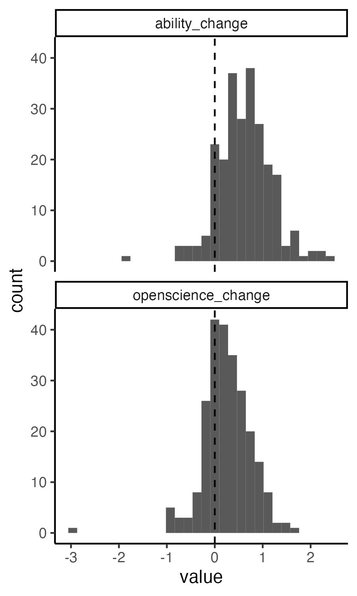

Wave 2 Hypothesis Testing
================
Rose Hartman
2024-01-19

> Note that code chunks are not printed in this report in order to keep
> the output tidy. To see all of the code to generate these results,
> open the .Rmd file.

This report executes the tests from [our
preregistration](https://osf.io/zmnr6). Text that appears as quotes in
this report is taken verbatim from the preregistration.

## Hypotheses to test

> 1.  Learners’ self-ratings of their own ability to perform data
>     science tasks will increase over the course of the program (pre to
>     post).
> 2.  Learners’ self-ratings of their agreement with important tenets of
>     open science will increase over the course of the program (pre to
>     post).
> 3.  Change in 1 and 2 will be stronger for learners who report higher
>     levels of engagement in the program.
>
> Additional hypotheses:
>
> 4.  Change in 1 and 2 will be higher for learners who report higher
>     levels of agreement with the statement “Self-paced asynchronous
>     studying works well for me in general”
> 5.  Change in 1 and 2 will be higher for learners who report higher
>     average levels of agreement with the statements about the
>     appropriateness of their assigned pathway (“The skills and topics
>     I was hoping to learn were covered in my modules”, “My assigned
>     modules worked together well as a learning pathway”, “My assigned
>     modules were appropriate to my skill level”, “I learned things
>     from my assigned modules that I can apply in my research”, and
>     “The assigned modules for my pathway were relevant to my learning
>     goals”)

This data includes 401 records for the NIH items (ability and open
science variables) at pretest, and 255 at post test. There are 248 exit
survey records (asynchronous learning preference and pathway fit
variables). There are 419 NALMS records (used to calculate engagement),
but note that only 243 actually show any activity from participants.

## Define variables

> For all mean scores, the mean will be computed on available data
> (i.e. using na.rm = TRUE).

> ability_pre and ability_post are the mean of participants’ ratings
> (assessed pre- or post-program, respectively) on the following items
> from survey2: all items under the instructions “please rate your
> ability to complete the following tasks”.
>
> openscience_pre and openscience_post are the mean of participants’
> ratings (assessed pre- or post-program, respectively) on the following
> items from survey2: all items under the heading “please rate your
> level of agreement with the following statements”

> Engagement is defined as number of modules marked complete out of
> total modules assigned as of the last day of the program (12am Eastern
> 2023-11-27).

> Asynchronous learning preference is participants’ level of agreement
> (1strongly disagree - 5 strongly agree) with the statement “Self-paced
> asynchronous studying works well for me in general”.

> Pathway fit is the mean of participants’ level of agreement (1strongly
> disagree - 5 strongly agree) with the following five statements: “The
> skills and topics I was hoping to learn were covered in my modules”,
> “My assigned modules worked together well as a learning pathway”, “My
> assigned modules were appropriate to my skill level”, “I learned
> things from my assigned modules that I can apply in my research”, “The
> assigned modules for my pathway were relevant to my learning goals”)

    ##    record_id         pathway     ability_post    ability_pre   
    ##  Min.   :  3.0   camellia: 42   Min.   :1.000   Min.   :1.000  
    ##  1st Qu.:367.0   crocus  : 39   1st Qu.:2.600   1st Qu.:1.857  
    ##  Median :522.0   lavender: 36   Median :3.057   Median :2.343  
    ##  Mean   :496.2   marigold: 35   Mean   :2.942   Mean   :2.331  
    ##  3rd Qu.:673.0   aster   : 31   3rd Qu.:3.429   3rd Qu.:2.800  
    ##  Max.   :823.0   azalea  : 29   Max.   :4.000   Max.   :4.000  
    ##                  (Other) :189   NA's   :148                    
    ##  openscience_post openscience_pre ability_change    openscience_change
    ##  Min.   :1.00     Min.   :4.600   Min.   :-1.9143   Min.   :-5.7000   
    ##  1st Qu.:6.10     1st Qu.:5.850   1st Qu.: 0.2571   1st Qu.: 0.0000   
    ##  Median :6.60     Median :6.211   Median : 0.5714   Median : 0.2000   
    ##  Mean   :6.41     Mean   :6.216   Mean   : 0.6051   Mean   : 0.2112   
    ##  3rd Qu.:6.85     3rd Qu.:6.650   3rd Qu.: 0.9429   3rd Qu.: 0.5500   
    ##  Max.   :7.00     Max.   :7.000   Max.   : 2.3714   Max.   : 1.6500   
    ##  NA's   :147                      NA's   :148       NA's   :147       
    ##    engagement       pathway_fit        asynch     
    ##  Min.   :0.00000   Min.   :1.400   Min.   :1.000  
    ##  1st Qu.:0.00000   1st Qu.:3.237   1st Qu.:3.000  
    ##  Median :0.08696   Median :4.000   Median :4.000  
    ##  Mean   :0.23240   Mean   :3.861   Mean   :3.633  
    ##  3rd Qu.:0.36000   3rd Qu.:4.200   3rd Qu.:5.000  
    ##  Max.   :1.00000   Max.   :5.000   Max.   :5.000  
    ##                    NA's   :161     NA's   :161

# Preregistered hypothesis tests

> All central hypotheses tested with mixed effects change-score models,
> with a random effect of cluster (change = post - pre), one model on
> change scores for ability and one on change scores for open science
> tenets. Another model including the effect of moderators as a
> covariate. For example:
>
>     lme4::lmer(change ~ 1 + (1|cluster), data)
>     lme4::lmer(change ~ 1 + engagement + (1 + engagement|cluster), data)
>     lme4::lmer(change ~ 1 + asynch + (1 + asynch|cluster), data)
>     lme4::lmer(change ~ 1 + pathway_fit + (1 + pathway_fit|cluster), data)
>
> If models with random slopes do not converge, drop the random slopes
> and include only a random intercept for cluster.
>
> If random intercepts model does not converge, run linear model with
> cluster as a fixed effect, and omitting cluster altogether:
>
>     lm(change ~ cluster, data = data)
>     lm(change ~ 1, data = data)
>     lm(change ~ cluster*engagement, data = data)
>     lm(change ~ engagement, data = data)
>     lm(change ~ cluster*asynch, data = data)
>     lm(change ~ asynch, data = data)
>     lm(change ~ cluster*pathway_fit, data = data)
>     lm(change ~ pathway_fit, data = data)
>
> Whether or not mixed models work, also run plain dependent samples
> t-test ignoring grouping by cluster:
>
>     t.test(x=data$pre, y=data$post, paired = TRUE)

> p values for mixed effects models calculated using Satterthwaite
> approximation (lmerTest package in R)

## Hypothesis 1

> 1.  Learners’ self-ratings of their own ability to perform data
>     science tasks will increase over the course of the program (pre to
>     post).

    ## Linear mixed model fit by REML ['lmerMod']
    ## Formula: ability_change ~ 1 + (1 | pathway)
    ##    Data: data
    ## 
    ## REML criterion at convergence: 433.1
    ## 
    ## Scaled residuals: 
    ##     Min      1Q  Median      3Q     Max 
    ## -4.3364 -0.5597 -0.0157  0.5903  3.1270 
    ## 
    ## Random effects:
    ##  Groups   Name        Variance Std.Dev.
    ##  pathway  (Intercept) 0.008757 0.09358 
    ##  Residual             0.312633 0.55914 
    ## Number of obs: 253, groups:  pathway, 19
    ## 
    ## Fixed effects:
    ##             Estimate Std. Error t value
    ## (Intercept)   0.6001     0.0427   14.05

    ## 
    ##  Paired t-test
    ## 
    ## data:  data$ability_post and data$ability_pre
    ## t = 16.995, df = 252, p-value < 2.2e-16
    ## alternative hypothesis: true difference in means is not equal to 0
    ## 95 percent confidence interval:
    ##  0.5350076 0.6752537
    ## sample estimates:
    ## mean of the differences 
    ##               0.6051307

## Hypothesis 2

> 2.  Learners’ self-ratings of their agreement with important tenets of
>     open science will increase over the course of the program (pre to
>     post).

    ## Linear mixed model fit by REML ['lmerMod']
    ## Formula: openscience_change ~ 1 + (1 | pathway)
    ##    Data: data
    ## 
    ## REML criterion at convergence: 541
    ## 
    ## Scaled residuals: 
    ##     Min      1Q  Median      3Q     Max 
    ## -8.3570 -0.3295  0.0359  0.4690  1.9890 
    ## 
    ## Random effects:
    ##  Groups   Name        Variance Std.Dev.
    ##  pathway  (Intercept) 0.01795  0.1340  
    ##  Residual             0.47294  0.6877  
    ## Number of obs: 254, groups:  pathway, 19
    ## 
    ## Fixed effects:
    ##             Estimate Std. Error t value
    ## (Intercept)  0.22296    0.05525   4.035

    ## 
    ##  Paired t-test
    ## 
    ## data:  data$openscience_post and data$openscience_pre
    ## t = 4.8074, df = 253, p-value = 2.625e-06
    ## alternative hypothesis: true difference in means is not equal to 0
    ## 95 percent confidence interval:
    ##  0.1246878 0.2977348
    ## sample estimates:
    ## mean of the differences 
    ##               0.2112113

## Hypothesis 3

> 3.  Change in 1 and 2 will be stronger for learners who report higher
>     levels of engagement in the program.

    ## Linear mixed model fit by REML ['lmerMod']
    ## Formula: ability_change ~ 1 + engagement + (1 + engagement | pathway)
    ##    Data: data
    ## 
    ## REML criterion at convergence: 422.4
    ## 
    ## Scaled residuals: 
    ##     Min      1Q  Median      3Q     Max 
    ## -4.2432 -0.6029  0.0235  0.5453  2.9375 
    ## 
    ## Random effects:
    ##  Groups   Name        Variance Std.Dev. Corr 
    ##  pathway  (Intercept) 0.02312  0.1521        
    ##           engagement  0.18837  0.4340   -0.82
    ##  Residual             0.28426  0.5332        
    ## Number of obs: 253, groups:  pathway, 19
    ## 
    ## Fixed effects:
    ##             Estimate Std. Error t value
    ## (Intercept)  0.50689    0.06054   8.373
    ## engagement   0.32335    0.14844   2.178
    ## 
    ## Correlation of Fixed Effects:
    ##            (Intr)
    ## engagement -0.736

    ## refitting model(s) with ML (instead of REML)

    ## Data: data
    ## Models:
    ## h1: ability_change ~ 1 + (1 | pathway)
    ## h3_ability: ability_change ~ 1 + engagement + (1 + engagement | pathway)
    ##            npar    AIC    BIC  logLik deviance  Chisq Df Pr(>Chisq)   
    ## h1            3 434.56 445.16 -214.28   428.56                        
    ## h3_ability    6 427.79 448.99 -207.89   415.79 12.773  3   0.005155 **
    ## ---
    ## Signif. codes:  0 '***' 0.001 '**' 0.01 '*' 0.05 '.' 0.1 ' ' 1

    ## boundary (singular) fit: see ?isSingular

    ## Linear mixed model fit by REML ['lmerMod']
    ## Formula: openscience_change ~ 1 + engagement + (1 | pathway)
    ##    Data: data
    ## 
    ## REML criterion at convergence: 540.6
    ## 
    ## Scaled residuals: 
    ##     Min      1Q  Median      3Q     Max 
    ## -8.3071 -0.3363  0.0589  0.4837  1.8330 
    ## 
    ## Random effects:
    ##  Groups   Name        Variance Std.Dev.
    ##  pathway  (Intercept) 0.01569  0.1252  
    ##  Residual             0.47098  0.6863  
    ## Number of obs: 254, groups:  pathway, 19
    ## 
    ## Fixed effects:
    ##             Estimate Std. Error t value
    ## (Intercept)   0.1542     0.0675   2.285
    ## engagement    0.2109     0.1268   1.663
    ## 
    ## Correlation of Fixed Effects:
    ##            (Intr)
    ## engagement -0.603

    ## refitting model(s) with ML (instead of REML)

    ## Data: data
    ## Models:
    ## h2: openscience_change ~ 1 + (1 | pathway)
    ## h3_openscience: openscience_change ~ 1 + engagement + (1 | pathway)
    ##                npar    AIC    BIC  logLik deviance  Chisq Df Pr(>Chisq)  
    ## h2                3 543.02 553.63 -268.51   537.02                       
    ## h3_openscience    4 542.22 556.37 -267.11   534.22 2.7989  1    0.09433 .
    ## ---
    ## Signif. codes:  0 '***' 0.001 '**' 0.01 '*' 0.05 '.' 0.1 ' ' 1

## Hypothesis 4

> 4.  Change in 1 and 2 will be higher for learners who report higher
>     levels of agreement with the statement “Self-paced asynchronous
>     studying works well for me in general”

    ## boundary (singular) fit: see ?isSingular

    ## Linear mixed model fit by REML ['lmerMod']
    ## Formula: ability_change ~ 1 + asynch + (1 | pathway)
    ##    Data: data
    ## 
    ## REML criterion at convergence: 409.2
    ## 
    ## Scaled residuals: 
    ##     Min      1Q  Median      3Q     Max 
    ## -4.3497 -0.6157 -0.0173  0.5374  3.0545 
    ## 
    ## Random effects:
    ##  Groups   Name        Variance Std.Dev.
    ##  pathway  (Intercept) 0.007503 0.08662 
    ##  Residual             0.305701 0.55290 
    ## Number of obs: 240, groups:  pathway, 19
    ## 
    ## Fixed effects:
    ##             Estimate Std. Error t value
    ## (Intercept)  0.36381    0.12278   2.963
    ## asynch       0.07008    0.03173   2.209
    ## 
    ## Correlation of Fixed Effects:
    ##        (Intr)
    ## asynch -0.939

    ## boundary (singular) fit: see ?isSingular

    ## Linear mixed model fit by REML ['lmerMod']
    ## Formula: openscience_change ~ 1 + asynch + (1 + asynch | pathway)
    ##    Data: data
    ## 
    ## REML criterion at convergence: 355.2
    ## 
    ## Scaled residuals: 
    ##     Min      1Q  Median      3Q     Max 
    ## -6.5407 -0.5091 -0.0225  0.5451  2.7423 
    ## 
    ## Random effects:
    ##  Groups   Name        Variance  Std.Dev. Corr
    ##  pathway  (Intercept) 0.0008028 0.02833      
    ##           asynch      0.0001727 0.01314  1.00
    ##  Residual             0.2436915 0.49365      
    ## Number of obs: 240, groups:  pathway, 19
    ## 
    ## Fixed effects:
    ##             Estimate Std. Error t value
    ## (Intercept)  0.14905    0.10792   1.381
    ## asynch       0.03127    0.02853   1.096
    ## 
    ## Correlation of Fixed Effects:
    ##        (Intr)
    ## asynch -0.938
    ## optimizer (nloptwrap) convergence code: 0 (OK)
    ## boundary (singular) fit: see ?isSingular

## Hypothesis 5

> 5.  Change in 1 and 2 will be higher for learners who report higher
>     average levels of agreement with the statements about the
>     appropriateness of their assigned pathway (“The skills and topics
>     I was hoping to learn were covered in my modules”, “My assigned
>     modules worked together well as a learning pathway”, “My assigned
>     modules were appropriate to my skill level”, “I learned things
>     from my assigned modules that I can apply in my research”, and
>     “The assigned modules for my pathway were relevant to my learning
>     goals”)

    ## boundary (singular) fit: see ?isSingular

    ## Linear mixed model fit by REML ['lmerMod']
    ## Formula: ability_change ~ 1 + pathway_fit + (1 | pathway)
    ##    Data: data
    ## 
    ## REML criterion at convergence: 382.6
    ## 
    ## Scaled residuals: 
    ##     Min      1Q  Median      3Q     Max 
    ## -4.2750 -0.5576  0.0442  0.5447  3.2005 
    ## 
    ## Random effects:
    ##  Groups   Name        Variance Std.Dev.
    ##  pathway  (Intercept) 0.00515  0.07176 
    ##  Residual             0.27570  0.52507 
    ## Number of obs: 240, groups:  pathway, 19
    ## 
    ## Fixed effects:
    ##             Estimate Std. Error t value
    ## (Intercept) -0.44318    0.19214  -2.307
    ## pathway_fit  0.27547    0.04875   5.651
    ## 
    ## Correlation of Fixed Effects:
    ##             (Intr)
    ## pathway_fit -0.979

    ## Linear mixed model fit by REML ['lmerMod']
    ## Formula: openscience_change ~ 1 + pathway_fit + (1 + pathway_fit | pathway)
    ##    Data: data
    ## 
    ## REML criterion at convergence: 352.8
    ## 
    ## Scaled residuals: 
    ##     Min      1Q  Median      3Q     Max 
    ## -6.5268 -0.4843 -0.0121  0.5617  2.8039 
    ## 
    ## Random effects:
    ##  Groups   Name        Variance Std.Dev. Corr 
    ##  pathway  (Intercept) 0.007042 0.08392       
    ##           pathway_fit 0.001736 0.04166  -1.00
    ##  Residual             0.241682 0.49161       
    ## Number of obs: 240, groups:  pathway, 19
    ## 
    ## Fixed effects:
    ##             Estimate Std. Error t value
    ## (Intercept) -0.02279    0.18072  -0.126
    ## pathway_fit  0.07441    0.04700   1.583
    ## 
    ## Correlation of Fixed Effects:
    ##             (Intr)
    ## pathway_fit -0.979

# Plots

## Distributions and summary stats for all key variables

<table class="gt_table">
  &#10;  <thead class="gt_col_headings">
    <tr>
      <th class="gt_col_heading gt_columns_bottom_border gt_left" rowspan="1" colspan="1" scope="col" id="&lt;strong&gt;Characteristic&lt;/strong&gt;"><strong>Characteristic</strong></th>
      <th class="gt_col_heading gt_columns_bottom_border gt_center" rowspan="1" colspan="1" scope="col" id="&lt;strong&gt;N = 401&lt;/strong&gt;&lt;sup class=&quot;gt_footnote_marks&quot;&gt;1&lt;/sup&gt;"><strong>N = 401</strong>1</th>
    </tr>
  </thead>
  <tbody class="gt_table_body">
    <tr><td headers="label" class="gt_row gt_left">pathway</td>
<td headers="stat_0" class="gt_row gt_center"></td></tr>
    <tr><td headers="label" class="gt_row gt_left">    aster</td>
<td headers="stat_0" class="gt_row gt_center">31 (7.7%)</td></tr>
    <tr><td headers="label" class="gt_row gt_left">    azalea</td>
<td headers="stat_0" class="gt_row gt_center">29 (7.2%)</td></tr>
    <tr><td headers="label" class="gt_row gt_left">    begonia</td>
<td headers="stat_0" class="gt_row gt_center">29 (7.2%)</td></tr>
    <tr><td headers="label" class="gt_row gt_left">    camellia</td>
<td headers="stat_0" class="gt_row gt_center">42 (10%)</td></tr>
    <tr><td headers="label" class="gt_row gt_left">    crocus</td>
<td headers="stat_0" class="gt_row gt_center">39 (9.7%)</td></tr>
    <tr><td headers="label" class="gt_row gt_left">    daffodil</td>
<td headers="stat_0" class="gt_row gt_center">25 (6.2%)</td></tr>
    <tr><td headers="label" class="gt_row gt_left">    dahlia</td>
<td headers="stat_0" class="gt_row gt_center">17 (4.2%)</td></tr>
    <tr><td headers="label" class="gt_row gt_left">    daisy</td>
<td headers="stat_0" class="gt_row gt_center">4 (1.0%)</td></tr>
    <tr><td headers="label" class="gt_row gt_left">    geranium</td>
<td headers="stat_0" class="gt_row gt_center">19 (4.7%)</td></tr>
    <tr><td headers="label" class="gt_row gt_left">    iris</td>
<td headers="stat_0" class="gt_row gt_center">23 (5.7%)</td></tr>
    <tr><td headers="label" class="gt_row gt_left">    jasmine</td>
<td headers="stat_0" class="gt_row gt_center">16 (4.0%)</td></tr>
    <tr><td headers="label" class="gt_row gt_left">    lavender</td>
<td headers="stat_0" class="gt_row gt_center">36 (9.0%)</td></tr>
    <tr><td headers="label" class="gt_row gt_left">    lilac</td>
<td headers="stat_0" class="gt_row gt_center">8 (2.0%)</td></tr>
    <tr><td headers="label" class="gt_row gt_left">    lily</td>
<td headers="stat_0" class="gt_row gt_center">20 (5.0%)</td></tr>
    <tr><td headers="label" class="gt_row gt_left">    lotus</td>
<td headers="stat_0" class="gt_row gt_center">10 (2.5%)</td></tr>
    <tr><td headers="label" class="gt_row gt_left">    magnolia</td>
<td headers="stat_0" class="gt_row gt_center">9 (2.2%)</td></tr>
    <tr><td headers="label" class="gt_row gt_left">    marigold</td>
<td headers="stat_0" class="gt_row gt_center">35 (8.7%)</td></tr>
    <tr><td headers="label" class="gt_row gt_left">    peony</td>
<td headers="stat_0" class="gt_row gt_center">7 (1.7%)</td></tr>
    <tr><td headers="label" class="gt_row gt_left">    tulip</td>
<td headers="stat_0" class="gt_row gt_center">2 (0.5%)</td></tr>
  </tbody>
  &#10;  <tfoot class="gt_footnotes">
    <tr>
      <td class="gt_footnote" colspan="2">1 n (%)</td>
    </tr>
  </tfoot>
</table>

<table class="gt_table">
  &#10;  <thead class="gt_col_headings">
    <tr>
      <th class="gt_col_heading gt_columns_bottom_border gt_left" rowspan="1" colspan="1" scope="col" id="&lt;strong&gt;Characteristic&lt;/strong&gt;"><strong>Characteristic</strong></th>
      <th class="gt_col_heading gt_columns_bottom_border gt_center" rowspan="1" colspan="1" scope="col" id="&lt;strong&gt;change&lt;/strong&gt;, N = 401&lt;sup class=&quot;gt_footnote_marks&quot;&gt;1&lt;/sup&gt;"><strong>change</strong>, N = 4011</th>
      <th class="gt_col_heading gt_columns_bottom_border gt_center" rowspan="1" colspan="1" scope="col" id="&lt;strong&gt;post&lt;/strong&gt;, N = 401&lt;sup class=&quot;gt_footnote_marks&quot;&gt;1&lt;/sup&gt;"><strong>post</strong>, N = 4011</th>
      <th class="gt_col_heading gt_columns_bottom_border gt_center" rowspan="1" colspan="1" scope="col" id="&lt;strong&gt;pre&lt;/strong&gt;, N = 401&lt;sup class=&quot;gt_footnote_marks&quot;&gt;1&lt;/sup&gt;"><strong>pre</strong>, N = 4011</th>
    </tr>
  </thead>
  <tbody class="gt_table_body">
    <tr><td headers="label" class="gt_row gt_left">ability</td>
<td headers="stat_1" class="gt_row gt_center">0.57 (0.26, 0.94)</td>
<td headers="stat_2" class="gt_row gt_center">3.06 (2.60, 3.43)</td>
<td headers="stat_3" class="gt_row gt_center">2.34 (1.86, 2.80)</td></tr>
    <tr><td headers="label" class="gt_row gt_left">    Unknown</td>
<td headers="stat_1" class="gt_row gt_center">148</td>
<td headers="stat_2" class="gt_row gt_center">148</td>
<td headers="stat_3" class="gt_row gt_center">0</td></tr>
    <tr><td headers="label" class="gt_row gt_left">openscience</td>
<td headers="stat_1" class="gt_row gt_center">0.20 (0.00, 0.55)</td>
<td headers="stat_2" class="gt_row gt_center">6.60 (6.10, 6.85)</td>
<td headers="stat_3" class="gt_row gt_center">6.21 (5.85, 6.65)</td></tr>
    <tr><td headers="label" class="gt_row gt_left">    Unknown</td>
<td headers="stat_1" class="gt_row gt_center">147</td>
<td headers="stat_2" class="gt_row gt_center">147</td>
<td headers="stat_3" class="gt_row gt_center">0</td></tr>
  </tbody>
  &#10;  <tfoot class="gt_footnotes">
    <tr>
      <td class="gt_footnote" colspan="4">1 Median (IQR)</td>
    </tr>
  </tfoot>
</table>

<table class="gt_table">
  &#10;  <thead class="gt_col_headings">
    <tr>
      <th class="gt_col_heading gt_columns_bottom_border gt_left" rowspan="1" colspan="1" scope="col" id="&lt;strong&gt;Characteristic&lt;/strong&gt;"><strong>Characteristic</strong></th>
      <th class="gt_col_heading gt_columns_bottom_border gt_center" rowspan="1" colspan="1" scope="col" id="&lt;strong&gt;N = 401&lt;/strong&gt;&lt;sup class=&quot;gt_footnote_marks&quot;&gt;1&lt;/sup&gt;"><strong>N = 401</strong>1</th>
    </tr>
  </thead>
  <tbody class="gt_table_body">
    <tr><td headers="label" class="gt_row gt_left">engagement</td>
<td headers="stat_0" class="gt_row gt_center">0.09 (0.00, 0.36)</td></tr>
    <tr><td headers="label" class="gt_row gt_left">pathway_fit</td>
<td headers="stat_0" class="gt_row gt_center">4.00 (3.24, 4.20)</td></tr>
    <tr><td headers="label" class="gt_row gt_left">    Unknown</td>
<td headers="stat_0" class="gt_row gt_center">161</td></tr>
    <tr><td headers="label" class="gt_row gt_left">asynch</td>
<td headers="stat_0" class="gt_row gt_center">4.00 (3.00, 5.00)</td></tr>
    <tr><td headers="label" class="gt_row gt_left">    Unknown</td>
<td headers="stat_0" class="gt_row gt_center">161</td></tr>
  </tbody>
  &#10;  <tfoot class="gt_footnotes">
    <tr>
      <td class="gt_footnote" colspan="2">1 Median (IQR)</td>
    </tr>
  </tfoot>
</table>

    ## Warning: Removed 148 rows containing non-finite values (stat_bin).

    ## Warning: Removed 4 rows containing missing values (geom_bar).

    ## `stat_bin()` using `bins = 30`. Pick better value with `binwidth`.

    ## Warning: Removed 147 rows containing non-finite values (stat_bin).

    ## Warning: Removed 4 rows containing missing values (geom_bar).

    ## `stat_bin()` using `bins = 30`. Pick better value with `binwidth`.

    ## Warning: Removed 295 rows containing non-finite values (stat_bin).

## Change in ability from pre to post

    ## Warning: Removed 148 rows containing non-finite values (stat_boxplot).

    ## Warning: Removed 148 row(s) containing missing values (geom_path).

Let’s look at the relationship between engagement and change in ability
by pathway.

    ## `geom_smooth()` using formula 'y ~ x'

    ## Warning: Removed 148 rows containing non-finite values (stat_smooth).

    ## Warning: Removed 148 rows containing missing values (geom_point).

## Change in open science from pre to post

    ## Warning: Removed 147 rows containing non-finite values (stat_boxplot).

    ## Warning: Removed 147 row(s) containing missing values (geom_path).

Let’s look at the relationship between engagement and change in open
science by pathway.

    ## `geom_smooth()` using formula 'y ~ x'

    ## Warning: Removed 147 rows containing non-finite values (stat_smooth).

    ## Warning: Removed 147 rows containing missing values (geom_point).

    ## Warning: Removed 148 rows containing missing values (geom_point).

